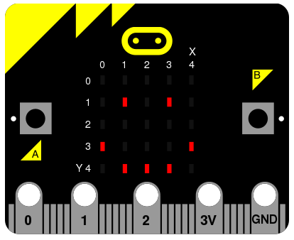
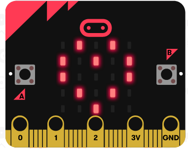
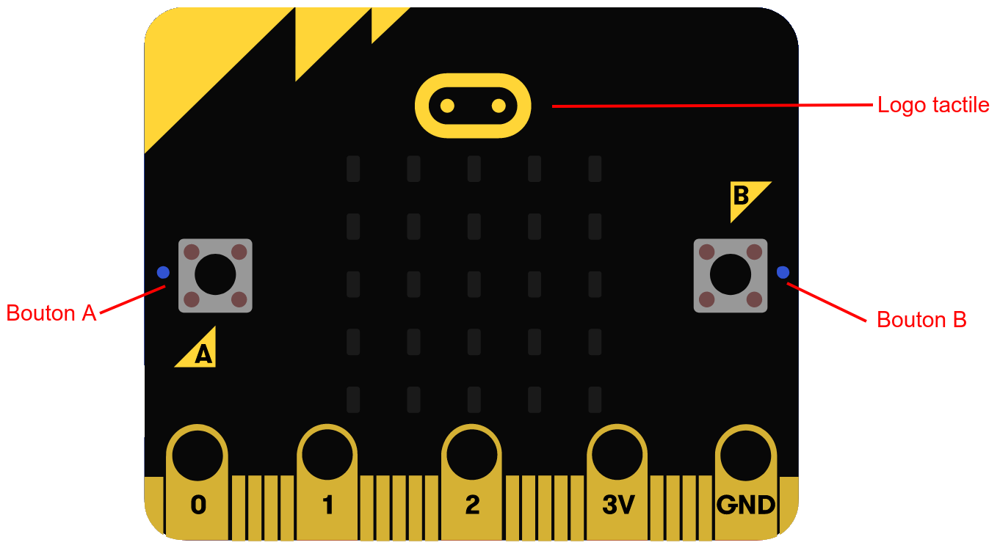
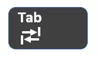

# Introduction

Bonjour à toi, jeune programmeuse, 
Je me présente, je suis Joseph Marchand, et c'est moi qui vais t'accompagner au
travers des différents TPs afin de t'apprendre à créer tes propres programmes
informatiques. Avant de commencer, laisse moi aussi te présenter mes fidèles
acolytes : les organisateurs. C'est eux qui t'ont accompagné en ce début de
matinée. Ils me remplacent car je suis très occupé en ce moment, mais si tu as
une quelconque question à n'importe quel moment, n'hésite surtout pas à leur
demander de l'aide, ils sont là pour ça.
Je m'arrête là pour les présentations, et je vais commencer dans ce TP par te
montrer les bases pour créer un programme. 

Mais d'abord, un ordinateur, c'est quoi ? 
Un ordinateur n'est rien d'autre qu'un ensemble de composants électroniques qui
exécutent des instructions. Lorsque tu ouvres un navigateur internet, ton
ordinateur exécute les instructions du logiciel utilisé, qu'on appelle aussi
**programme**. Le but de cet atelier est de te faire découvrir comment nous
pouvons créer nos propres programmes, et pour cela il nous faut un moyen
d'écrire ces instructions : un **langage de programmation**.

Il existe énormément de langage de programmation, tout comme il existe des
milliers de langue dans le monde ! Certains sont plus connus que d'autres et
nous allons, avec les organisateurs, te faire découvrir Python, un langage 
facile à prendre en main mais très puissant.

## Qu'est-ce qu'un `micro:bit` ?

Pour cet atelier, nous allons utiliser un `micro:bit`. C'est un microcontrôleur
de la taille d'une carte bancaire. Nous pouvons écrire des programmes et les
lancer dessus, ainsi qu'intéragir avec ses composants : l'écran de LED, les
boutons, l'accéléromètre (pour détecter des mouvements), etc.

Tu peux garder le microcontrôleur avec toi, et continuer à écrire tes propres
programmes en Python dessus après l'atelier !

## Notre environnement de travail

Pour écrire nos programmes, nous utiliserons `Mu`, que tu as pu découvrir dans le TP0.

Si tu n'as pas réussi à bien installer `Mu`, demande aux organisateurs de t'aider.

# Ton premier programme

Un programme en Python est constitué d'une série d'instructions qui sont exécutées par un
ordinateur (dans notre cas, le `micro:bit`). Chaque instruction doit être écrite
sur une nouvelle ligne, et le programme sera lu par l'ordinateur de haut en bas.
Commençons par analyser un premier exemple de programme très basique :

```python
from microbit import *

display.set_pixel(0, 2, 9)
sleep(500)
display.set_pixel(1, 2, 9)
sleep(500)
display.set_pixel(2, 2, 9)
sleep(500)
display.set_pixel(3, 2, 9)
sleep(500)
display.set_pixel(4, 2, 9)
```

Si tu testes ce programme, il affiche une barre de chargement sur la ligne de
diode centrale de ton `micro:bit`.

Exécutons 'à la main' ce petit programme pour comprendre ce qu'il fait : 

1. `from microbit import *` permet d'indiquer à l'ordinateur la signification
   des commandes propres au micro:bit. Sans cela, le programme ne sait pas ce
   que doivent faire les commandes permettant d'utiliser le micro:bit. Cette
   ligne est très importante car sans elle, ton programme ne pourra pas
   fonctionner. 
2. Nous avons ensuite une ligne vide. Cela n'a aucune influence sur le
   comportement de ton code, il ne faut donc pas hésiter à t'en servir pour
   espacer ton programme. Cela rend ton code plus lisible pour toi comme pour les
   personnes qui voudront le lire.
3. `display.set_pixel(0, 2, 9)` est une fonction propre au micro:bit, elle
   permet d'allumer le pixel situé sur la colonne n°0 et la ligne n°2. Son
   comportement est expliqué plus en détail juste après. 
4. `sleep(500)` est aussi une fonction propre au micro:bit. Elle met l'exécution 
   du programme en pause pendant 500 millisecondes. Essaye de supprimer cette 
   ligne, le programme s'exécute tellement vite que tu n'as pas le temps de voir
   qu'une diode s'allume avant l'autre !
5. La suite du programme se répète : on allume les diodes des colonnes numéro 1,
   2, 3 puis 4.


# Les fonctions de contrôle du micro:bit

Comme tu l'as vu plus tôt, il existe des fonctions qui permettent de contrôler
le microbit. Nous allons ici te présenter les principales.


## Allumer des LEDs

Il existe de nombreuses façons d'afficher quelque chose sur l'écran du micro:bit.
La première, et la plus basique, consiste à choisir les LEDs que l'on veut allumer
et à les allumer une par une. Pour cela, tu l'as vu juste avant, on utilise la
fonction `display.set_pixel(colonne, ligne, intensite)`, où `colonne` représente
le numéro de la colonne de la LED à allumer, `ligne` le numéro de la ligne et
enfin `intensite` est l'intensité avec laquelle la LED va s'allumer (de 0
pour une LED éteinte à 9 pour une LED allumée à pleine puissance). 

En ce qui concerne cette fonction, voici un petit schéma qui permet de mieux 
comprendre les coordonnées de chaque LED (la coordonnée **X** correspond au
numéro de **colonne** et la coordonnée **Y** correspond au numéro de **ligne**) :



### Mini-exercice
**But :** Affiche un coeur sur l'écran
_Ça devrait ressembler à quelque chose comme ça :_
{width=5cm}


## Les images

Comme tu as pu le constater, c'est assez long et fasctidieux d'afficher quelque
chose de complexe avec la fonction précédente. Pour nous faciliter la vie, il
existe quelques autres fonctions, et une en particulier qui est faite pour
afficher des images et des symboles : `display.show(Image.UNE_IMAGE)`. Comme tu
peux le voir, cette fonction prend en paramètre une image, que tu peux trouver
en faisant `Image.` suivi du nom de l'image. 
Il en existe de nombreuses qui sont déjà dessinée. On y
accède en tapant `Image.` suivi du nom de l'image que tu recherches. 
Voici à quoi ressemblent les images `HEART` et `SMILE` :


### Mini-exercice
**But :** Affiche un smiley content sur l'écran du microbit.


## Et le texte ?
C'est super, tu sais maintenant comment allumer les LED une par une et afficher
une image. Mais comment faire si jamais tu veux afficher un message sur l'écran ?
Et bien la vie est bien faite, puisqu'il existe une fonction pour faire cela.
Mais juste avant, il faut comprendre comment ton ordinateur fait la différence
entre ton code et du texte que tu voudrais afficher. Ce n'est pas compliqué, il
suffit de mettre ton texte entouré par des guillemets (`"`).
Voici un exemple de chaine de caratères : `"Je suis Joseph Marchand !"`.

Maintenant que tu sais ça, revenons à nos moutons. La fonction pour afficher du 
texte sur l'écran s'appelle `display.scroll(message)`. Elle prend en paramètre la
chaine de caractères que tu veux afficher. 

### Mini-exercice
**But :** Affiche le texte de ton choix sur l'écran du microbit.


## Ça va trop vite !
Une autre fonction bien pratique est la fonction `sleep(millisecondes)` qui
permet, comme évoqué dans la partie "Ton premier programme", de mettre en pause
ton programme pour, par exemple, te laisser le temps de voir ce qu'il se passe. 


Nous avons vu beaucoup de choses nouvelles jusqu'ici. Si jamais tu as une
question ou si tu n'as pas compris quelque chose, n'hésite surtout pas à demander
de l'aide à un organisateur. 
N'hésite pas non plus à relire les parties que tu n'as pas compris. 
Si jamais tu as besoin, une liste _presque_ exhaustive des fonctions de contrôle
du microbit est disponible à la toute fin de ce TP. 

### Exercice 1
**But :** Max, qui est un ami de Joseph, te demande de créer un programme
pour que son microbit affiche une barre de chargement, puis affiche le message 
`"Salut Joseph !"` suivi d'un smiley qui sourit. 


# Les variables

Jusque là, on a vu comment faire afficher des images et du texte sur le 
`Micro:bit`, mais il se passe toujours la même chose. Heureusement, un 
ordinateur peut enregistrer des informations !

Pour cela, on utilise des variables : un morceau de la mémoire dans lequel on
va pouvoir enregistrer des valeurs. Quand on crée une variable, on commence par
lui donner un nom qui va être utilisé pour lire ou modifier la valeur qui lui
a été donnée.

## Utilisation des variables

Pour **créer une variable** il suffit d'écrire `nom_de_la_variable =
valeur_initiale`, par exemple : `nombre_de_patates = 42`.

Ensuite on peut **réutiliser la valeur** stockée dans la variable en
l'identifiant par son nom, par exemple on peut créer une nouvelle variable
`prix` qui dépend de la variable qui a été créée précédemment : `prix =
nombre_de_patates + 50`.

Pour **modifier une variable** on utilise aussi le symbole d'égalité, par
exemple on peut augmenter de 1 la valeur stockée dans une variable :
`nombre_de_patates = nombre_de_patates + 1`.

Voici un exemple de programme complet que tu peux tester sur ton `micro:bit`
suivi d'un petit schéma qui représente ce qui est enregistré dans les variables
après chaque ligne du programme :

```python
from microbit import *

x = 3
y = 5
y = 2 * y
x = x + y

display.scroll(x)
```

### Mini Exercice
**But :** Crée une variable avec la valeur 42, puis ajoute-y 2 et affiche-la 
sur l'écran.

## Types de variables

### Nombres

Comme leur nom l'indique, il s'agit tout simplement de nombres (positifs ou 
négatifs). On peut donc faire des opérations dessus avec les opérateurs 
classiques : `+`, `-`, `*` (multiplication), `/` (division).

```python
x = 3 * 4
y = x / 2
z = 8 + 1
```

Ici `x` vaut 12, `y` vaut 6.0, et `z` vaut 9. Nous pouvons aussi combiner
plusieurs opérations ensemble, par exemple :

```python
a = (x - y) + z
```

#### Mini-Exercice
**But :** Joseph a envie de bananes. Le marchand lui propose de les acheter pour
2€ l'unité. Combien 10 bananes vont-elles lui coûter ? Affiche le résultat sur 
le `Micro:bit`.

### Chaines de caractères

On peut créer du texte en mettant son contenu entre guillemets (par exemple :
`mon_texte = "Bonjour tous le monde !"`). On peut aussi attacher des morceaux
de textes entre eux avec l'opérateur `+` (par exemple : `mon_texte = mon_texte +
"!!"`).

À noter qu'il est souvent très pratique de convertir un nombre en texte pour
ensuite l'incorporer dans une phrase, on peut faire ça avec la fonction
`str(nombre)`.

```python
from microbit import *

nombre_de_patates = 42
texte = "Il y a " + str(nombre_de_patates) + " patates !"
display.scroll(texte)  # Affiche "Il y a 42 patates !" sur l'écran
```

#### Mini-Exercice
**But :** Comme dans l'exercice précédent, Joseph a besoin de savoir combien 
vont lui coûter ses bananes. Mais le marchand a augmenté le prix et les bananes 
coûtent désormais 3€ chacunes. Après avoir calculé, affiche `"Payer (le prix) 
pour 10 bananes ? Mais c'est beaucoup trop cher !"` en remplacant `le prix` par 
sa valeur.


### Booléens

Enfin, les booléens servent à exprimer le vrai ou le faux. Il n'y a que deux
valeurs possibles pour ce type de variables : `True` (vrai) et `False` (faux).

Des valeurs booléennes sont renvoyées par les opérations de comparaisons : `==`
(égalité), `!=` (différence), `<`, `>` (les inégalités strictes), `<=` et `>=`
(les inégalités larges). Par exemple `1 < 2` vaut `True` mais `3 != 3` vaut
`False`.

Enfin, il est possible de manipuler les valeurs booléennes avec les opérateurs
`not`, `and` et `or` :

 - `not a` vaut l'inverse de `a`, donc `True` si a vaut `False`;
 - `a and b` vaut `True` si et seulement si `a` **et** `b` valent `True`;
 - `a or b` vaut `True` si et seulement si `a` **ou** `b` valent `True`.

#### Mini-Exercice
**But :** Après une discussion intense avec le marchand, Joseph n'est plus sûr
de ses calculs. Les bananes coûtant 3€, il pense que pour 7 bananes il en aura
pour 22€. Calcule le vrai prix et affiche si celui de Joseph est le bon.

# Comment utiliser les boutons du microbit ?

Comme tu le voir, il y a deux boutons physiques sur le microbit : le bouton A et
le bouton B. Mais il y a aussi un bouton tactile au niveau du logo au dessus de
l'écran. Voici un petit schéma qui te permet de repérer les différents boutons : 



Pour utiliser les boutons A et B, tu peux respectivement utiliser la fonction
`button_a.get_presses()` et `button_b.get_presses()`. Ces fonctions renvoient le
nombre d'appuis sur le bouton depuis la dernière fois qu'elles ont été appelée.
Par exemple, ce code va prendre le nombre de fois que le bouton A a été appuyé
au cours des 5 dernières secondes :

```python
from microbit import *

sleep(5000)
display.scroll(button_a.get_presses())
```

En ce qui concerne le bouton au tactile, tu peux détecter si tu appuies dessus
en utilisant la fonction `pin_logo.is_touched()`, qui renvoie un booléen. 

### Mini-exercice
**But :** Crée un programme qui affiche la somme du nombre d'appuis sur les
boutons A et B au cours des 3 dernières secondes. 

## Un exemple un peu plus complexe

Voici un exemple de petit programme qui déclenche un compte à rebours avant de
donner 5 secondes pour appuyer autant de fois que possible sur le bouton de gauche.

```python
from microbit import *

# Compte à rebours
display.set_pixel(0, 2, 9)
sleep(500)
display.set_pixel(1, 2, 9)
sleep(500)
display.set_pixel(2, 2, 9)
sleep(500)
display.set_pixel(3, 2, 9)
sleep(500)
display.set_pixel(4, 2, 9)

# Phase de jeu
button_a.get_presses()     # réinitialise le compteur d'appuis
sleep(5000)                # donne 5 secondes pour jouer
a = button_a.get_presses() # récupère le nombre d'appuis

# Affichage du score
display.scroll("Score: " + str(a))
```

### Exercice 3

**But :** Joseph voudrait connaitre le résultat de la multiplication de deux
nombres. Pour récupérer la valeur des deux nombres tu peux donner quelques secondes
à l'utilisateur pour appuyer le bon nombre de fois sur chaque bouton. Par exemple,
si pendant ce temps, tu appuies 3 fois sur le bouton de gauche et 7 fois sur celui 
de droite, le programme affichera `3 * 7 = 21` sur l'écran.


# Et si...

## Avant de continuer...

Avant de continuer avec les conditions (je t'explique ça juste
après), je dois t'expliquer une partie importante de la programmation :
l'**indentation**. 
L'indentation correspond au nombre d'espaces avant le début d'une ligne. Par
exemple, la première ligne ci-dessous à une indentation égale à **0** (pas
d'espaces en début de ligne), et la troisième ligne à une indentation égale à
**4** (quatre espaces en début de ligne.

```python
display.scroll("Coucou") # Ligne qui n'est pas indentée
if True:
    display.show(Image.SMILE) # Ligne qui est indentée
```

L'indentation permet surtout de définir des blocs. Chaque ligne avec la même 
indentation fait donc partie du même bloc.

**Attention**, l'indentation doit être constante tout le long du programme !
Avec des blocs indentés de 1, 3 puis 2 espaces, python a du mal a comprendre ce 
qui se passe. En général, on décale le code de 4 espaces à chaque fois.

```python
display.scroll("Coucou")
if True:
  display.scroll("Ceci")
 display.scroll("est un")
   display.scroll("mauvais")
    display.scroll("exemple")
  display.scroll("d'indentation")
```

Tu peux te demander, comment facilement faire des indentations ? 
Et bien il te suffit simplement d'appuyer sur la touche `tabulation`. Celle qui
ressemble à ça (c'est la touche juste au dessus de la touche `verrouillage
majuscule`): 



Pour l'instant il te suffit juste de savoir ça, je reviendrais là-dessus juste
après. 


## Revenons à nos conditions

Maintenant que tu sais utiliser des variables et plusieurs fonctions de contrôle
du microbit, tu dois vouloir faire réagir ton programme en fonction de toutes
ces donnée. Et bien ça tombe bien, car Python sait faire ça grâce aux
instructions `if`, `elif` et `else`. 

L'instruction `if` permet de décider de n'exécuter un morceau de code que
lorsqu'une condition est vraie. Ce sont les même conditions que celles décrites
dans la section "Booléens" de la partie sur les types de variables. 
Pour écrire une condition, la syntaxe est : `if condition:`
suivi d'un bloc de code indenté. Le bloc de code en question ne sera alors
exécuté que si `condition` s'évalue à `True`. Un `if` peut être accompagné
d'un `else` qui exécute un bloc de code uniquement si la condition du `if`
est fausse. Enfin, il y a aussi le `elif` qui est la contraction du `else` et
du `if`. Le `elif` n'est exécuté que si sa condition est vraie et que les
conditions précédentes sont fausses.

Voici un exemple simple pour illustrer :

```python
from random import randint
from microbit import *

x = randint(0, 100)  # assigne un nombre aléatoire à x compris entre 0 et 100

if x < 30:
    display.scroll('x est inférieur à 30')
elif x < 50:
    display.scroll('x est inférieur à 50')
elif x < 80:
    display.scroll('x est inférieur à 80')
else:
    display.scroll('x est supérieur à 80')
```

### Mini-exercice
**But :** Essaye de trouver ce que va afficher le programme ci-dessus pour `x =
0`, `x = 42` et `x = 238`. 

*Remarques :*

- Un `if` n'est pas nécessairement accompagné d'un `else` (ou d'un `elif`).
Dans ce cas, si sa condition est fausse, rien n'est exécuté
- On peut ajouter autant de `elif` que l'on veut après un `if`

*Tout est clair ?*

Si jamais tu as une question ou s'il y a quelque chose que tu n'as pas compris,
n'hésite pas.

### Et les indentations dans tout ça ?

Comme tu as pu le voir dans les codes d'exemples, le _bloc de code_ qui est 
exécuté lorsque la condition du `if` est vérifiée est **indenté**. 
Lorsque l'on sort de la condition, le code perd son indentation. L'indentation 
permet à Python de différencier les `blocs de code` appartenant aux conditions, 
et ainsi de savoir ce qui doit être exécuté ou non.

La partie sur les indentation est une partie très importante car elle ne permet
pas seulement de permettre à Python de différencier les blocs de code, mais
aussi de rendre ton code plus clair et plus lisible. 
Si jamais tu as une quelconque question ou qu'il y a quelque chose que tu n'as
pas compris, n'hésite pas à faire appel à un organisateur. 


## Ca fait beaucoup de lignes

(boucles for/while et indentation)


# Les fonctions du `micro:bit`
## Les fonctions d'affichage
- `display.set_pixel(colonne, ligne, intensite)`
- `display.scroll(message)`
- `display.show(Image.UNE_IMAGE)` (La liste de toutes les images disponibles est
        [ici](https://microbit-micropython.readthedocs.io/en/v2-docs/image.html#attributes) (https://microbit-micropython.readthedocs.io/en/v2-docs/image.html#attributes)

## Les boutons
- `button_a.get_presses()`
- `button_b.get_presses()`
- `pin_logo.is_touched()`


## Les fonctions générales
- `sleep(millisecondes)`


