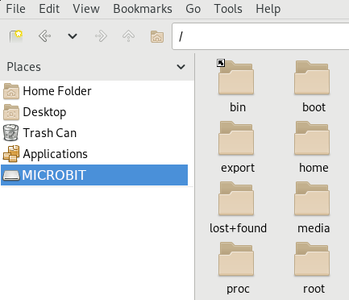
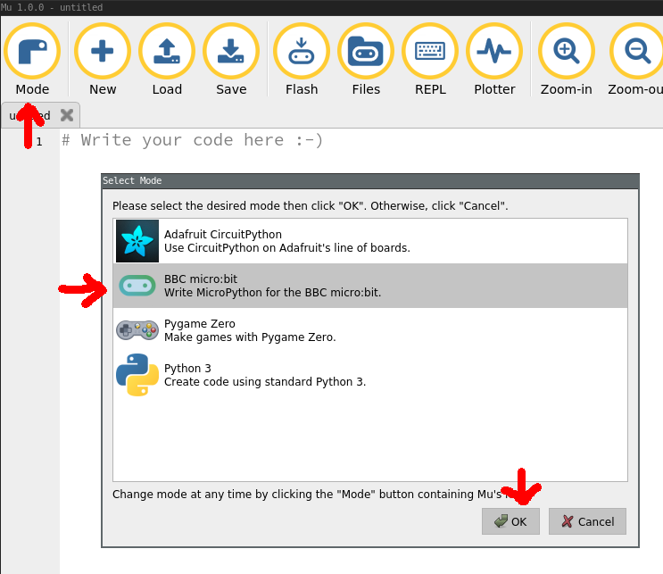

# Introduction

Les `Micro:bit` sont de tout petits ordinateurs embarqués, conçus pour
s’entraîner à programmer. Ils ont beaucoup de composants en plus de leur
processeur : un carré de 5x5 diodes électroluminescentes, un capteur de
mouvement, une boussole 3D, des boutons programmables, une antenne Bluetooth et
un port USB.

En utilisant MicroPython, une version simplifiée de Python, on peut programmer
le `Micro:bit` pour utiliser tous ces composants comme on le souhaite : faire
clignoter les diodes, détecter la vitesse du `Micro:bit`, ou encore faire
communiquer plusieurs `Micro:bit` entre eux.

{width=5cm height=5cm}

Ce TP est libre : nous allons vous présenter différentes choses que l’on peut
faire avec les `Micro:bit`, et vous devrez choisir comment vous souhaitez
programmer le vôtre.

# Coder sur un `Micro:bit`

Pour coder sur votre `Micro:bit`, commencez par le brancher à votre ordinateur.
Vous devriez voir apparaître dans votre explorateur de fichiers un appareil
“MICROBIT”, comme si vous aviez branché une clé USB. Cliquez dessus, et vérifiez
que vous pouvez voir son contenu.

{width=7cm height=7cm}

Une fois que vous avez vérifié que le `Micro:bit` est bien branché, ouvrez
l’éditeur de Python **Mu Editor** (en ligne de commande, tapez `mu-editor`),
puis passez le en mode `Micro:bit`.

{width=7cm height=5cm}

Une fois que tout est en place, nous pouvons écrire le premier programme à
lancer sur notre `Micro:bit`. Pour commencer, nous allons faire un programme
très simple qui affiche sur les diodes le mot “TEST”.

```python
from microbit import *

display.scroll("TEST")
```

Une fois ce code rentré dans l’éditeur, appuyez sur le bouton “Flash”.  Si tout
se passe bien, la diode au dos de votre `Micro:bit` devrait se mettre à
clignoter en jaune. Cela signifie que le programme est en train de se faire
copier ou “flasher” sur la carte mémoire.

Si vous obtenez un message d’erreur, que la diode ne clignote pas en jaune ou
que “TEST” ne s’affiche pas sur votre `Micro:bit`, demandez de l’aide à un
organisateur !

# Utilisation

Dans cette section, nous allons voir quelques fonctions qui nous permettent de
programmer le `Micro:bit`. La liste complète de toutes les fonctions se trouve
ici (en anglais !) :

<https://microbit-micropython.readthedocs.io/>

## Affichage

Nous avons déjà vu la fonction `display.scroll` qui permet d’afficher du texte.

Il est également possible d’afficher des images avec `display.show` :

```python
display.show(Image.HAPPY)  # Affiche un smiley :ɔ
sleep(1000)                # Attend une seconde

display.show(Image.SAD)    # Affiche un smiley :c
sleep(1000)                # Attend une seconde

display.show(Image.HEART)  # Affiche un cœur
sleep(1000)                # Attend une seconde
```

La liste des images déjà définies est présente ici :
<https://microbit-micropython.readthedocs.io/en/latest/tutorials/images.html>

Il est aussi possible d’afficher des images que l’on définit nous-mêmes.  Voici
comment créer des images :

```python
from microbit import *

bateau = Image("05050:"
                "05050:"
                "05050:"
                "99999:"
                "09990")
display.show(bateau)
```

Chaque diode a une valeur de lumière comprise entre 0 (éteint) et 9 (allumée au
maximum). En mettant des nombres quand on définit l’image, on indique dans notre
image à quel point chaque diode doit être lumineuse.

## Boutons

On peut utiliser les fonctions suivantes pour contrôler le bouton A :

- `button_a.is_pressed()` : renvoie `True` seulement si le bouton A est pressé.
- `button_a.was_pressed()` : renvoie `True` seulement si le bouton A a été
  pressé depuis le dernier appel de cette fonction.
- `button_a.get_presses()` : renvoie le nombre d’appuis sur le bouton A depuis
  le dernier appel.

Toutes ces fonctions marchent aussi pour le bouton B en utilisant `button_b`.

Voici un exemple de programme qui affiche un smiley heureux quand on appuie sur
A, et un smiley triste quand on appuie sur B.

```python
from microbit import *

while True:
    if button_a.was_pressed():
        display.show(Image.HAPPY)
    elif button_b.was_pressed():
        display.show(Image.SAD)
```

## Mouvement

Le `Micro:bit` a un accéléromètre qui mesure son mouvement selon trois axes :

- X - inclinaison à droite et à gauche
- Y - inclinaison en avant et en arrière
- Z - déplacement en haut et en bas

Pour récupérer l'inclinaison, on utilise les fonctions :
`accelerometer.get_x()`, `accelerometer.get_y()` et `accelerometer.get_z()`.

Voici un programme qui affiche "D" si le `Micro:bit` est incliné à droite (X est
positif), et "G" si le `Micro:bit` est incliné à gauche (X est négatif) :

```python
from microbit import *

while True:
    x = accelerometer.get_x()
    if x > 0:
        display.show("D")
    elif x < 0:
        display.show("G")
```

Pour vous faciliter la tâche, la fonction `accelerometer.current_gesture()`
permet d'analyser automatiquement le geste qui est appliqué au microbit, parmi :

- `"up"` quand le microbit monte
- `"down"` quand le microbit descend
- `"left"` quand le microbit est incliné à gauche
- `"right"` quand le microbit est incliné à droite
- `"face up"` quand le microbit est tourné vers le haut
- `"face down"` quand le microbit est tourné vers le bas
- `"freefall"` quand le microbit est en chute libre
- `"shake"` quand le microbit est secoué
- `"3g"`, `"6g"` et `"8g"` quand le microbit est soumis à 3, 6 et 8 fois
  l'accélération de la pesanteur terrestre.

Le programme suivant affiche un smiley content uniquement s'il a la tête vers le
haut, et en colère sinon :

```python
from microbit import *

while True:
    geste = accelerometer.current_gesture()
    if geste == "face up":
        display.show(Image.HAPPY)
    else:
        display.show(Image.ANGRY)
```

## Radio

Vous pouvez utiliser la Radio pour communiquer avec d'autres `Micro:bits`.

Pour cela, il faut l'activer avec `radio.on()`. Ensuite, on peut envoyer un
message avec `radio.send` :

```python
import radio
from microbit import *

radio.on()
radio.send("mon message trop cool")
```

Ensuite, sur un autre `Micro:bit`, on peut recevoir les messages qu'on nous
envoie avec `radio.receive()`. Par exemple, si on veut afficher le message qu'on
a reçu :

```python
import radio
from microbit import *

radio.on()
message = radio.receive()
if message:
    display.scroll(message)
```

Pour ne pas vous marcher sur les pieds, vous pouvez choisir un *canal de
communication* afin que votre message ne soit pas reçu par le mauvais
`Micro:bit`, entre 1 et 255 :

```python
radio.config(channel=42)
```

En faisant cela, vous n'échangerez de messages qu'avec les autres `Micro:bit`
configurés pour écouter sur le canal 42.

# Projet

Pendant ce TP, nous aimerions que vous trouviez une idée de quelque chose que
vous voulez coder sur votre `Micro:bit`. En informatique, il est très important
d’apprendre à *bidouiller* avec ce que l'on a sous la main, pour éveiller sa
créativité et prendre du plaisir à faire ce que l'on a envie.

Vous ne devez pas savoir à l'avance comment faire tout ce que vous souhaiteriez
faire : le but est d'apprendre à chercher des solutions au fil des problèmes que
l'on rencontre.

Attention, pour les projets utilisant la radio, vous devrez travailler à
plusieurs !

## Idées de projets

Pour vous donner un peu d'inspiration si vous n'en trouvez pas, voici une liste
d'idées de choses à faire avec son `Micro:bit`. Certaines sont faciles, d'autres
demanderont un peu plus de recherche !

- Projet **Magic-8** : Lorsque l'on secoue le `Micro:bit`, il affiche une phrase
  au hasard, vous donnant votre bonne fortune.
- Projet **Compas** : Le `Micro:bit` vous indique la direction du Nord.
- Projet **Niveau à bulles** : Le `Micro:bit` devient un niveau à bulles : si
  vous le penchez trop, la bulle bouge du milieu et monte jusqu'au point le plus
  haut.
- Projet **eau digitale** : Le `Micro:bit` affiche de l'eau qui bouge quand on
  change son orientation.
- Projet **Télémoticone** : Le `Micro:bit` vous propose de choisir une émotion
  parmi une liste, puis l'envoie aux autres `Micro:bit` autour de lui qui le
  reçoivent et l'affichent.
- Projet **Tamagochi** : Le `Micro:bit` devient vivant. Donnez-lui à manger pour
  qu'il ne fasse pas de grimace, mais ne le laissez pas tomber de trop haut,
  sinon il se met en colère !
- Projet **Jeu de la vie** : Programmez le Jeu de la vie sur votre `Micro:bit`:
  <https://fr.wikipedia.org/wiki/Jeu_de_la_vie>
- Projet **Labyrinthe** : Programmez un Labyrinthe sur votre `Micro:bit`, et
  utilisez son orientation pour choisir la direction où aller.
- Projet **Space Invaders** : Programmez un Space Invader sur votre `Micro:bit`:
  <https://en.wikipedia.org/wiki/Space_Invaders>

# Aller plus loin

Le `Micro:bit` a de nombreuses autres capacités que nous n'avons pas explorées
dans ce TP. Par exemple, avec un peu plus de matériel, il est possible de le
brancher à des écouteurs pour faire de la musique, le brancher à un moteur pour
programmer une voiture télécommandée, ou même de lui faire faire de la synthèse
vocale !

Voici quelques ressources, si vous souhaitez continuer d'expérimenter chez vous
:

- Le site du `Micro:bit`, où l'on peut trouver des revendeurs qui vendent du
  matériel plus complexe (moteurs, pinces crocodiles, enceintes, capteurs...) :
  <https://microbit.org/>
- Le site de l'éditeur Mu qui contient quelques tutoriels pour apprendre à
  utiliser l'éditeur avec des `Micro:bit` : <https://codewith.mu/>
- La documentation de MicroPython pour `Micro:bit` qui contient énormément de
  tutoriels, d'exemples et de réponses pour programmer sur cet ordinateur :
  <https://microbit-micropython.readthedocs.io>
