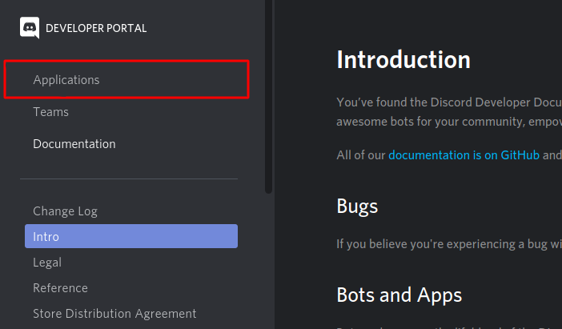
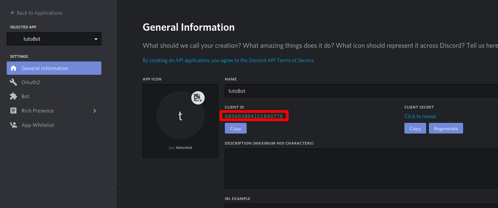
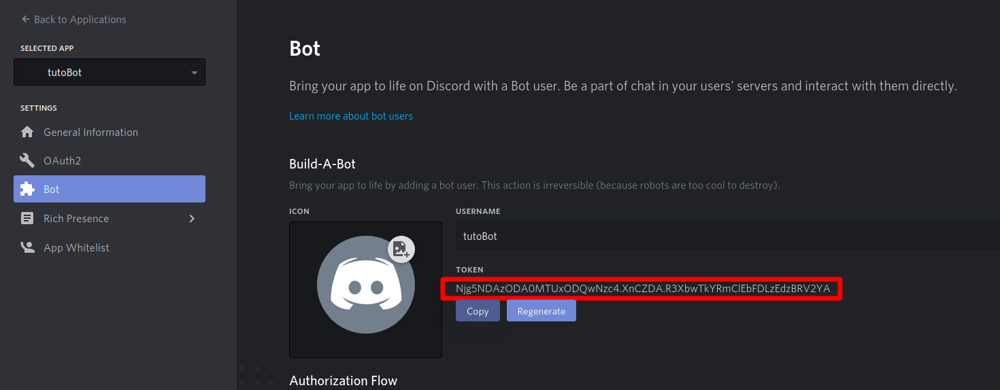
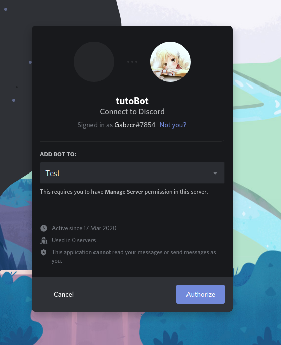
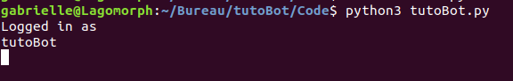
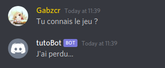
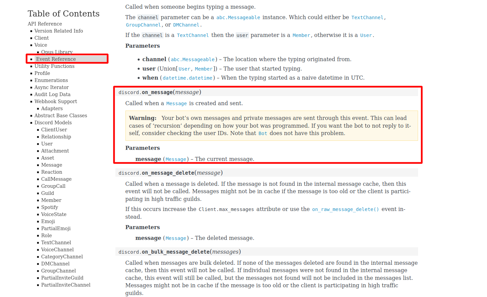
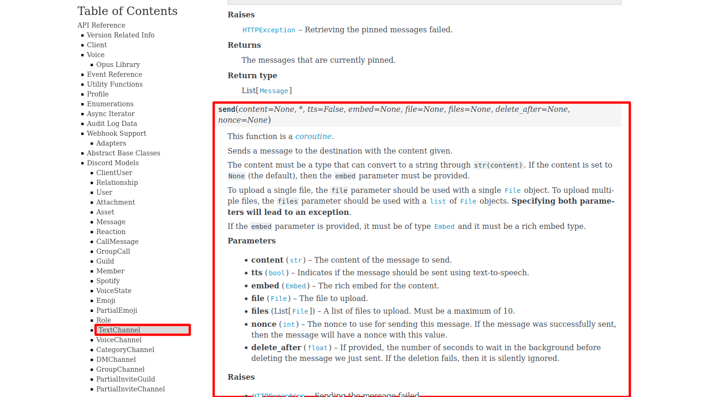

Introduction
============

Dans ce TD, nous allons apprendre pas à pas comment créer un bot pour Discord en python et lui donner quelques premières commandes très simples, par exemple répondre à une commande par un “hello world”.

Création du Bot
===============

Tout d’abord, connectez vous sur le site de gestion des bots discord :
<https://discordapp.com/developers/docs/intro>.

Puis cliquez sur l’onglet `Applications` en haut à gauche.

[comment]: 
<center>

</center>

Si vous ne possédez pas de compte discord, vous devez en créer un car cette action vous demandera de vous authentifier pour vous connecter à votre compte discord. Cliquez sur le bouton `New application` en haut à droite et entrez le nom de votre Bot pour le créer. Vous arrivez sur la page de votre bot, qui contient entre autres son identifiant (`ID`) dont vous aurez besoin pour la suite. Notez le quelque part, il servira !

[comment]: 
<center>

</center>

Cliquez ensuite sur l’onglet Bot à gauche puis sur `Add Bot`. Ici, vous
verrez les informations de votre Bot, dont son pseudo (`username`) et son avatar que vous pourrez modifier selon vos envies, et surtout son token qui **doit toujours rester secret !** (sauf pour vous). Si votre token fuite (sur
internet par exemple), changez le ! Gardez le dans un coin, on va aussi en
avoir besoin pour la prochaine étape. Et ne vous inquiétez pas pour le token de mon bot sur l'image, je l'ai changé après avoir mis ça ici.

[comment]: 
<center>

</center>

Voilà, votre bot est créé. Il faut maintenant lui donner du code à lire et exécuter.

Coder son Bot
=============

Il est temps d’écrire le fichier python qui contiendra votre code.
Créez-en un où vous voulez à l’aide de votre éditeur de texte préféré.
Par défaut, si vous n’en connaissez aucun, vous pouvez utiliser gedit
sous linux. Nommez-le comme vous voulez avec l’extension `.py`, par
exemple `bot.py`, et remplissez le de la manière suivante :

``` python
import discord
import asyncio
from discord.ext import commands
bot = commands.Bot(command_prefix='!', description="ce que vous voulez en description")
#vous pouvez changer la commande '!' en autre chose si vous le souhaitez

@bot.event
async def on_ready():
    print("Logged in as")
    print(bot.user.name)

#ici figureront les commandes et instructions pour votre bot

bot.run("token") #vous devez ici rentrer le token de votre bot, que vous avez trouvé plus haut.
```

Dans l’instruction `bot.run`, vous devez mettre entre guillemets `"` le vrai token de votre bot. Dans tout ce tuto, il figurera en clair sur votre fichier python, mais vous devrez le cacher si vous mettez votre code en ligne un jour
(rappelez-vous, il doit rester secret).

Tester son Bot
==============

Nous en venons à une partie un peu délicate : les tests. Vous allez avoir besoin d’accéder à votre bot via discord pour lui
parler et lui donner les instructions. Nous allons l’inviter dans un
serveur discord créé pour l'occasion. Vous pourrez le
supprimer à la fin des tests si cela vous chante. Ouvrez discord (l'application que vous avez l'habitude d'utiliser) et créez un serveur de test en appuyant sur le `+` dans la barre de gauche en bas de vos serveurs.

Ensuite, dans votre navigateur de recherche (par exemple firefox ou google chrome), tapez le lien suivant en remplaçant \[votre ID\] par l’ID de votre bot, sans guillemet. Normalement, vous avez noté cet ID dans un coin lors de la partie "Création du Bot".

    https://discordapp.com/oauth2/authorize?client_id=[votre ID]&scope=bot&permissions=0

Vous devriez voir apparaître une page comme celle ci.

[comment]: 
<center>

</center>

Sélectionnez le serveur dans lequel vous voulez inviter votre Bot, c'est à dire le serveur Test que nous venons de créer, et cliquez sur le bouton
“Authorize”. Dans quelques instants, vous devriez voir votre Bot
apparaître en tant que membre de ce serveur. Pour l’instant,
il apparaît hors-ligne. C’est tout à fait normal, car nous ne lui avons
pas encore donné de code à exécuter et nous ne l’avons pas lancé. C’est
ce que nous allons faire maintenant.

Exécutez votre fichier python contenant le code du Bot. Par exemple si votre fichier s’appelle `Bot.py`, ouvrez un terminal linux, rendez vous dans le dossier contenant votre fichier et tapez `python3 Bot.py`.

Vous aurez peut-être besoin de faire une étape intermédiaire si vous rencontrez une erreur. Il faut installer des fichiers dont python à besoin pour comprendre votre code. Pour cela, tapez `pip3 install discord.py`.

Si tout se passe correctement, vous devriez obtenir ce résultat :

[comment]: 
<center>

</center>

Le terminal vous affiche `Logged in as ...` car dans le fichier que vous venez de lancer se trouve la commande

``` python
@bot.event
async def on_ready():
    print("Logged in as")
    print(bot.user.name)
```

qui s’exécute au lancement du Bot (et uniquement à ce moment là).

Voilà, votre Bot apparaît désormais en ligne et connecté sur votre
serveur de test. Mais pour l’instant, il ne fait rien. Nous devons lui
donner des instructions.

Une première commande : Hello World
===================================

Dans votre fichier python, à l’endroit où doivent figurer les commandes
et instructions (repérées par un commentaire dans votre fichier si vous
ne l’avez pas effacé), ajoutez le code suivant :

``` python
@bot.command(pass_context=True)
async def bonjour(ctx):
    msg = ctx.message
    await msg.channel.send("hello world")
```

Sauvegardez, et relancez votre bot dans le terminal. Vous devrez d'abord reprendre le contrôle de votre terminal en arrêtant l'exécution précédente du Bot qui tourne en boucle. Pour cela, appuyez deux fois de suite sur `ctrl + C` avant de retaper `python3 Bot.py`.

Une fois votre bot relancé, retournez dans discord et tapez dans votre serveur de test la commande `!bonjour`. Votre Bot devrait vous répondre `hello world` comme ci-dessous.

[comment]: 
<center>

</center>

À vous de jouer !
=================

Laissez moi vous donner quelques explications. Le code que lit un bot discord est dit asynchrone, c’est à dire qu’au lieu de lire votre
code ligne par ligne et de l’exécuter au fur et à mesure comme
d’habitude, le code va s’exécuter en parallèle. Le code asynchrone est
repéré par les mots-clés `async` et `await` à ajouter avant les
fonctions asynchrones. Par exemple, `await message.channel.send`. Les autres
instructions sont exécutées comme vous en avez l’habitude.

De plus, chaque morceau de code asynchrone se déclenchera lorsque
certains événements arriveront. Nous en avons déjà vu deux exemples, l'affichage du `Logged in as ...` qui se déclenche quand vous lancez le bot, et la commande "bonjour" qui se déclenche quand vous tapez `!bonjour` dans
discord.

Il existe plein d'autres évènements. Une catégorie importante d'événements est constituée des commandes : le bot réagit à un mot devant lequel vous mettez un `!` (par exemple). Mais ce ne sont pas les seules. Vous pouvez lui demander de réagir à l’écriture d’un message, à l’ajout d’une réaction par quelqu’un, etc.

Voici un exemple d’instruction qui réagit à un message dans lequel quelqu’un à écrit “le jeu” en disant “J’ai perdu...” :

``` python
@bot.listen()
async def on_message(msg):
    if "le jeu" in msg.content:
        await msg.channel.send("J'ai perdu...")
```

[comment]: 
<center>

</center>

Comme vous pouvez le voir, ici le bot n’attend pas qu’on s’adresse à lui
par une commande, il reste tout le temps à l’écoute et exécute son code
chaque fois qu’un message est posté. Si les conditions sont remplies,
il envoie alors lui-même un message. C’est l’instruction
`on_messsage` qui lui permet de faire ça.

Pour voir les événements disponibles, je vous conseille de vous référer
à la documentation python de discord.py :
<https://discordpy.readthedocs.io/en/latest/api.html>.

Vous y trouverez dans l’onglet `Event reference` une liste exhaustive de
tous les événements pour lesquels vous pouvez demander à votre bot de
faire quelque chose. Par exemple notre `on_message` est là :

[comment]: 
<center>

</center>

La doc renseigne aussi sur les actions que vous pouvez demander
à votre Bot. Par exemple, nous lui avons demandé d’envoyer
des messages dans des salons discord (channels en anglais) grâce à
l’instruction `msg.channel.send`. Pour plus d'information, allez voir les onglets correspondants. Ici, c'est dans l’onglet `TextChannel` que vous trouverez les explications pour l'instruction `send` qui envoie un message dans un salon.

[comment]: 
<center>

</center>

Détaillons un peu le fonctionnement de cette instruction en particulier. Lorsqu'on écrit `msg.channel.send`, on manipule l'objet `msg`, le message qui a été envoyé par quelqu'un. Puis on récupère le salon dans lequel ce message a été envoyé `msg.channel`. Enfin, dans ce salon là, on demande au Bot d'envoyer un message `.send`.

On dit alors que l'on fait de la programmation “orientée objet”, car l’on ne fait que manipuler des “objets” (ici le message `msg` ou encore son salon `msg.channel`) et leurs attributs. Les attributs sont repérés par des “.” et peuvent être des fonctions, des chaînes de caractères, d'autres objets etc. qui sont liés à l'objet. Cette façon de programmer peut surprendre
un peu et est assez particulière, ce tuto n’a pas pour but de vous faire
un cours sur les objets python, qui mériteraient de traiter le sujet à part, mais de vous donner quelques pistes pour les utiliser sans
forcément bien les comprendre.

Bon Courage !
=============

Lire la doc (en Anglais) et la comprendre peut paraître difficile,
surtout lorsque l’on n’est pas familier avec la programmation orientée
objet. N’hésitez pas à tester des choses par vous même et à demander
autour de vous comment faire tel ou tel truc. Bonne programmation !
