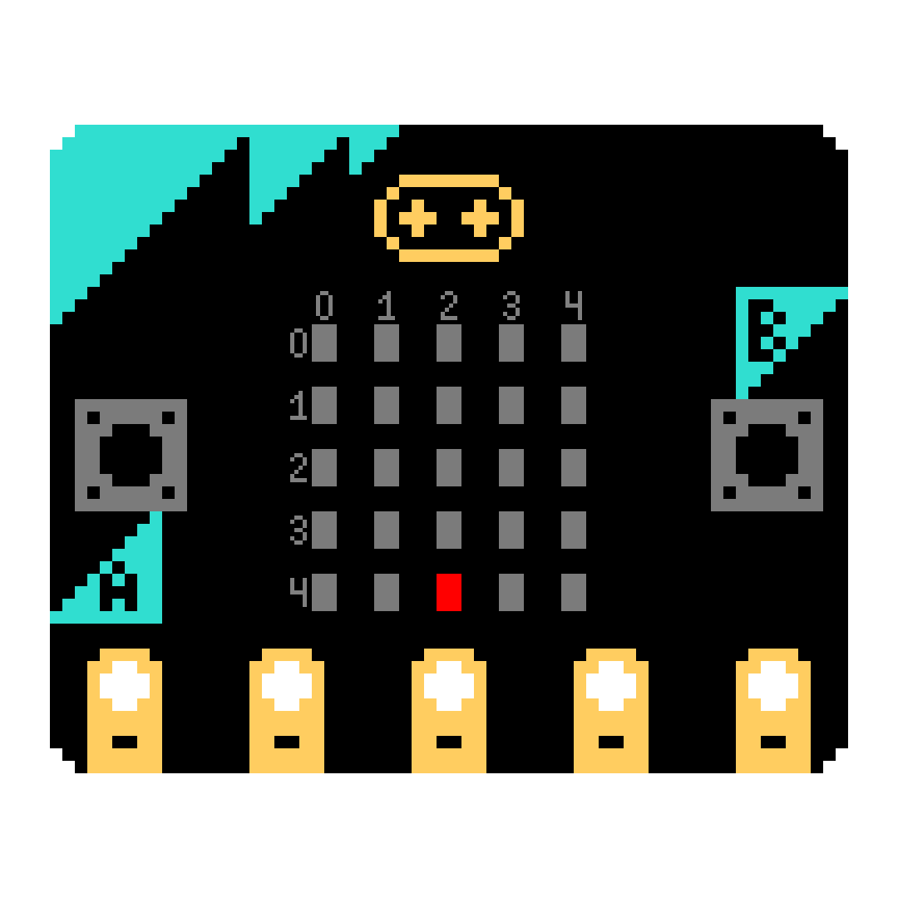

# Jeu du Panier


Maintenant que vous avez appris à utiliser des **micro:bit**, il est temps de passer aux choses sérieuses avec un petit projet. Ne vous inquiétez pas, ce TP est très guidé.


Le but de ce projet est de faire un **jeu du panier** :


{width=5cm}


## Principe du jeu

Le principe général est de ramasser des pommes qui tombent du ciel à l'aide d'un panier.

{width=5cm}

### Le panier

Le panier se trouve sur le sol. Il peut se déplacer sur tout l'axe horizontal (axe X), mais pas sur l'axe vertical (axe Y). Il sert à ramasser les pommes qui tombent du ciel.

### Les pommes

Les pommes tombent une par une du ciel, depuis une position aléatoire. Il faut réussir à en attraper le plus possible pendant la partie.


### Fin de la partie

La partie se finit lorsqu'une pomme touche le sol. Dans ce cas nous afficherons le score du joueur.


## Partie I : Le panier

*Attention pensez à bien importer la bibliothèque **microbit** avant de commencer.*
```python
from microbit import *
```

Dans cette partie nous allons simplement nous occuper du panier. Le panier fait 1 pixel de large.
Pour ce faire, commençons par créer une variable `posPanier` qui sera la position du panier en X. Au début de la partie, le panier sera au milieu de l'écran, soit en position 2 (image ci-dessous). 


{width=5cm}


Maintenant que cette variable est créée, nous allons vouloir déplacer notre panier. 

Pour cela, tant que le joueur n'a pas perdu, on laissera le joueur faire bouger le panier. Vous pouvez utiliser une variable booléenne pour cela.

{width=5cm}


### Rappel :  
Une variable booléenne représente deux valeurs : `True` ou `False`.
Les valeurs `True` et `False` représentent respectivement les états `Vrai` et `Faux`.
Nous sommes à l'état `Vrai` lorsque l'affirmation que l'on teste est vérifiée. 
```python
# on teste l'égalité 1 = 1 
>>> 1 == 1
# ce test nous renvoie le mot clé `True` donc l'affirmation 1=1 est vraie
True
```
Une variable booléenne peut stocker le résultat de ce test ou simplement être initialisée à `True` ou `False`.
```python
# on initialise notre variable avec le résultat de notre test
>>> v_bool = 1==1
>>> print(v_bool)
True
# on définit maintenant notre variable avec la valeur `False`
>>> v_bool = False
>>> print(v_bool)
False
``` 
Une variable booléenne peut donc être utilisée dans une condition ou comme condition d'arrêt d'une boucle. 
Pour une utilisation dans une boucle, il faudra penser à actualiser la valeur de notre variable à l'intérieur de notre boucle. 

```python
# on définit notre variable booléen à `True` à l'état initial.
v_bool = True

if vBool:
    # si la variable est à vrai alors le programme évalue 
    # les expressions à l'intérieur de la condition
    print("Condition réalisée") 

# on initialise la variable `en_cours` à `True` 
en_cours = True   
x = 0

while en_cours: 
    # tant que la variable reste à `True`, on évalue les 
    # expressions dans la boucle 
   
     # si x est égale à 5  
    if x == 5:
        # alors on met la variable `en_cours` à `False`
        en_cours = False
        # `en_cours` étant à `False` on sort de la boucle 
   
     # sinon on ajoute 1 à x
    else:
          x = x + 1
        
print(x)
# Vous pouvez constater qu'à la fin de cette boucle 
# la variable x a une nouvelle valeur : 5
```


Dès que le panier change de position il faut afficher sa nouvelle position sur l'écran. Ensuite il faut recalculer la position du panier.

Afin de vous faciliter le travail, nous vous conseillons d'utiliser une variable qui contiendra la position du panier. Ainsi vous pourrez plus facilement déterminer la nouvelle position du panier en fonction des boutons pressés. 

### Attention : 
Il faut faire en sorte que le panier ne sorte pas de l'écran, sinon cela causera une erreur.
Pour cela, n'oubliez pas de vérifier, à l'aide de conditions, les cas suivants : 
* si la panier dépasse vers la droite, que faire ?
* si la panier dépasse vers la gauche, que faire ?

Avant de passer à la partie suivante, assurez-vous d'avoir un panier pouvant bouger à droite et à gauche sur toute la ligne grâce aux boutons.

## Partie II : Les pommes

Cette partie va comprendre l'ajout des pommes.

Dans un premier temps, voici comment créer un nombre aléatoire en python : 
```python
# importer la librairie aléatoire :
from random import *

# générer un nombre entier `a` entre 0 et 4 inclus :
a = randint(0, 4)
```

La variable `a` peut ici contenir la valeur `0`, `1`, `2`, `3`, ou `4`.


Pour créer la pomme nous allons utiliser un `tuple`. Un tuple est couple de valeurs.
Le tuple peut être vu comme une boite avec deux valeurs à l'intérieur.
L'utilisation d'un tuple va donc nous permettre de conserver la position des pommes, la position horizontale en x et la position verticale en y, dans une variable qui sera notre boite. 
*En cas de besoin n'hésitez pas à demander de l'aide aux organisateurs qui sont là pour vous aider*
```python
# ici la variable a est un tuple contenant les nombres 1 et 2.
>>> a = (1, 2)
>>> print(a)
(1, 2)
# pour changer les valeurs d'un tuple, il faut le réassigner :
>>> a = (3, 4)
>>> print (a)
(3, 4)
```

Vous pouvez maintenant faire apparaître une pomme de manière aléatoire et changer son emplacement. À chaque tour, la pomme doit descendre sur l'axe vertical.

{width=5cm}


Vous pouvez utiliser la fonction `sleep(time)` pour attendre entre chaque tour. Nous vous conseillons de mettre la valeur `time` dans une variable et de la définir au début de votre code.

Si la position de la pomme est sur la dernière ligne, la plus basse, il faut alors gérer les deux cas suivants : 
- la position est la même que celle de la pomme alors le joueur a réussi, et il faut faire apparaître une nouvelle pomme sur l'écran.
- sinon, c'est que le joueur a perdu.


### Compter les pommes
Par ailleurs, il est nécessaire de compter le nombre de pommes attrapées au cours de la partie. 

Pour faire cela vous pourrez utiliser une variable, vous servant de compteur. 

À l’aide de ce compteur, vous pourrez compter le nombre de pommes qui ont été attrapées et afficher ce score.

Ce compteur est initialisé à 0 et s’incrémente de 1 à chaque fois qu’une pomme touche le panier.

Attention, il ne faut pas comptabiliser une pomme si celle-ci tombe à côté du panier.

Avant de passer à la partie suivante, veillez à vérifier ces différents points : 
* toujours pouvoir bouger le panier dans les deux directions.
* avoir toujours au moins une pomme qui tombe sur votre écran.
* pouvoir attraper la pomme avec le panier.
* avoir un score qui compte le nombre de pommes attrappées.

## Partie III : Fin de partie

Quand le joueur a perdu, il faut sortir de la boucle. Pour ce faire, il suffit de passer notre condition de boucle à `False`.

Une fois sorti de la boucle, vous devrez afficher un message pour indiquer au joueur que ce dernier a perdu.

Pour finir cette partie, vérifiez que si l'on n'attrape pas la pomme, la partie se termine bien et affiche le score.

## Partie IV : Améliorations

Une fois le jeu fini, vous pouvez ajouter plusieurs améliorations. Notez que chaque amélioration est réalisable indépendamment des autres. 

### Accélération de la chute des pommes!

Pour rendre la partie plus difficile et amusante, vous pouvez faire augmenter la vitesse de chute des pommes au cours du temps. 
*Il faut tout de même s'assurer que le jeu reste faisable, en posant par exemple une limite de vitesse de chute.*

## Rejouer et meilleur score

Cette partie a pour objectif d'améliorer votre jeu qui est déjà fonctionnel. Pour cette partie vous aurez besoin de faire appel à un nouveau type d'implémentation : les fonctions. 

---
### Les fonctions
En programmation, les fonctions sont très similaires aux fonctions mathématiques. En général les fonctions prennent un ou plusieurs arguments en paramètre, et retournent un résultat. 

Plus simplement, vous pouvez voir une fonction comme une recette de cuisine. 
Tout d'abord si vous voulez créer une nouvelle recette de cuisine, il vous faut trouver le nom de notre recette, lister les ingrédients nécessaires et ensuite écrire les étapes de préparations à suivre. 
Pour écrire une nouvelle fonction, vous pouvez suivre le même fonctionnement. Trouver le nom de votre fonction, lister les paramètres nécessaire et écrire ce que fais votre fonction. 

Cette première étape s'appelle la définition d'une fonction. Pour cela nous utilisons le mot clé ```def``` suivi du nom de notre fonction puis des arguments que l'on souhaite utiliser entre parenthèses. Attention à ne pas oublier les 2 points après la parenthèse fermante. 
*Notez qu'il est possible de définir des fonctions sans paramètres.*

```python
def nom_fonction(parametre1, parametre2):
```
Une fois que nous avons choisi le nom de notre fonction et déterminé le nombre d'arguments néscessaires, nous pouvons définir le comportement de notre fonction. 

#### Exemple : 
Essayons de faire une fonction qui effectue la somme de ses deux arguments. 
```python
def somme(nbr1, nbr2): # Ici nous avons déclaré le nom de notre 
                       # fonction et ses arguments 
                      
    return nbr1 + nbr2 # Le mot clef return permet de renvoyer 
                      # le résultat de l'addition
```
La fonction `somme` renvoie donc le résultat de la somme des deux nombres passés en paramètre. 

Maintenant que nous avons défini notre fonction `somme`, nous allons pouvoir l'utiliser. Pour ce faire rien de plus simple, il suffit d'appeler le nom de notre fonction avec les 2 nombres que nous voulons additionner en paramètre. 

```python
somme(2, 4)
```
Vous remarquerez que l'appel de notre fonction ne fais rien. C'est normal car ce que nous ne faisons rien du résultat de notre fonction. Plusieurs possibilités s’offrent à nous, nous pouvons afficher le résultat, le stocker dans une variable...
```python
print(somme(2, 3))
# résultat affiché dans la console : 5

resultat = somme(2, 3)
print(resultat)
# résultat affiché dans la console : 5
```

*Pro tips : Attention l'ordre dans lequel vous renseignez vos arguments peut avoir un impact sur le résultat.*


---
Maintenant que nous en avons terminé avec cette partie de cours, passons à l'application directe pour notre jeu. 

Une fois que le joueur a perdu, vous pouvez lui proposer de rejouer une partie. Pour cela, vous pouvez utiliser les connaissances que vous avez déjà, notamment les boucles, mais vous pouvez aussi utiliser des fonctions. 

Ainsi, le joueur pourra relancer une partie en cliquant sur un bouton, ou arrêter le jeu en cliquant sur un autre. 
L'intérêt de relancer une partie sans relancer tout le programme est que l'on peut conserver les données des parties précédentes, comme le **meilleur score**.

Ainsi, à la fin d'une partie, en plus du score réalisé, vous pourrez afficher le meilleur score réalisé jusque-là.

L'idée est d'utiliser une première fonction pour retourner le résultat d'une partie et ensuite d'utiliser une seconde fonction pour traiter le résultat et gérer les autres fonctionnalités de notre jeu.

Avant de finir ce projet, vérifiez d'avoir bien implémenté ces différents éléments : 
* augmentation de la vitesse 
* meilleur score
* pouvoir jouer normalement 
* relancer la partie


# FIN
Bravo vous voilà arrivée à la fin de ce projet !
Vous avez maintenant un code qui fonctionne. Si vous avez des idées d’amélioration, essayez de les mettre en place par vous même !