## Introduction aux images matricielles
Une image matricielle est une image représentée sous forme de matrice de points de couleurs (pixels). 


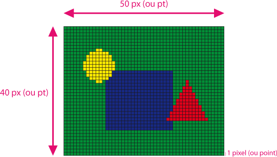


Dans ce TP, nous utiliserons la représentation Rouge Vert Bleu (RVB ou RGB en anglais) pour donner une large palette de couleurs aux pixels de nos images. 
Une couleur est representée sous la forme d'un triplet (R, V, B) où chaque valeur est comprise entre 0 et 255.

## Introduction à la bibliothèque PIL (Python Imaging Library)

Une bibliothèque est une collection de fonctions externes que tu peux importer pour les utiliser dans ton propre code.

En écrivant :``from PIL import Image`` nous importons le module Image de la bibliothèque PIL.

PIL sert au traitement d'image. Elle va nous permettre d'appliquer nos filtres et manipuler les images.

Cette bibliothèque n'étant pas disponible de base sur ``mu-editor``, il est nécessaire de l'installer.

Voici la démarche à suivre :

#### 1 - Aller dans les paramètres

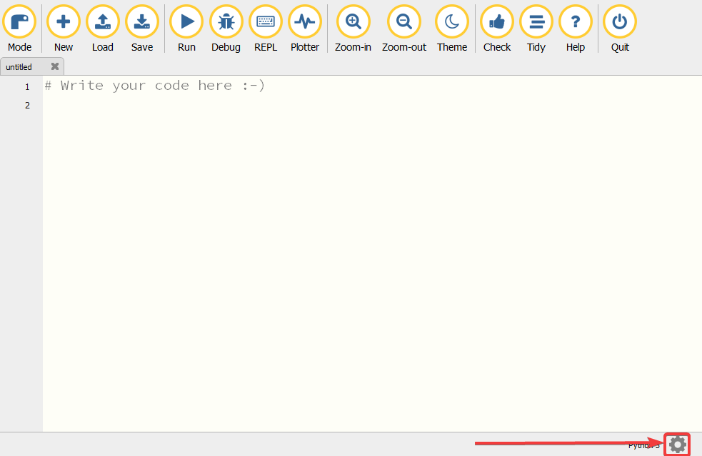


#### 2 - Cliquer sur l'onglet "Third Party Packages"
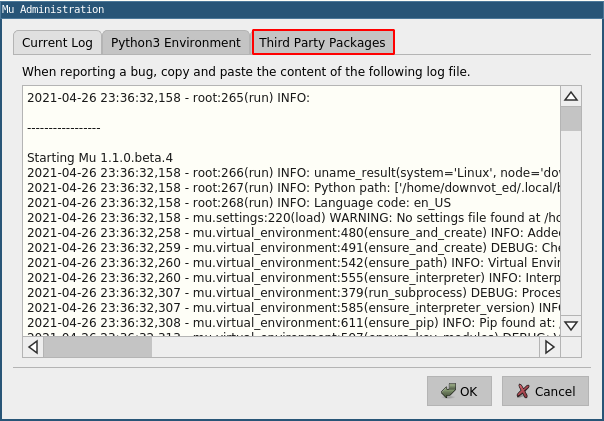


#### 3 - Écrire "Pillow" puis valider


Et voilà! La blibliothèque est installée. Maintenant intéressons-nous à son fonctionnement.


### Utiliser la blibliothèque PIL

PIL est une bibliothèque assez large. Pour vous aider, voici une compilation d'instructions intéressantes que vous utiliserez durant ce TP.

```Python
Mon_image = Image.open("cat.png") # Ouvrir une image depuis ton ordinateur.
Nouvelle_image = Image.new(mode = "RGB", size = (1920, 1080)) # Créer une nouvelle image RGB de largeur 1920 pixels et de hauteur 1080 pixels.
Largeur = Mon_image.width # Obtenir la largeur d'une image.
Hauteur = Mon_image.height # Obtenir la hauteur d'une image.
Matrice = Mon_image.load() # Obtenir la matrice de pixels d'une image. Un pixel est une valeur RGB.
(Rouge, Vert, Bleu) = Matrice[0, 0] # Obtenir la composante RVB/RGB du pixel à la position (0, 0).
Matrice[0, 0] = (255, 255, 255) # Changer la couleur du pixel à la position (0, 0)
```

Maintenant, au travail !


## Les filtres

Le principe d'un filtre est de modifier la valeur des pixels d'une image pour appliquer un effet (noir et blanc, flou etc...).

Tout au long de ce TP nous travaillerons avec cette image de référence :


### Exercice 1 : Faire appliquer un filtre

Pour appliquer tous les filtres de cette première partie, nous allons construire la fonction ``ApplyFilter``.
Cette fonction prend en paramètre une image et une autre fonction.

Voici un exemple d'un passage de fonction en paramètre :

Imaginons que nous avons un nombre ``x`` et que nous souhaitons lui associer différentes valeurs.

```Python
def AppliquerFonction(x, fonction):
	return fonction(x)

def FonctionCarre(x):
	return x*x

def MaFonction(x):
	return 5*x + 1

AppliquerFonction(3, FonctionCarre) # Résultat : 9
AppliquerFonction(3, MaFonction)    # Résultat : 16
```

**But : Écrire la fonction ``ApplyFilter(image, filter)`` qui applique le filtre donné en paramètre sur l'image. ``filter`` est une fonction qui prend une couleur et en retourne une nouvelle. Ce filtre sera donc à appliquer sur tous les pixels d'une image. La fonction doit retourner une nouvelle image.**

### Exercice 2 : Filtre de niveau de gris

Le niveau de gris est défini par la relation suivante : 
``Résultat = 0.2126 * Rouge + 0.7152 * Vert + 0.0722 * Bleu``


**But : Écrire la fonction ``Grayscale(color)`` qui applique un filtre de niveau de gris sur une couleur. La fonction doit retourner la nouvelle couleur.**

Résultat souhaité pour ``ApplyFilter(Grayscale, ref_image).save("Grayscale.jpg")``:


### Exercice 3 : Filtre cyan

**But : Écrire la fonction ``Cyan(color)`` qui applique un filtre cyan sur une couleur. La fonction doit retourner la nouvelle couleur.**

*__Conseil__: S'intéresser au fonctionnement de la synthèse additive : https://fr.wikipedia.org/wiki/Synth%C3%A8se_additive*

Résultat souhaité :


### Exercice 4 : Filtre négatif

Le négatif d'une couleur est donné par les relations suivantes:

- Nouveau Rouge = 255 - Rouge
- Nouveau Vert = 255 - Vert
- Nouveau Bleu = 255 - Bleu

**But : Écrire la fonction ``Negative(color)`` qui applique un filtre négatif sur une couleur. La fonction doit retourner la nouvelle couleur.**

Résultat souhaité :
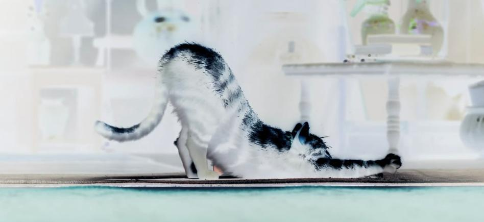


## Manipulation d'image

### Exercice 5 : Symétrie horizontale

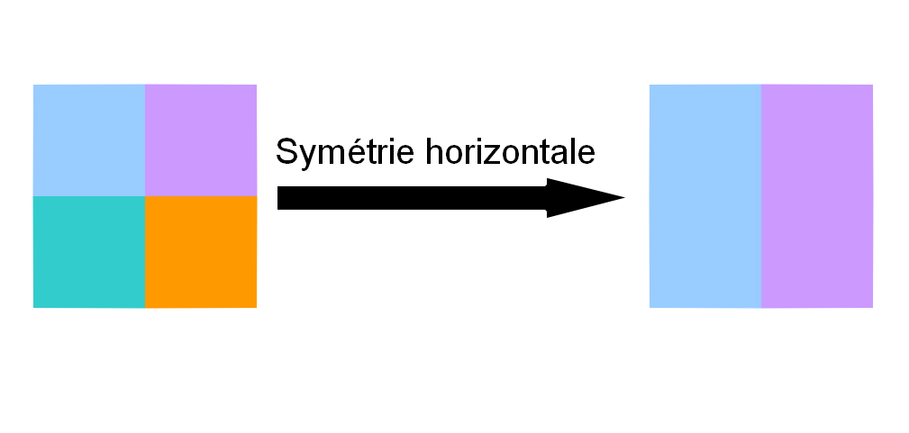

**But : Écrire la fonction ``SymmetryX(image)`` qui applique une symétrie horizontale sur une image. La fonction doit retourner une nouvelle image.**

Résultat souhaité :
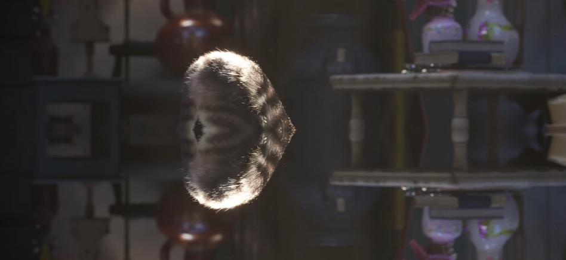

### Exercice 6 : Symétrie verticale

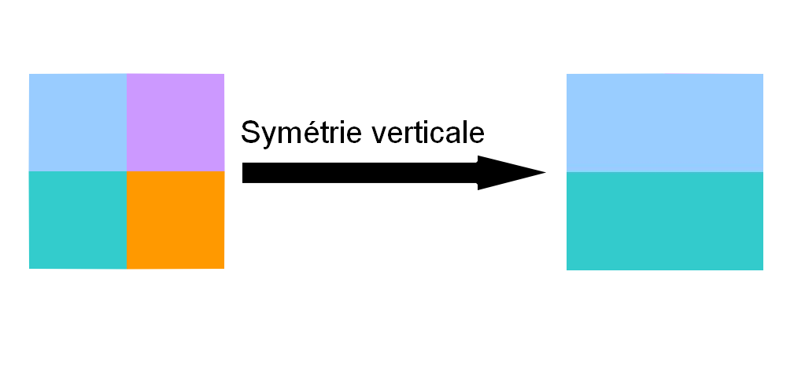

**But : Écrire la fonction ``SymmetryY(image)`` qui applique une symétrie verticale sur une image. La fonction doit retourner une nouvelle image.**

Résultat souhaité :


### Exercice 7 : Rotation

**But : Écrire la fonction ``RotateN(image, n)`` qui applique N fois une rotation droite (90 degres) sur une image. La fonction doit retourner une nouvelle image.**

Résultat souhaité pour n = 2 :


Résultat souhaité pour n = 9 :


### Exercice 8 : Pourcentage de différence

Démarche pour calculer le pourcentage de différence entre deux images :

**(r1, g1, b1)** sont les valeurs correspondant aux couleurs de la première image.
**(r2, g2, b2) **sont les valeurs correspondant aux couleurs de la deuxième image.
**diff** est la variable à laquelle on affecte la différence entre les deux images pour chaque composante de chaque pixel.

Pour chaque pixel, on calcule la différence de valeur entre **r1** et **r2** ; **g1** et **g2** ; **b1** et **b2** et on affecte tout cela à la variable **diff** de cette manière :

``diff += abs(r1-r2)``

La fonction abs() permet d'obtenir la valeur absolue.

Faire la valeur absolue de ``r1 - r2`` permet d'avoir un résultat positif peu importe si **r1 > r2** ou **r1 < r2**.

*Par exemple : abs(5 - 8) = abs(-3) = 3 et abs(8 - 5) = abs(3) = 3*.

Une fois que les images ont été entièrement parcourues, il ne reste plus qu'à calculer le pourcentage. Pour cela, nous avons besoin du nombre de composantes R, G, B dans une des images et de la valeur par rapport à laquelle chaque composante est exprimée (255).

**Ceci donne la formule :** 

pourcentage = 100 * ((diff/255) / (width * height * 3))

**But : Écrire la fonction ``Diff(image1, image2)`` qui calcule le pourcentage de différence entre deux images de même dimensions. La fonction doit retourner un entier.**


Exemple : Pour ``Diff(ref_image, noisycat)``, avec ``ref_image`` étant l'image de référence et ``noisy_cat`` l'image ci-dessus contenant du bruit, le resultat doit être de 3%.

### Exercice 9 : Réduction de bruit

**But : Écrire la fonction ``NoiseReduction(image)`` qui applique un filtre median sur l'image. Le filtre median remplace la couleur d'un pixel par la couleur de la valeur médiane des pixels de son voisinage et de lui-meme.**
**Pour des raisons de simplicité appliquez ce filtre sur les pixels dans l'intervalle ([2, largeur - 2], [2, - hauteur - 2]).**
**La fonction doit retourner une nouvelle image. **

**Voisinage d'un pixel :**

Prenons une matrice avec des valeurs aleatoires pour illustrer. Ici nous nous intéressons aux voisins de 250 :

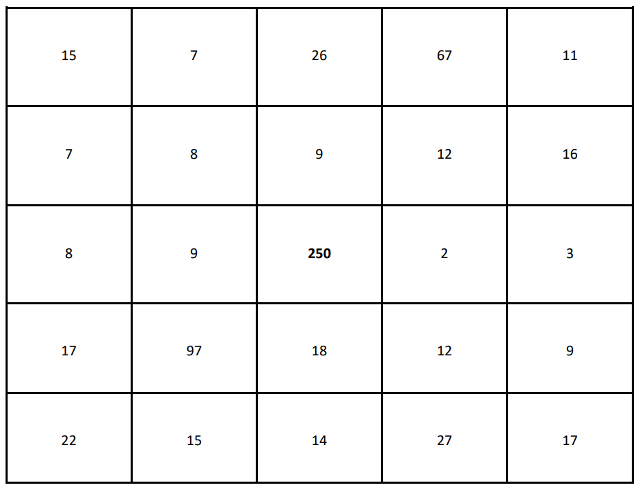

La valeur médiane ici sera de 14 car si l'on trie chaque valeur par ordre croissant on obtient:

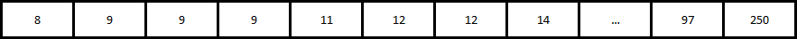

Rappel : La médiane est la la valeur qui sépare une distribution ordonnée en deux groupes de taille égale. Donc pour la retrouver dans notre cas, on trie en ordre croissant les valeurs des pixels intéressants et la médiane correspondra à la valeur au milieu de cette liste (à la position (nombre total d'éléments) / 2)
Nous remplaçons donc **250** par **14**.

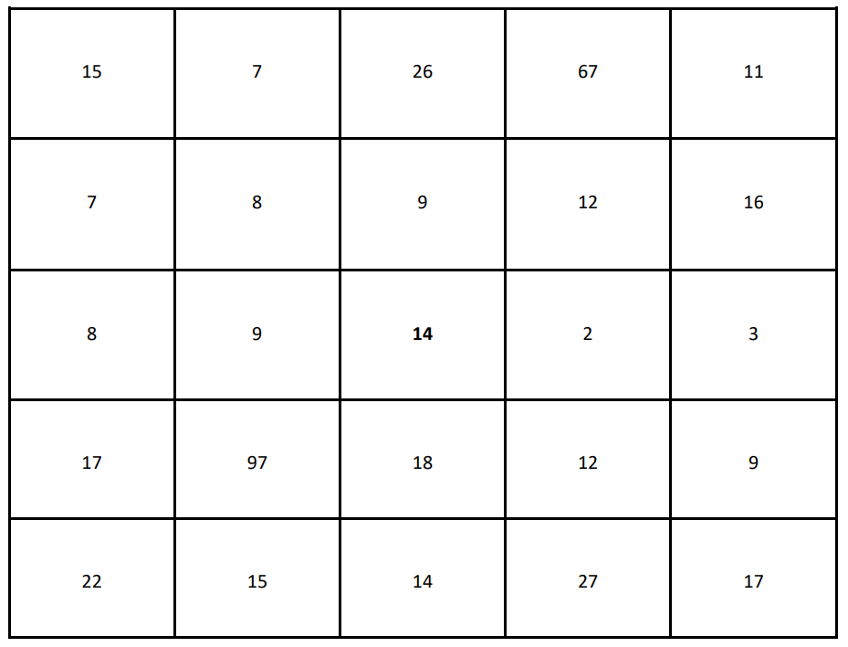


*__Conseil__ : Tu peux utiliser la fonction sort() de python pour trier une liste.*

```Python
ma_liste = [1, 5, 3, 7, 2, 9]
ma_liste.sort()
# ma_liste = [1, 2, 3, 5, 7, 9]
```

Résultat souhaité:
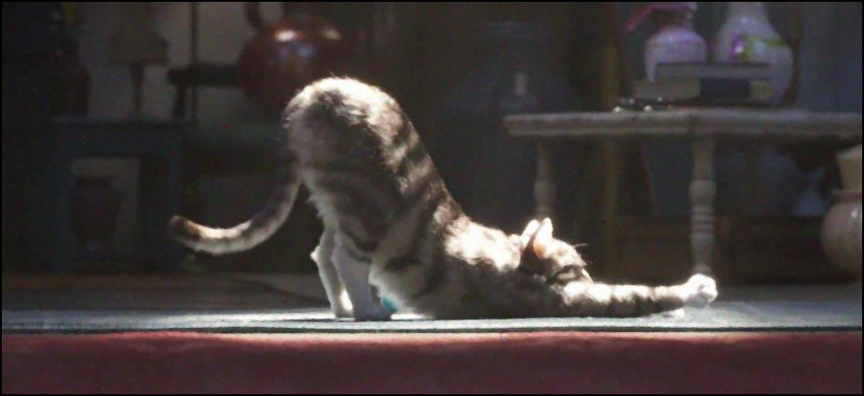

## Conclusion :


**But : Utilisez la fonction ``Diff`` et observez le resultat.**


## Bonus : convolution

### Un peu de théorie tout d'abord...

La convolution consiste à utiliser une matrice sur une image pour appliquer un filtre. Cette matrice est souvent désignée par noyau, matrice de convolution, masque de convolution et d'autres.

> Comment utiliser la matrice de convolution ?

La valeur de chaque pixel va être déterminée par ses pixels voisins. Donc il suffit de "superposer" la matrice sur une partie de l'image, puis de faire la somme pondérée des valeurs des pixels voisins, à l'aide de la matrice. On obtient ainsi la nouvelle valeur du pixel.

Voici des exemples pour illustrer ces explications : 

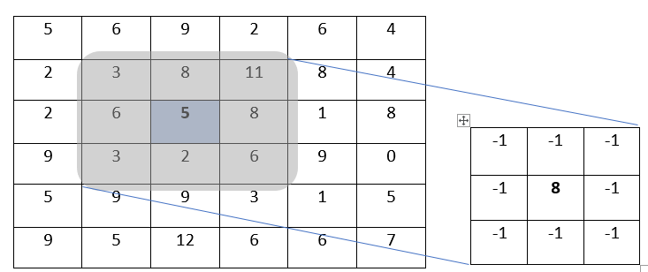

Dans cette illustration, le pixel sélectionné est celui en bleu, de valeur 5. C'est la valeur de ce pixel qui changera en fonction du résultat de la somme pondérée. Les pixels voisins qui seront considérés dans la somme pondérée dépendent de la taille de la matrice, ils sont grisés sur le schéma. Voici comment on effectuerait le calcul:

```
new = (-1)*3 + (-1)*8 + (-1)*11 + (-1)*6 + 8*5 + (-1)*8 + (-1)*3 + (-1)*2 + (-1)*6
new = -7
```

On obtient donc `-7`. Problème : cette valeur n'est pas valide pour un pixel. En effet, il faut qu'elle soit comprise entre 0 et 255. 

Ainsi, dans le cas où la valeur obtenue n'est pas comprise entre 0 et 255, voici la démarche à suivre :
- si `new < 0` alors `new = 0`
- si `new > 255` alors `new = 255`
- si `0 < new < 255` alors new ne change pas

Dans cet exemple, la valeur que prendra le pixel en bleu sera 0.

---

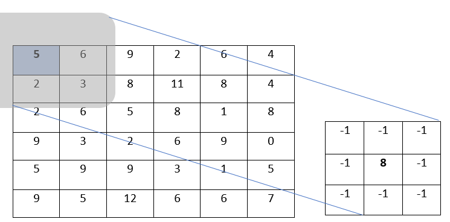

Dans cet exemple, le pixel sélectionné est en bleu également. On remarque cependant qu'il a peu de pixels voisins comparés à l'exemple précédent. Voici comment le calcul de la somme pondérée serait effectué :

```
new = 8*5 + (-1)*6 + (-1)*2 + (-1)*3
new = 29
```

Ainsi, la nouvelle valeur du pixel est 29.

> **Remarque :** Il faut appliquer cette somme pondérée pour chaque composante des pixels (Rouge, Vert, Bleu). 

### À vous de coder !

**But : Écrire la fonction `convolution(m, path, out)` qui applique la convolution et qui prend les paramètres suivants :**
- `m` la matrice que l'on souhaite appliquer sur l'image
- `path` la chaîne de caractères correspondant au nom de l'image que l'on souhaite utiliser, dans le même dossier que le script python
- `out` le nom que l'on désire donner à l'image de sortie (chaîne de caractères)

> **Conseil :** vous pouvez écrire des fonctions supplémentaires vous aidant à vérifier si des coordonnées sont valides ou renvoyant forcément une valeur valide pour un pixel (entre 0 et 255).

Matrices que vous pouvez utiliser :
```py
edge = [[-1, -1, -1],
        [-1, 8, -1], 
        [-1, -1, -1]]

blurr = [[1/9, 1/9, 1/9],
         [1/9, 0, 1/9],
         [1/9, 1/9, 1/9]]

sharp = [[0, -1, 0],
         [-1, 5, -1],
         [0, -1, 0]]
```

Résultat souhaité avec la matrice `edge`:
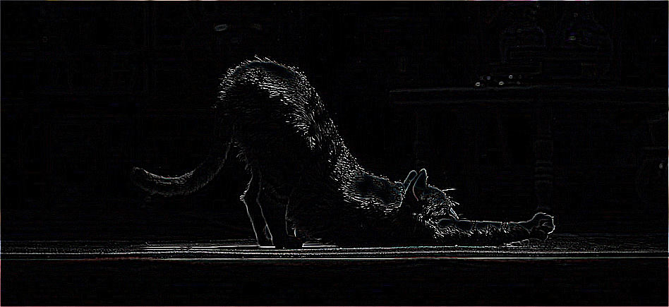

Résultat souhaité avec `blurr`:


Résultat souhaité avec `sharp`:
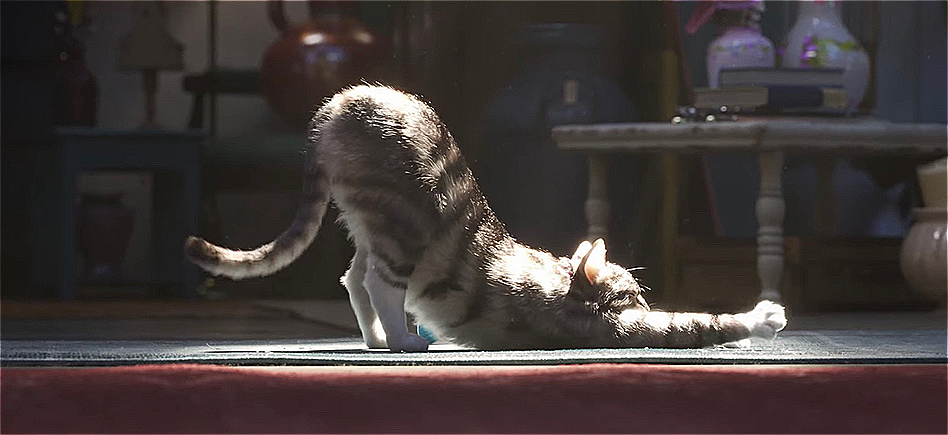