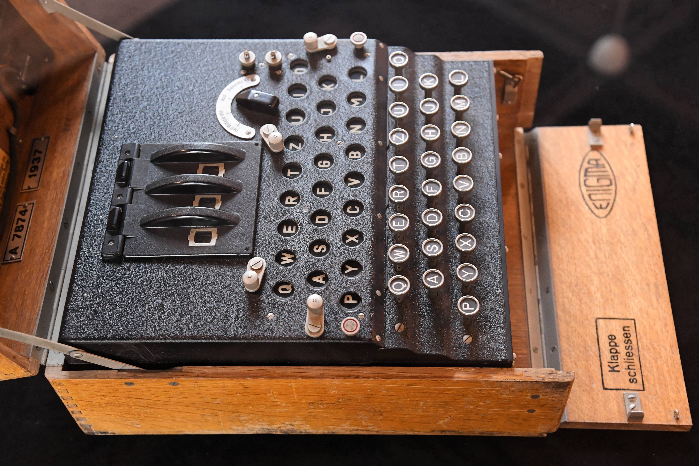

# Le chiffre de César

_Prérequis : la table ASCII, modulo_

### **La table ASCII**

Avant de commencer, nous allons rapidement évoquer une notion qui vous sera utile tout au long de ce TP.

La table ASCII (American Standard Code for Information Interchange), est une norme d'encodage des caractères. C'est une représentation qu'utilisent les ordinateurs pour garder en mémoire des caractères. Par exemple, avec la table ASCII, le **A** correspond à la valeur $65$ et le **a** correspond à $97$. Cela permet de convertir vos lettres en nombres et inversement, ça va s'avérer très pratique dans la suite !

{height=8cm}

## Un peu d'histoire

Ce moyen de chiffrement doit son nom à Jules César, célèbre homme d'état romain. Il aurait utilisé pour certaines de ses communications secrètes, militaires notamment, un chiffrement par substitution.

## Qu'est-ce qu'un chiffrement par substitution ?

Pour faire simple, cette méthode consiste à échanger un caractère par un autre. Dans le cas du chiffrement de César, on remplace une lettre par la lettre trois rangs plus à droite dans l'alphabet comme vous pouvez le voir sur la figure ci-dessous.


Voilà comment cela va se répercuter sur l'alphabet tout entier :

| |Substitution avec un décalage de 3|
|---|---|
|Alphabet|A B C D E F G H I J K L M N O P Q R S T U V W X Y Z|
|Substitution|D E F G H I J K L M N O P Q R S T U V W X Y Z A B C|

On observe donc que A (première lettre de l'alphabet) sera remplacée par D (quatrième lettre de l'alphabet), B par E, C par F, etc. Dès lors que le décalage fait sortir de l'alphabet, on retourne au début, c'est pourquoi X sera remplacé par A, Y par B et Z par C.

Prenons l'exemple de Z, qui est la 26ème lettre de l'alphabet. Si l'on applique un décalage de trois, on a alors : 26 + 3 = 29. C'est plus qu'il n'y a de lettres dans l'alphabet. Pour revenir au début, il n'y a qu'à soustraire le nombre total de lettres dans l'alphabet : 29 - 26 = 3. La troisième lettre de l'alphabet est C, Z est donc remplacé par C.

D'autres exemples:

- Décalage de trois : **Girls Can Code!** devient **Jluov Fdq Frgh!**
- Décalage de dix : **Hello World!** devient **Rovvy Gybvn!**

Voilà donc le principe de base du chiffrement de César.

## Place au code

Pour implémenter le chiffre de César, il va être plus simple de diviser le problème en deux parties. On peut, dans un premier temps, appliquer le chiffrement à une seule lettre, puis ensuite appliquer cela à une chaîne de caractères. Pour l'instant, vous pouvez ne prendre en compte que les lettres majuscules ou minuscules si cela vous aide.

Ainsi, il va falloir implémenter les fonctions `letterCaesar(l, d)` et `textCaesar(s, d)`.

### La fonction `letterCaesar(l, d)`

Cette fonction va se charger d'appliquer le chiffre de César à seulement une lettre, elle va renvoyer un caractère. Elle prend en paramètre `l` qui correspond à la lettre sur laquelle on va appliquer le chiffrement, c'est un caractère. Quant au paramètre `d`, il s'agit du décalage qui va être appliqué, c'est un nombre entier.

**Conseil :** pensez à prendre en compte les espaces et la ponctuation : ils ne doivent pas être modifiés. Vous pouvez également utiliser des modulos si vous savez ce que c'est (en python, cela correspond à `%`).

**Bonus:** essayez de gérer les majuscules et minuscules.

### La fonction `textCaesar(t, d)`

Cette fonction va se charger d'appliquer le chiffre de César sur une chaîne de caractères, elle va renvoyer une chaîne de caractères. Elle prend en paramètre `t` qui correspond à une chaîne de caractères que l'on souhaite chiffrer. Elle prend également un autre paramètre `d` qui correspond au décalage qui doit être appliqué, c'est un nombre entier.

## Quelques fonctions et notions utiles

```py
# L'opérateur + permet, quand il est appliqué à des chaînes de caractères, de concaténer celles-ci. Exemples:

>>> 'Hello' + 'World'
'HelloWorld'
>>> 'O' + 'K'
'OK'


# La fonction len() permet de connaître la longueur d'une chaîne de caractère.

>>> len('Hello World')
11
>>> s = 'ABCD'
>>> len(s)
4


# Les fonctions ord() et chr() permettent de transformer un caractère en son code ASCII et vice-versa.

>>> ord('A')
65
>>> ord('C')
67
>>> chr(65)
'A'


# La méthode upper() permet de tranformer une chaîne de caractères en majuscules.

>>> s = 'hello World'
>>> s.upper()
'HELLO WORLD'
>>> 'a'.upper()
'A'
```

```py
# La méthode isalpha() permet de déterminer si un caractère est une lettre ou non.

>>> c = '!'
>>> c.isalpha()
False
>>> c = 'a'
>>> c.isalpha()
True


# La méthode isupper() permet de savoir si un caractère est une majuscule ou non.

>>> c = 'G'
>>> c.isupper()
True
>>> c = "HELLO"
>>> c.isupper()
True
>>> c = 'g'
>>> c.isupper()
False
```

## Déchiffrer un message

Pour déchiffrer un message il suffit d'utiliser la clé inverse à celle utilisée pour chiffrer. Par exemple:

```py
msg = stringCaesar("Hello World", 10)   # chiffre "Hello World", va donner "Rovvy Gybvn"
stringCaesar(msg, -10)                  # déchiffre msg, va donner "Hello World"
```

Dans un premier temps, testez avec votre code pour observer le résultat obtenu. Puis, adaptez votre code pour prendre en compte les décalages négatifs.

## Casser le chiffre de César

Il existe plusieurs méthodes pour casser le chiffre de César. On peut par exemple faire une analyse fréquentielle qui va compter la proportion de chaque lettre dans le message chiffré et comparer par rapport à la fréquence connue des lettres dans la langue du message. En français, à titre d'exemple, la lettre `e` est la plus fréquente, ainsi la lettre la plus fréquente du message chiffré doit sans doute correspondre à un `e`. Cette méthode est très efficace sur les messages longs, le problème est donc que sur les messages dits courts, elle ne sera pas d'un grande utilité. Ce n'est donc pas celle que vous allez implémenter, mais il est toujours intéressant de savoir qu'une telle méthode existe.

La méthode que vous allez implémenter consiste en du brute force.

**Qu'est-ce que le brute force ?**  Pour faire simple, cela consiste à essayer toutes les combinaisons possibles. Dans notre cas, cela revient à essayer 26 possibilités, puisqu'il y a 26 lettres dans l'alphabet.

Vous allez donc implémenter la fonction `breakCaesar(msg)`. Elle prend en paramètre une chaîne de caractère (chiffrée) et ne renvoie rien. Son but va être d'afficher toutes les possibilités de déchiffrement du message. C'est à dire, à appliquer `charCaesar(c, d)` avec différentes valeurs de décalage. Voici un exemple de ce qu'elle devrait afficher pour `breakCaesar("Rovvy Gybvn")`:

```text
Spwwz Hzcwo
Tqxxa Iadxp
Uryyb Jbeyq
Vszzc Kcfzr
Wtaad Ldgas
Xubbe Mehbt
Yvccf Nficu
Zwddg Ogjdv
Axeeh Phkew
Byffi Qilfx
Czggj Rjmgy
Dahhk Sknhz
Ebiil Tloia
Fcjjm Umpjb
Gdkkn Vnqkc
Hello World     # message déchiffré !
Ifmmp Xpsme
Jgnnq Yqtnf
Khoor Zruog
Lipps Asvph
Mjqqt Btwqi
Nkrru Cuxrj
Olssv Dvysk
Pmttw Ewztl
Qnuux Fxaum
Rovvy Gybvn
```

Vous pouvez tout à fait améliorer l'affichage pour que cela soit davantage lisible !

La fonction `print()` va vous être utile. Elle permet d'afficher ce qu'on lui donne en paramètre (une chaîne de caractère, un nombre, une liste...). Par exemple :

```py
>>> s = "Hello World"
>>> print(s)
Hello World
>>> print("Bonjour !")
Bonjour !
>>> print(42)
42
>>> print() # sans argument, print() affiche uniquement un retour à la ligne

>>>
# N'hésitez pas à essayer de votre côté !
```

### Challenge

Essaye de décrypter ce message chiffré avec le chiffre de César !

```text
YRF FGNTRF TVEYF PNA PBQR! P'RFG GEBC PBBY!
```

# Le chiffre de Vigenère

_Prérequis : avoir fini la partie sur le chiffre de César_

## Un peu d'histoire

Le chiffre de Vigenère est une méthode de chiffrement par substitution imaginée au XVIe siècle par Blaise de Vigenère (ou peut-être pas, mais la méthode a néanmoins le nom de Vigenère). Le général prussien Friedrich Kasiski publie en 1863 une méthode permettant de casser ce chiffre.

## Principe du chiffre de Vigenère

Cette méthode de chiffrement est assez similaire au chiffre de César que vous avez implémenté précedemment. La différence notable est que, pour Vigenère, on applique à chaque lettre du message un décalage différent. Celui-ci dépendant d'une clé donnée au préalable, correspondant à une chaîne de caractères.

De la clé, on en déduit ensuite les décalages successifs à appliquer (on considère que a est la "0e" lettre de l'alphabet). Exemple avec la clé **"clef"** :

- **c** est la 2e lettre de l'alphabet, le décalage correspond ici à 2
- **l** est la 11e lettre de l'alphabet, ici ce sera 11
- **e** est la 4e lettre de l'alphabet, ici ce sera 4
- **f** est la 5e lettre de l'alphabet, ici ce sera 5

Si la clé est plus courte que le message, celle-ci sera répétée autant de fois que nécessaire. Voici un exemple avec la clé **"clef"** :

```text
Message :           Comment est votre blanquette ?
Clé :               clefclefclefclefclefclefclefcl

Message chiffré :   Ezqrgyx gdx xzxwg fqcyuzgexj ?
```

## À vos claviers

Pour implémenter le chiffre de Vigenère, il va être plus simple de diviser le problème en sous-problèmes. Vous aurez également besoin de la fonction `letterCaesar(l, d)` réalisée dans la partie sur le chiffre de César.

### La fonction `keyToOffset(k)`

Cette fonction a pour but de convertir la clé en une liste de décalages. Elle prend en paramètre `k` la clé, qui correspond à une chaîne de caractères. Elle retourne une liste de la longueur de la clé contenant les décalages correspondant à chaque lettre de la clé.

### La fonction `textVigenere(t, k)`

Cette fonction va chiffrer le texte donné à l'aide du chiffre du Vigenère. Elle prend en paramètre `t`, une chaîne de caractères, qui est le message à dissimuler. L'autre paramètre `k`, est aussi une chaîne de caractères et correspond à la clé.

## Annexe

### Sources

- "La cryptographie militaire", Auguste Kerchkhoffs, 1883
- [Wikipedia: Chiffre de Vigenère](https://fr.wikipedia.org/wiki/Chiffre_de_Vigen%C3%A8re)
- [haltode.fr: Chiffre de Vigenère](https://haltode.fr/algo/chiffrement/chiffre_vigenere.html)

\newpage

# La machine Enigma

_Prérequis : maîtrise des classes et de l'opérateur modulo_

## Culture générale

Tu en as peut-être déjà entendu parler, Enigma est une machine de cryptologie mise au point et utilisée par les allemands pendant la seconde guerre mondiale. Après avoir longtemps été considérée comme incassable, le mathématicien Alan Turing, qui est aujourd'hui considéré comme le père de l'informatique moderne, parvint à comprendre son fonctionnement et fut en mesure de décrypter les messages chiffrés avec Enigma.

## Mais comment fonctionne Enigma ?

### 1. Les rotors

La machine Enigma est composée de 3 parties mobiles appelées "rotors" (visibles sur la photo ci-dessous).
Ces rotors associent une lettre de l'alphabet à une autre. Les trois rotors sont connectés les uns aux autres. Imaginons que l'on donne un **A** au premier rotor, celui-ci pourrait par exemple le transformer en **F**. Le second rotor transforme le **F** en **O** et le troisième transforme le **O** en **E**. *Note ici que les rotors n'appliquent pas un chiffre de César, si **A** devient **F** avec le premier rotor, cela ne veut pas dire que **B** deviendra **G**.*

{height=6cm}

En code, on peut représenter un rotor par une chaîne de 26 caractères.

| Alphabet | A B C D E F G H I J K L M N O P Q R S T U V W X Y Z |
|---|---|
| Rotor 1 | E K M F L G D Q V Z N T O W Y H X U S P A I B R C J |

Ici, on peut comprendre que le rotor 1 donnera **E** en sortie pour un **A** en entrée, un **K** pour un **B**, etc.

Dernière chose, afin de changer l'état de la machine et de rendre plus complexe le déchiffrement, les rotors peuvent tourner d'un 26ième de tour. Quand cela se produit, les lettres transformées par le rotor changent. Si l'on tourne d'un cran le rotor 1 défini au dessus, le fil dans le rotor qui reliait **A** à **E** reliera désormais **B** à **F**. De la même manière, le fil qui reliait **B** à **K** reliera désormais **C** à **L**, etc...

Puisque cela serait trop simple de tourner les 3 rotors à chaque fois, les cryptologues allemands ont mis au point le système suivant : pour chaque lettre tapée, le rotor 1 tourne d'un cran. Le rotor 2 tourne lui d'un cran quand le rotor 1 a fait un tour complet (c'est-à-dire toutes les 26 lettres tapées), et le rotor 3 tourne d'un cran à chaque tour complet du rotor 2 (toutes les 676 lettres tapées).

### 2. Le réflecteur

Après avoir fait passer la lettre dans les 3 rotors, on la passe dans une pièce appelée le *réflecteur*. Le réflecteur est une partie similaire à un rotor, car il associe une lettre à une autre, mais reste fixe sans tourner. Enfin, on fini par renvoyer la lettre dans les rotors en sens inverse, et le tour est joué !

### 3. Le tableau de permutations

Comme si cela n'était pas déjà assez compliqué, on rajoute une couche avec le **tableau de permutations**. Le fonctionnement de celui-ci est très simple. Il s'agit simplement de brancher des lettres 2 par 2 pour échanger leur place (on peut échanger comme cela jusqu'à 10 paires de lettres). On branche ce tableau avant le système de rotor. Par exemple, si l'on échange les lettres **A** et **O**, alors chaque **A** tapé par l'opérateur de la machine deviendra un **O** pour le système des rotors, et chaque **A** "renvoyé" par ce dernier sera un **O** pour l'opérateur (et vice-versa, le **O** devient un **A**).

{height=6cm}

Vous pouvez aussi visualiser le fonctionnement d'Enigma sur ce site : <https://observablehq.com/@tmcw/enigma-machine>

### 4. Et pour décoder un message ?

Tu viens d'apprendre le fonctionnement général de la machine Enigma, mais une question persiste : avec un système aussi complexe, comment fait-on pour déchiffrer un message chiffré avec une machine Enigma ? La réponse est sûrement plus simple qu'il n'y paraît : il suffit de taper le message chiffré sur une machine Enigma qui a les mêmes paramètres initiaux que pour chiffrer le message ! En effet, prenons le message "GirlsCanCode" et imaginons que tous les rotors soient sur le cran 0 au début du message. Taper **G** sur la machine donnera une lettre différente, peut-être un **V**. Mais de la même manière, si l'on avait tapé **V**, on aurait obtenu **G**, car le chemin de la lettre dans la machine est le même, seulement il est parcouru à l'envers.

## Exercices

À ton tour de créer ton propre programme Enigma !

Afin d'implémenter notre propre machine Enigma, nous utiliserons une classe qui nous sera utile pour sauvegarder l'état actuel des rotors.

Voici le squelette du code:

```py
class Enigma:
    def __init__(self, r1, r2, r3, ref):
        """
        Initialise la machine avec les rotors et le réflecteur donnés
        Appelé par Enigma(...)
        r1 : rotor1
        r2 : rotor2
        r3 : rotor3
        ref : reflecteur
        """
        self.r1 = r1
        self.r2 = r2
        self.r3 = r3
        self.ref = ref

        # on initialise le décalage des rotors à 0
        self.x1 = 0
        self.x2 = 0
        self.x3 = 0

    def reset_rotors(self):
        # on réinitialise le décalage des rotors à 0
        self.x1 = 0
        self.x2 = 0
        self.x3 = 0

    def encode_letter(self, letter):
        pass # À toi de jouer !


    def encode_message(self, msg):
        pass # À toi de jouer !

# Exemples

# On déclare notre variable Enigma (avec les rotors définis ci-dessous)
# État initial : tous les décalages à 0
>>> en = Enigma(rotor_I, rotor_II, rotor_III, reflector_A)

>>> en.encode('A')
'N'
# État interne des rotors après opération : x1 = 1, x2 = 0, x3 = 0
```

Voici également deux simples fonctions permettant de trouver l'indice d'une lettre dans l'alphabet (en partant de `0`), et vice-versa :

```py
def letter_to_number(letter):
    """
    Donne la position d'une lettre dans l'alphabet
    """
    letter = letter.upper() # on transforme la lettre en majuscule
    return ord(letter) - ord('A')

def number_to_letter(number):
    """
    Donne la lettre majuscule correspondante au nombre donné
    """
    return chr(number + ord('A'))

# Exemples
>>> letter_to_number('A')
0
>>> letter_to_number('z')
25


>>> number_to_letter(0)
A
>>> number_to_letter(23)
X
```

Enfin, voici des rotors et réflecteurs qui ont réellement été utilisés pendant la seconde guerre mondiale :

```py
rotor_I = "EKMFLGDQVZNTOWYHXUSPAIBRCJ"
rotor_II = "AJDKSIRUXBLHWTMCQGZNPYFVOE"
rotor_III = "BDFHJLCPRTXVZNYEIWGAKMUSQO"

reflector_A = "EJMZALYXVBWFCRQUONTSPIKHGD"
reflector_B = "YRUHQSLDPXNGOKMIEBFZCWVJAT"
```

---

### Partie 1 : `encode_letter`

Dans cette méthode de la classe Enigma, tu dois chiffrer la lettre donnée en paramètre.

Entrée :

- `letter`: la lettre à chiffrer

Sortie :

- La lettre chiffrée correspondante

**ATTENTION**: après avoir trouvé la lettre, il ne faut pas oublier de **modifier la position des rotors**.

### Partie 2 : `encode_message`

Dans cette méthode, il te faut encoder tout un message avec le programme Enigma !

Entrée :

- `msg`: le message à chiffrer

Sortie :

- Le message chiffré

N'oublie pas que tu peux utiliser la méthode `encode_letter` dans `encode_message`.
Fais attention aux caractères spéciaux dans ton message, les chiffres, espaces et caractères de ponctuation ne peuvent pas être chiffrés par Enigma.

Une fois implémenté, tu peux tester ton code de la manière suivante :

```py
>>> msg = 'HELLO WORLD'
>>> en.reset_rotors()
>>> coded = en.encode_message(msg)
>>> print(coded)
# message chiffré
>>> en.reset_rotors()
>>> decoded = en.encode_message(coded)
>>> print(decoded)
# 'HELLOWORLD'
```

Si tout fonctionne normalement, le programme devrait afficher la version chiffrée puis déchiffrée de ton message !

### Partie 3 : Bonus

Bien joué !

Pour aller plus loin, tu peux modifier le programme pour ajouter la fonctionnalité du tableau de permutation, qui n'est pas montrée ici.

**Info**: une particularité de la machine Enigma qui a aidé Alan Turing et son équipe pour casser le code est la suivante : Enigma ne donnait jamais de lettre identique à celle donnée en entrée. Saurais-tu expliquer pourquoi ?

\newpage

# XOR / Ou Exclusif

_Prérequis : l'hexadécimal, la table ASCII_

## Quelques rappels : le binaire

Le binaire est un système permettant d'écrire des nombres en utilisant 2 symboles : 0 et 1.

À titre d'exemple, voici comment compter de 0 à 10 en binaire :

| Nombre | Binaire |
|---|---|
| 0 | 0 |
| 1 | 1 |
| 2 | 10 |
| 3 | 11 |
| 4 | 100 |
| 5 | 101 |
| 6 | 110 |
| 7 | 111 |
| 8 | 1000 |
| 9 | 1001 |
| 10 | 1010 |

### L'hexadécimal

L'hexadécimal est un système permettant d'écrire des nombres en utilisant 16 symboles : les chiffres de 0 à 9 (inclus), puis les lettres de A à F (inclus).

À titre d'exemple, voici comment compter de 0 à 20 en hexadécimal :

```text
base 10 : 0 1 2 3 4 5 6 7 8 9 10 11 12 13 14 15 16 17 18 19 20
base 16 : 0 1 2 3 4 5 6 7 8 9  A  B  C  D  E  F 10 11 12 13 14
```

**Remarque :** on utilise le système décimal, en base 10, dans la vie courante. Il utilise donc 10 symboles : les chiffres de 0 à 9.

## Un peu de théorie

Le XOR est un opérateur logique, on l'appelle également le **OU Exclusif** et en anglais **eXclusive OR**. Il est souvent représenté avec le symbole :  "$\oplus$". En Python, on utilisera le caractère `^`.

Table de vérité :

- On définit $A$ et $B$ deux opérandes binaires sur lesquelles on va appliquer XOR.

| $A$ | $B$ | $A \oplus B$ |
|---|---|---|
| 0 | 0 | 0 |
| 0 | 1 | 1 |
| 1 | 0 | 1 |
| 1 | 1 | 0 |

En observant la table de vérité, on peut dire que le XOR peut se définir de la façon suivante :

- Si les deux opérandes sont différentes, alors le résultat est 1
- Si les deux opérandes sont identiques, alors le résultat est 0

## Chiffrer des messages avec XOR

Dans cet exercice, vous allez chiffrer des messages avec XOR. Cet opérateur logique possède en effet des propriétés intéressantes qui vont permettre de chiffrer et déchiffrer un message avec la même clé.

Pour mieux vous faire comprendre le processus, appliquons-le avec un exemple en binaire. Admettons que le message que l'on souhaite chiffrer est `01100101 01110000 01101001` et que la clé est `01110100 01100001 01100001`.

```text
Étape de chiffrement
Message :         01100101 01110000 01101001
Clé :             01110100 01100001 01100001
Message ⊕ Clé =  00010001 00010001 00001000 (Message chiffré)

Étape de déchiffrement
Message chiffré :        00010001 00010001 00001000
Clé :                    01110100 01100001 01100001
Message chiffré ⊕ clé = 01100101 01110000 01101001

On retrouve bien le message initial !
N'hésitez pas à essayer par vous même !
```

Cette explication avait pour but de vous faire comprendre le fonctionnement de XOR et du processus de chiffrement / déchiffrement. Lorsque vous allez coder cette méthode de chiffrement en Python, vous n'aurez pas besoin de passer par du binaire, vous utiliserez de l'hexadécimal.

Maintenant que vous connaissez le XOR, il est temps d'écrire les fonctions !

## Let's code

Pour implémenter cette méthode de chiffrement, il va être plus simple de diviser le problème en plusieurs parties, et donc en plusieurs fonctions. Comme écrit précedemment, pour appliquer le XOR, pas besoin de passer par du binaire, nous allons utiliser de l'hexadécimal. La première fonction va donc transformer du texte en hexadécimal. La deuxième va appliquer XOR sur le message transformé en hexadecimal avec une clé en hexadecimal de la même longueur. Finalement, la troisième va transformer de l'hexadecimal en lettres, texte lisible pour nous !

**Comment obtenir une clé en hexadécimal de la même longueur que le message que l'on souhaite chiffrer ?**

C'est tout simple, une fonction générant des clés en hexadécimal vous est fournie : `randomHexa(lenstr)`. Elle prend en paramètre `lenstr` qui correspond à la longueur du message initial en lettres et renvoie une clé générée aléatoirement. Cette fonction vous sera grandement utile pour effectuer vos tests !

Voici la fonction :

```py
import random  # N'oubliez pas cette ligne !

def randomHexa(lenstr):
    string = ""
    for i in range(lenstr):
        rdm_int = random.randint(0, 255)  # on génère un entier entre 0 et 255
        string += chr(rdm_int)  # on convertit en caractère et on concatène
    res = stringToHexa(string)  # on convertit en hexa pour avoir une clé en hexa
    return res
```

Elle utilise une fonction que vous devez implémenter. En cas de difficulté, n'hésitez pas à demander de l'aide :)

Exemple d'application :

```py
>>> s = "Hey !"
>>> randomHexa(len(s))
02d5ff5087
```

Ainsi, il va falloir implémenter les fonctions `stringToHexa(s)`, `msgXor(m, key)` et `hexaToString(hexa)`.

### La fonction `stringToHexa(s)`

Cette fonction va se charger de transformer une chaîne de caractères formée de lettres en une chaîne de caractères en hexadécimal. Elle prend en paramètre `s`, une chaîne de caractères.

Pour convertir une chaîne de caractères en hexadécimal. Il va falloir le faire lettre par lettre et appliquer quelques transformations à chacune des lettres :

- Calculer la valeur de la lettre dans la table ASCII (nombre entier)
- Convertir la valeur ASCII en sa représentation hexadécimale (chaîne de caractères)
- Adapter le résultat de l'étape précédente pour qu'il soit de longueur 2 (ajouter des 0 si besoin) et qu'il ne contienne que de l'hexadecimal (sans "0x", voir la fonction `hex()`expliquée plus bas)

**Quelques fonctions utiles !**

```py
# Les fonctions ord() et chr() permettent de transformer un caractère en son code ASCII et vice-versa.

>>> ord('A')
65
>>> ord('C')
67
>>> chr(65)
'A'

# La fonction hex() permet de convertir un nombre entier en base 10 en un nombre en base 16 (hexadecimal). Elle renvoie une chaîne de caractères avec "Ox" devant qui indique que la chaîne de caractères représente de l'hexadécimal.
>>> hex(16)
'0x10'
>>> hex(42)
'0x2a'

# Pour retirer un nombre x de lettres au début d'un mot, on utilise [x:]
>>> s = "moustique"
>>> s[4:]
'tique'

#La fonction zfill() prend en paramètre un nombre entier.
#Elle permet de rajouter des 0 au début d'une chaîne de caractères
#si la longueur de celle-ci est inférieure au paramètre donné à la fonction.
>>>'hello'.zfill(6)
'0hello'
>>> 'hello'.zfill(5) # Si le paramètre est inférieur ou égal à la taille de la chaîne de caractère, il n'y a pas de changement
'hello'
```

### La fonction `msgXor(m, key)`

Cette fonction va se charger d'appliquer XOR entre le message et la clé (soit message ⊕ clé). Elle prend donc en paramètre `m` une chaîne de caractères correspondant au message que l'on désire chiffrer, et **qui a déjà été converti en hexadecimal**. Elle prend également `key` qui est également une chaîne de caractères en hexadecimal et qui est de la même longueur que `m`. `msgXor(m, key)` va renvoyer une chaîne de caractères en hexadecimal.

Pour appliquer XOR, voici les différentes étapes qu'il faudra implémenter :

- Sélectionner chaque caractère des chaînes de caractère 2 par 2
- Les convertir en nombre entier
- Appliquer XOR !

**Quelques fonctions utiles...**

```py
# La fonction int() va convertir un caractère ou une chaîne de caractère en un entier. Dans notre cas, nous allons renseigner deux paramètres : une chaîne de caractères en hexadécimal et la base de notre chaîne de caractères (ici, 16 car on utilise de l'hexadecimal).
>>> int('10', 16)
 16
>>> int('FA', 16)
250

# L'opérateur logique XOR est symbolisé par ^ en Python. Il peut être utilisé avec des nombres entiers.
>>> 42^56
18

# Les fonctions et opérateurs hex(), [x:], zfill(), expliqués plus haut.
```

### La fonction `hexaToString(hexa)`

Cette fonction va se charger de convertir une chaîne de caractères de valeurs hexadécimales, en une chaîne de caractères de lettres, que l'on pourra lire et comprendre. Elle va donc renvoyer une chaîne de caractères. `hexaToString(hexa)` prend en paramètre `hexa`, une chaîne de caractères en hexadécimal.

Les fonctions dont vous aurez besoin pour implémenter votre solution ont déjà été expliquées plus haut. Les étapes ne sont pas données mais vous pouvez les déduire des étapes de `stringToHexa()`.

À vous de jouer !

## Sources

- [Table ASCII](https://computersciencewiki.org/images/3/3d/Ascii_table.png)
- [Infos sur la table ASCII](http://www.table-ascii.com/)
