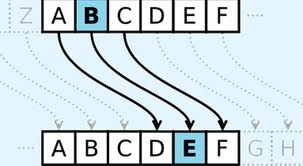

# Le chiffre de César

_Prérequis : la table ASCII, modulo_

### **La table ASCII**

Avant de commencer, nous allons rapidement évoquer une notion qui vous sera utile tout au long de ce TP.

La table ASCII (American Standard Code for Information Interchange), est une norme d'encodage des caractères. C'est une représentation qu'utilisent les ordinateurs pour garder en mémoire des caractères. Par exemple, avec la table ASCII, le **A** correspond à la valeur $65$ et le **a** correspond à $97$. Cela permet de convertir vos lettres en nombres et inversement, ça va s'avérer très pratique dans la suite !

{height=8cm}

## Un peu d'histoire

Ce moyen de chiffrement doit son nom à Jules César, célèbre homme d'état romain. Il aurait utilisé pour certaines de ses communications secrètes, militaires notamment, un chiffrement par substitution.

## Qu'est-ce qu'un chiffrement par substitution ?

Pour faire simple, cette méthode consiste à échanger un caractère par un autre. Dans le cas du chiffrement de César, on remplace une lettre par la lettre trois rangs plus à droite dans l'alphabet comme vous pouvez le voir sur la figure ci-dessous.



Voilà comment cela va se répercuter sur l'alphabet tout entier :

| |Substitution avec un décalage de 3|
|---|---|
|Alphabet|A B C D E F G H I J K L M N O P Q R S T U V W X Y Z|
|Substitution|D E F G H I J K L M N O P Q R S T U V W X Y Z A B C|

On observe donc que A (première lettre de l'alphabet) sera remplacée par D (quatrième lettre de l'alphabet), B par E, C par F, etc. Dès lors que le décalage fait sortir de l'alphabet, on retourne au début, c'est pourquoi X sera remplacé par A, Y par B et Z par C.

Prenons l'exemple de Z, qui est la 26ème lettre de l'alphabet. Si l'on applique un décalage de trois, on a alors : 26 + 3 = 29. C'est plus qu'il n'y a de lettres dans l'alphabet. Pour revenir au début, il n'y a qu'à soustraire le nombre total de lettres dans l'alphabet : 29 - 26 = 3. La troisième lettre de l'alphabet est C, Z est donc remplacé par C.

D'autres exemples:

- Décalage de trois : **Girls Can Code!** devient **Jluov Fdq Frgh!**
- Décalage de dix : **Hello World!** devient **Rovvy Gybvn!**

Voilà donc le principe de base du chiffrement de César.

## Place au code

Pour implémenter le chiffre de César, il va être plus simple de diviser le problème en deux parties. On peut, dans un premier temps, appliquer le chiffrement à une seule lettre, puis ensuite appliquer cela à une chaîne de caractères. Pour l'instant, vous pouvez ne prendre en compte que les lettres majuscules ou minuscules si cela vous aide.

Ainsi, il va falloir implémenter les fonctions `letterCaesar(l, d)` et `textCaesar(s, d)`.

### La fonction `letterCaesar(l, d)`

Cette fonction va se charger d'appliquer le chiffre de César à seulement une lettre, elle va renvoyer un caractère. Elle prend en paramètre `l` qui correspond à la lettre sur laquelle on va appliquer le chiffrement, c'est un caractère. Quant au paramètre `d`, il s'agit du décalage qui va être appliqué, c'est un nombre entier.

**Conseil :** pensez à prendre en compte les espaces et la ponctuation : ils ne doivent pas être modifiés. Vous pouvez également utiliser des modulos si vous savez ce que c'est (en python, cela correspond à `%`).

**Bonus:** essayez de gérer les majuscules et minuscules.

### La fonction `textCaesar(t, d)`

Cette fonction va se charger d'appliquer le chiffre de César sur une chaîne de caractères, elle va renvoyer une chaîne de caractères. Elle prend en paramètre `t` qui correspond à une chaîne de caractères que l'on souhaite chiffrer. Elle prend également un autre paramètre `d` qui correspond au décalage qui doit être appliqué, c'est un nombre entier.

## Quelques fonctions et notions utiles

```py
# L'opérateur + permet, quand il est appliqué à des chaînes de caractères, de concaténer celles-ci. Exemples:

>>> 'Hello' + 'World'
'HelloWorld'
>>> 'O' + 'K'
'OK'


# La fonction len() permet de connaître la longueur d'une chaîne de caractère.

>>> len('Hello World')
11
>>> s = 'ABCD'
>>> len(s)
4


# Les fonctions ord() et chr() permettent de transformer un caractère en son code ASCII et vice-versa.

>>> ord('A')
65
>>> ord('C')
67
>>> chr(65)
'A'


# La méthode upper() permet de tranformer une chaîne de caractères en majuscules.

>>> s = 'hello World'
>>> s.upper()
'HELLO WORLD'
>>> 'a'.upper()
'A'
```

```py
# La méthode isalpha() permet de déterminer si un caractère est une lettre ou non.

>>> c = '!'
>>> c.isalpha()
False
>>> c = 'a'
>>> c.isalpha()
True


# La méthode isupper() permet de savoir si un caractère est une majuscule ou non.

>>> c = 'G'
>>> c.isupper()
True
>>> c = "HELLO"
>>> c.isupper()
True
>>> c = 'g'
>>> c.isupper()
False
```

## Déchiffrer un message

Pour déchiffrer un message il suffit d'utiliser la clé inverse à celle utilisée pour chiffrer. Par exemple:

```py
msg = stringCaesar("Hello World", 10)   # chiffre "Hello World", va donner "Rovvy Gybvn"
stringCaesar(msg, -10)                  # déchiffre msg, va donner "Hello World"
```

Dans un premier temps, testez avec votre code pour observer le résultat obtenu. Puis, adaptez votre code pour prendre en compte les décalages négatifs.

## Casser le chiffre de César

Il existe plusieurs méthodes pour casser le chiffre de César. On peut par exemple faire une analyse fréquentielle qui va compter la proportion de chaque lettre dans le message chiffré et comparer par rapport à la fréquence connue des lettres dans la langue du message. En français, à titre d'exemple, la lettre `e` est la plus fréquente, ainsi la lettre la plus fréquente du message chiffré doit sans doute correspondre à un `e`. Cette méthode est très efficace sur les messages longs, le problème est donc que sur les messages dits courts, elle ne sera pas d'un grande utilité. Ce n'est donc pas celle que vous allez implémenter, mais il est toujours intéressant de savoir qu'une telle méthode existe.

La méthode que vous allez implémenter consiste en du brute force.

**Qu'est-ce que le brute force ?**  Pour faire simple, cela consiste à essayer toutes les combinaisons possibles. Dans notre cas, cela revient à essayer 26 possibilités, puisqu'il y a 26 lettres dans l'alphabet.

Vous allez donc implémenter la fonction `breakCaesar(msg)`. Elle prend en paramètre une chaîne de caractère (chiffrée) et ne renvoie rien. Son but va être d'afficher toutes les possibilités de déchiffrement du message. C'est à dire, à appliquer `charCaesar(c, d)` avec différentes valeurs de décalage. Voici un exemple de ce qu'elle devrait afficher pour `breakCaesar("Rovvy Gybvn")`:

```text
Spwwz Hzcwo
Tqxxa Iadxp
Uryyb Jbeyq
Vszzc Kcfzr
Wtaad Ldgas
Xubbe Mehbt
Yvccf Nficu
Zwddg Ogjdv
Axeeh Phkew
Byffi Qilfx
Czggj Rjmgy
Dahhk Sknhz
Ebiil Tloia
Fcjjm Umpjb
Gdkkn Vnqkc
Hello World     # message déchiffré !
Ifmmp Xpsme
Jgnnq Yqtnf
Khoor Zruog
Lipps Asvph
Mjqqt Btwqi
Nkrru Cuxrj
Olssv Dvysk
Pmttw Ewztl
Qnuux Fxaum
Rovvy Gybvn
```

Vous pouvez tout à fait améliorer l'affichage pour que cela soit davantage lisible !

La fonction `print()` va vous être utile. Elle permet d'afficher ce qu'on lui donne en paramètre (une chaîne de caractère, un nombre, une liste...). Par exemple :

```py
>>> s = "Hello World"
>>> print(s)
Hello World
>>> print("Bonjour !")
Bonjour !
>>> print(42)
42
>>> print() # sans argument, print() affiche uniquement un retour à la ligne

>>>
# N'hésitez pas à essayer de votre côté !
```

### Challenge

Essaye de décrypter ce message chiffré avec le chiffre de César !

```text
YRF FGNTRF TVEYF PNA PBQR! P'RFG GEBC PBBY!
```

# Le chiffre de Vigenère

_Prérequis : avoir fini la partie sur le chiffre de César_

## Un peu d'histoire

Le chiffre de Vigenère est une méthode de chiffrement par substitution imaginée au XVIe siècle par Blaise de Vigenère (ou peut-être pas, mais la méthode a néanmoins le nom de Vigenère). Le général prussien Friedrich Kasiski publie en 1863 une méthode permettant de casser ce chiffre.

## Principe du chiffre de Vigenère

Cette méthode de chiffrement est assez similaire au chiffre de César que vous avez implémenté précedemment. La différence notable est que, pour Vigenère, on applique à chaque lettre du message un décalage différent. Celui-ci dépendant d'une clé donnée au préalable, correspondant à une chaîne de caractères.

De la clé, on en déduit ensuite les décalages successifs à appliquer (on considère que a est la "0e" lettre de l'alphabet). Exemple avec la clé **"clef"** :

- **c** est la 2e lettre de l'alphabet, le décalage correspond ici à 2
- **l** est la 11e lettre de l'alphabet, ici ce sera 11
- **e** est la 4e lettre de l'alphabet, ici ce sera 4
- **f** est la 5e lettre de l'alphabet, ici ce sera 5

Si la clé est plus courte que le message, celle-ci sera répétée autant de fois que nécessaire. Voici un exemple avec la clé **"clef"** :

```text
Message :           Comment est votre blanquette ?
Clé :               clefclefclefclefclefclefclefcl

Message chiffré :   Ezqrgyx gdx xzxwg fqcyuzgexj ?
```

## À vos claviers

Pour implémenter le chiffre de Vigenère, il va être plus simple de diviser le problème en sous-problèmes. Vous aurez également besoin de la fonction `letterCaesar(l, d)` réalisée dans la partie sur le chiffre de César.

### La fonction `keyToOffset(k)`

Cette fonction a pour but de convertir la clé en une liste de décalages. Elle prend en paramètre `k` la clé, qui correspond à une chaîne de caractères. Elle retourne une liste de la longueur de la clé contenant les décalages correspondant à chaque lettre de la clé.

### La fonction `textVigenere(t, k)`

Cette fonction va chiffrer le texte donné à l'aide du chiffre du Vigenère. Elle prend en paramètre `t`, une chaîne de caractères, qui est le message à dissimuler. L'autre paramètre `k`, est aussi une chaîne de caractères et correspond à la clé.

## Annexe

### Sources

- "La cryptographie militaire", Auguste Kerchkhoffs, 1883
- [Wikipedia: Chiffre de Vigenère](https://fr.wikipedia.org/wiki/Chiffre_de_Vigen%C3%A8re)
- [haltode.fr: Chiffre de Vigenère](https://haltode.fr/algo/chiffrement/chiffre_vigenere.html)


