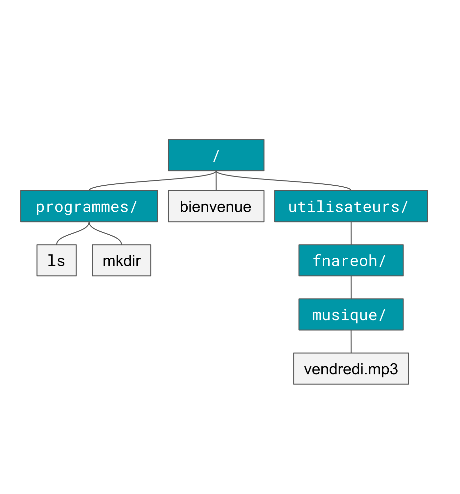

# Introduction

Lorsque vous utilisez un ordinateur, vous faites appel à des programmes qui vous
permettent de faire des actions pour vous: déplacer/créer des fichiers, afficher
une page web ...

Chacun de ces programmes donne des ordres au matériel:

- Afficher une fenêtre
- Vous demander quoi faire
- Afficher le résultat dans la même fenêtre

Sauf que, vous le découvrirez surement par vous-même, une fenêtre ce n'est pas
facile à faire: il faut décider où les placer, comment les afficher... Souvent,
demander quoi faire à l'utilisateur devient plus compliqué que le but initial du
programme.

Heureusement, il existe une alternative plus simple à programmer: au lieu de
communiquer avec des fenêtres, on échangera par messages texte avec nos
programmes !

# Le système de fichiers

Au début de l'informatique, pour stocker leurs programmes ou documents textes
favoris, les premiers utilisateurs ne disposaient que d'une grande liste de
fichiers. Assez rapidement, il a été rendu possible de regrouper des fichiers
dans des dossiers, qui peuvent eux-mêmes en contenir d'autres, ce qui permet
d'éviter d'avoir une gigantesque liste sous les yeux.

Le nom des dossiers se termine parfois par une barre oblique.

{width="7cm" height="7cm"}

Pour désigner un dossier ou un fichier, on utilise un *chemin*. Chaque chemin
part du dossier de plus haut niveau, appelé *racine*.

Par exemple, le chemin de `ls` est `/programmes/ls`. De même, le chemin de
`vendredi.mp3` est `/utilisateurs/fnareoh/musique/vendredi.mp3` On peut aussi
décrire le chemin vers un dossier ou fichier à partir de l'endroit où l'on se
trouve.

Pour pouvoir désigner un dossier plus proche de la racine que le dossier
courrant, on utilise `..` pour parler du dossier du dessus.  Par exemple, on
désignera depuis le dossier `fnareoh` le fichier `mkdir` par le chemin
`../../programmes/mkdir`.  Aussi, depuis le dossier `programmes`, on désignera
la racine, `/`, par `../`.

# Le shell, programme à votre service

Le shell va donc vous demander quoi faire dans une unique fenêtre, via un
message de bienvenue : `[fnareoh@r11p11]`

Dans les exemples de la suite du TP, ce texte sera remplacé par `$`.

Cette ligne signifie que le shell est prêt à exécuter vos ordres. Chacun de vos
ordres sera en fait le nom d'un programme à démarrer, suivi de détails
permettant au programme de savoir quoi faire[^1]. Ce programme pourra à son tour
afficher du texte. Lorsque le programme correspondant à votre ordre termine, le
shell, qui l'a démarré, vous redemande quoi faire.

Une fois que votre ordre est prêt, validez-le avec la touche `entrée`.

# Afficher et se déplacer

Première étape : s'orienter. La commande permet d'afficher le nom du dossier
actuel :

``` {.bash}
$ pwd
/home/fnareoh
```

#### Exercice 1

Entrez la commande `pwd` et observez le résultat.

En fait, `pwd` affiche le chemin vers le dossier actuel, depuis la racine. La
`racine`, c'est le dossier de plus haut niveau, qui contient tous les autres
dossiers et fichiers. Si un chemin ne commence pas par un `/`, c'est un chemin
depuis le dossier actuel.

À propos de dossier actuel, baladons-nous un peu. La commande `cd` permet de
changer de dossier. Seule, la commande `cd` permet de revenir à votre espace
personnel, qui a pour chemin `/home/prénom.nom`. N'hésitez pas à l'utiliser si
vous êtes perdues.

`cd` peut également être utilisé avec un argument, qui est le chemin du dossier
dans lequel aller.

``` {.bash}
$ cd /
$ pwd
/
$ cd /home
$ pwd
/home
```

#### Exercice 2

Entrez la commande `cd /home`, puis la commande `pwd` et observez le résultat.

``` {.bash}
$ cd /home
$ pwd
/home
$ cd shloub
$ pwd
/home/shloub
```

#### Exercice 3

Retournez dans votre dossier personnel.

La commande `ls` permet de lister le contenu d'un dossier.

Par défaut, `ls` liste le contenu du dossier courant. La commande `ls` peut
également être utilisée avec des arguments pour lister le contenu d'autres
dossiers.

``` {.bash}
$ ls /
bin  boot  dev  etc  home  lib  lib64 …
$ ls /home
shloub fnareoh
```

Ces commandes offrent des fonctionnalités proches d'explorateurs de fichiers
graphiques. N'hésitez pas à comparer les résultats si vous le pouvez.

Les commandes comme `ls` peuvent être utilisées avec des arguments, mais
également avec des *options*, qui commencent souvent par `-`. Par exemple,
l'option `-a` permet d'afficher les fichiers cachés. Un fichier caché est un
fichier commençant par un point. Les fichiers nommés `.bash_history` et
`.bashrc` dans l'exemple qui suit sont des fichiers cachés.

``` {.bash}
$ cd
$ ls
afs
$ ls -a
. .. afs .bash_history .bashrc
```

#### Exercice 4

Entrez la commande `ls -a` et observez le résultat.

# Créer et modifier

La commande `mkdir` permet de créer un dossier.

``` {.bash}
$ cd
$ mkdir TP_UNIX
$ ls
afs TP_UNIX
```

#### Exercice 5

Créez un dossier `TP_UNIX` dans votre espace personnel.

Vous pouvez utiliser la commande `gedit` pour lancer un éditeur de texte. Vous
pouvez donner en argument le chemin du fichier à éditer.

``` {.bash}
$ gedit mon_fichier
* un éditeur apparaît *
```

La commande `cat` permet d'afficher le contenu d'un fichier.

``` {.bash}
$ cat mon_fichier
du texte tapé dans gedit !
```

Beaucoup d'autres commandes sont disponibles pour manipuler les fichiers. Par
exemple, `mv` permet de déplacer [^2] des fichiers ou des dossiers.

Le premier argument de `mv` est le chemin actuel du fichier ou dossier à
déplacer.  Son second argument est le nouveau chemin du fichier, **ou** le
chemin du dossier dans lequel le déplacer.

``` {.bash}
$ mv mon_fichier autre_fichier
$ mv autre_fichier TP_UNIX/encore_un_autre
$ mv TP_UNIX/encore_un_autre ./
$ ls
afs encore_un_autre TP_UNIX
```

#### Exercice 6

Renommez un de vos fichiers, puis déplacez-le.

La commande pour renommer un fichier est la même que pour déplacer un fichier,
l'opération étant en fait similaire.

De plus, la commande `cp` permet de dupliquer - **c**o**p**ier - un fichier.

``` {.bash}
$ cat encore_un_autre
du texte tapé dans gedit !
$ cp encore_un_autre heyhey
$ ls
afs encore_un_autre heyhey TP_UNIX
$ cat heyhey
du texte tapé dans gedit !
```

#### Exercice 7

Copiez un de vos fichiers.

La commande `rm` permet de supprimer [^3] un fichier. Attention, soyez prudentes
ou vous risqueriez de perdre des fichiers importants: il n'y a pas de Corbeille
où récupérer les fichiers supprimés.

``` {.bash}
$ ls
afs encore_un_autre heyhey TP_UNIX
$ rm heyhey
$ ls
afs encore_un_autre TP_UNIX
```

#### Exercice 8

Effacez une copie.

# Raccourcis clavier

De nombreux autres raccourcis existent. Par exemple lorsque vous tapez un nom de
fichier ou de commande, la touche `TAB` peut vous aider à compléter la suite. On
appelle cela *l'auto-complétion*. Les touches `UP` et `DOWN` peuvent également
permettre de parcourir l'historique des commandes saisies.

``` {.bash}
$ cat encor[TAB]
$ cat encore_un_autre
```

#### Exercice 9

Parcourez vos anciennes commandes et essayez l'auto-complétion.

# Pour aller plus loin

Si le temps le permet, n'hésitez pas à explorer d'autres commandes, par exemple
grâce à l'équipe qui vous entoure. Quelques idées : `time`, `touch`, `tail`,
`grep`, raccourci `Ctrl + r`.

# Pense-Bête

|  **commande**      |  **fonction**                       | **exemple**                         |
|  ----------------- |  ---------------------------------- | ----------------------------------- |
|  pwd               |  dossier courant                    | pwd                                 |
|  cd                |  changer de dossier                 | cd TP_UNIX                         |
|  ls                |  lister le contenu                  | ls                                  |
|  mkdir             |  créer un répertoire                | mkdir TP_UNIX                      |
|  cat               |  afficher le contenu d'un fichier   | cat test1.txt                       |
|  mv                |  déplacer ou renommer un fichier    | mv resultplusun.txt ../testmv.txt   |
|  cp                |  copier un fichier                  | cp ../testmv.txt resplusun.txt      |
|  rm                |  effacer un fichier                 | rm ../testmv.txt                    |
|  raccourci `TAB`   |  auto-complétion                    | cat resplus`TAB`                    |
|  `HAUT` `BAS`      |  parcourir l'historique             |                                     |

[^1]: On les appelle les arguments

[^2]: **m**o**v**e en anglais

[^3]: **r**e**m**ove, en anglais
