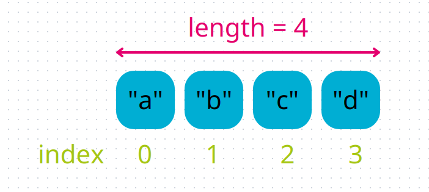
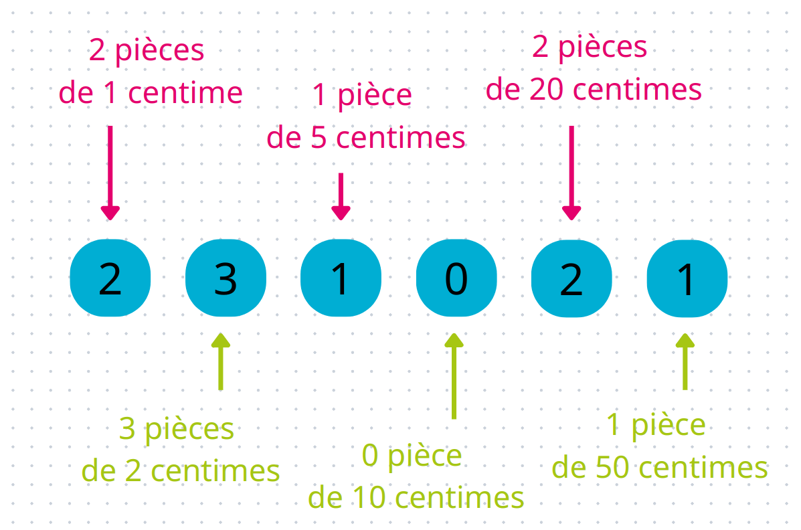

# Introduction aux listes

Tu as pu apprendre grâce au TP précédent à faire ton premier programme, notamment avec l'utilisation de variables.

Nous allons voir dans ce TP d'autres types de valeurs que peut contenir une variable.

En effet, une variable peut contenir toutes sortes de valeurs, tu as déjà vu :
- les entiers : `pommes = 10`
- les chaînes de caractères : `stage = "GCC!"`

Et quelques opérations en utilisant ces variables.

Ici, nous allons parler des **listes**.

Une liste est un type qui permet de stocker **plusieurs éléments**.

Par exemple :
```codepython
ma_liste = [1, 2, 3]
print(ma_liste)
```

La liste dans la variable `ma_liste` est composée de 3 entiers : `1`, `2` et `3`.

On peut accéder directement à un élément d'une liste si on connaît sa position (son index) avec l'opérateur `[]`.

L'index des éléments dans une liste commencent à `0` :
```codepython
alphabet = ["a", "b", "c", "d", "e", "f", "g"]
print(alphabet[0])
print(alphabet[2])
```



{}

Utilise la liste `alphabet` ci-dessus pour écrire "gcc" ! Quels sont les index des lettres à utiliser ?

{}

{}

Il est possible de dire à la fonction `print` d'afficher plusieurs éléments sur la même ligne :

```codepython
print("a", "b", "c", sep="")
```

La fonction `print` peut prendre plusieurs paramètres et va tous les afficher.  
Le dernier paramètre, `sep=""`, est un paramètre nommé de la fonction `print`, il nous permet de définir avec quel séparateur les éléments donnés à `print` seront affichés.

Essaie l'instruction ci-dessous :

```codepython
print("S", "O", "S", sep=".")
```

{}

{}

Attention lorsque tu utilises l'opérateur `[]` sur les listes, à ne pas prendre des index qui dépassent la taille des listes. Python nous dira qu'il y a une erreur, qu'il ne peut pas accéder à cette position.
Essaie avec :

```codepython
trop_court = [5, 6, 7]  # liste de 3 entiers
print(trop_court[5])  # tente d'afficher le 6e élément
```

{}

On peut également modifier les éléments de la liste, si on connaît leur position.
Par exemple:

```codepython
ma_liste = [4, 5, 6, 8]
print(ma_liste)
ma_liste[3] = 7  # On change le 4e élément (index = 3)
print(ma_liste)
```

{}

Pour pouvoir t'acheter des bonbons, tu récoltes des pièces de centimes par-ci, par-là, dans une petite pochette, dont tu connais très bien le contenu : tu as 2 pièces de 1 centime, 3 pièces de 2 centimes, 1 pièce de 5 centimes, 0 pièce de 10 centimes, 2 pièces de 20 centimes et 1 pièce de 50 centimes.

```codepython
pieces = [2, 3, 1, 0, 2, 1]
```



Pour chaque bonne action, tes parents te donnent une pièce.

Aujourd'hui, ton action avait un si grand impact, qu'ils te donnent une pièce de 50 centimes et une pièce de 10 centimes. Rajoute-les dans ta pochette à pièces, en changeant les nombres correspondant directement dans la liste, combien as-tu de pièces de chaque après cet ajout ?

{}

Maintenant qu'on sait comment utiliser simplement une liste, accéder et modifier ses éléments, on va pouvoir faire des opérations dessus, comme ajouter et supprimer des éléments, dans la prochaine section.