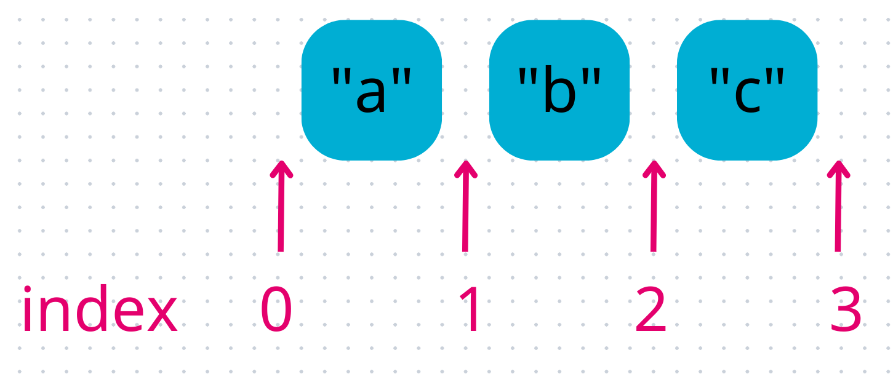

# Opérations sur les listes

Nous avons vu dans la section précédente comment créer une liste avec des valeurs, et y accéder.

Sauf qu'une liste, si elle est fixe, elle nous sert pas à grand chose. Nous on veut pouvoir la modifier, comme ajouter des éléments par exemple !

## Ajout dans une liste

Il existe plusieurs manières d'**ajouter un élément dans une liste**, nous allons commencer avec la méthode `append`.

### Append

{}
Petit aparté sur la différence entre les fonctions et les méthodes.

Vous avez normalement déjà vu les fonctions : elles sont définies avec le mot-clé `def`, peuvent prendre des paramètres, etc.
C'est la même chose pour les méthodes.

La différence principale c'est la manière d'y accéder : une fonction peut être appelée depuis n'importe où avec son nom, alors qu'une méthode peut être appelée uniquement depuis un objet (une variable).

Par exemple :
```codepython
print("Allo")  # `print` est une fonction
L = [1, 2, 3]
print(L)
L.append(10)  # `append` est une méthode
print(L)
```

Pour appeler une méthode, on fait `variable.nom_de_la_methode(parametre)`, avec `variable` à remplacer par le nom de la variable, `nom_de_la_methode` à remplacer par le nom de la méthode et `parametre` à remplacer par les paramètres ou à enlever si la méthode n'a pas besoin de paramètre.
{}


Revenons à notre ajout d'éléments dans une liste, la méthode `append` nous permet d'ajouter un élément **à la fin d'une liste** :

```codepython
alphabet = ["a", "b", "c"]
alphabet.append("d")
print(alphabet)
alphabet.append("e")
print(alphabet)
```

{}

Utilisons la fonction d'ajout pour ajouter des affaires dans une liste `valise` pour partir en voyage.

Tout d'abord, créons une liste `valise` qui contient les chaînes de caractères des affaires qui sont déjà dedans : `"t-shirt"` et `"pantalons"`.

Puis affichons la avec la fonction `print`, pour la montrer à nos parents.

Ils nous font remarquer que nous avons oublier notre `"pyjama"` et nos `"chaussons"`, ajoute-les dans la valise.

Montre leur une nouvelle fois la valise pour être sûre que tout est bon !
{}

{}
Les parents pensent qu'on a encore oublié quelque chose, demande leur quoi et ajoute le dans la valise, puis affiche la !

Tu te rappelles de la fonction `input` du TP précédent ? Utilise-la pour demander quelle affaire tu as bien pu oublier.

Rappel :
```codepython
nom = input("Comment t'appelles-tu ?")
print(nom)
```

{}


Il est également possible de créer une liste vide, donc qui ne possède pas d'éléments, et de lui en ajouter plus tard.

```codepython
ma_liste = []
print(ma_liste)
ma_liste.append("chien")
print(ma_liste)
ma_liste.append("chat")
print(ma_liste)
```

{}

On peut donc créer totalement la valise et la remplir en demandant à ses parents quoi mettre dedans !

Crée une liste `valise` et demande aux parents de rajouter les 5 affaires qu'il faut absolument pour partir en vacances.

Te rappelles-tu comment répéter une action plusieurs fois ? Pour cela, on utilise les boucles. Ici nous voulons répéter une action (demander quelle affaire, puis de l'ajouter dans la valise) 5 fois. On peut donc utiliser une boucle `for`.

Rappel :
```codepython
for i in range(3):
    print("Hello")
```

{}


### Insert

Il existe une 2e méthode pour ajouter un élément dans une liste, la méthode `insert`.

Celle-ci permet d'ajouter un élément à la position (à l'index) qu'on veut dans la liste.

```codepython
ma_liste = ["a", "c", "e"]
ma_liste.insert(1, "b")
print(ma_liste)
ma_liste.insert(3, "d")
print(ma_liste)
ma_liste.insert(5, "f")  # ajoute à la fin de la liste, après le "e"
print(ma_liste)
ma_liste.insert(0, "0")  # ajoute au début de la liste, avant le "a"
print(ma_liste)
```

{}

Comme pour l'accès à un élément dans une liste, lors de l'utilisation d'un index, il faut faire attention que celui-ci ne dépasse pas de la liste.

Pour l'ajout d'un élément, il est possible d'ajouter de la 1ere position, jusqu'à la fin de la liste.
Donc pour une liste de 3 éléments par exemple, on peut insérer à l'index `0`, `1`, `2` et `3`.



{}

{}

L'école est en train de définir l'emploi du temps de la rentrée prochaine.
Pour le lundi, il y aura cours de Mathématiques, Français, Physique.
Mais suite à un changement de professeur d'Informatique, l'école doit également ajouter ce cours le lundi, avant le cours de Physique.

Aide l'école à faire l'emploi du temps de la rentrée, en utilisant la méthode `insert`.
À quelle position doit-on ajouter ce nouveau cours ?

{}