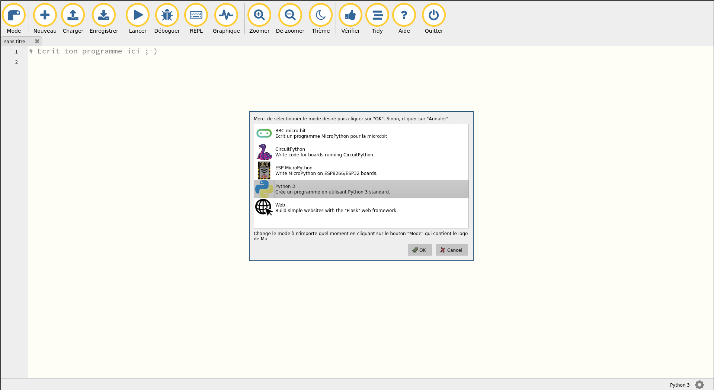
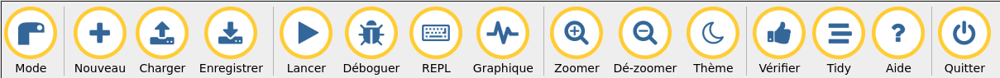
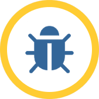
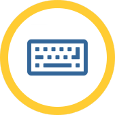
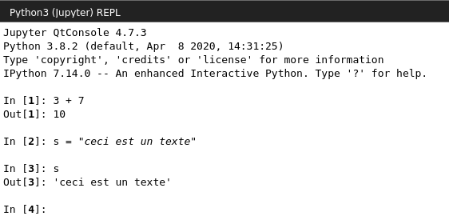

# Comment utiliser Mu Editor ?
Mu est un éditeur de texte pour développer en Python.
Il est complet mais reste minimaliste pour que tout le monde puisse le prendre
en main facilement.

Vous pouvez le télécharger [ici](https://codewith.mu/en/download).

Ce tutoriel présente toutes les fonctionnalités du logiciel, une par une pour
que vous puissez vous y retrouvez facilement !

# Au démarrage

Au démarrage, Mu devrait vous demander dans quel mode vous souhaitez
développer. Vous trouverez une présentation plus détaillée des différents modes
plus bas dans ce tutoriel, mais sachez qu'il est préférable de commencer par
le mode `Python3` le temps de découvrir et bien maîtriser le langage.

Cliquez donc sur `Python3` et validez.

Si vous allez utiliser les microbits, alors choisissez le mode `BBC micro:bit`.

# La barre d'outils

Mu Editor possède une barre remplie d'outils et de fonctionnalités pour vous
permettre de faire à peu près tout ce qui est possible dans un éditeur de code.

### Le bouton 'Mode'

Le bouton `Mode` permet de changer le mode dans lequel sera interprété votre
programme Python.

Il peut être :

* `BBC micro:bit` si vous développez pour les cartes électroniques microbit ;

* `CircuitPython` si vous développez pour des cartes électroniques qui tournent
sur CircuitPython ;

* `ESP MicroPython` si vous développez pour des cartes ESP8266/ESP32 ;

* `Python3` si vous développez simplement un programme sur votre ordinateur
(c'est celui-ci que nous utiliserons le plus souvent !) ;

* `Web` si vous développez un site web à l'aide du cadriciel Flask.

Donc retenez-bien, vous développerez le plus souvent dans le mode Python3, le
temps d'apprendre le langage.

### Le bouton 'Nouveau'

Le bouton `Nouveau` ouvre un nouvel onglet, dans lequel vous pourrez coder un
autre bout de votre projet ou simplement autre chose.
Pensez à enregistrer le travail effectué dans ce nouvel onglet !

### Le bouton 'Charger'

Le bouton `Charger` vous permet d'ouvrir dans un nouvel onglet un fichier
contenant du code Python, déjà présent sur votre ordinateur. Par exemple, quand
vous reprenez un projet pour y ajouter du code.

### Le bouton 'Enregistrer'

Le bouton `Enregistrer` vous permet d'enregistrer votre code (celui contenu dans
l'onglet dans lequel vous codez actuellement) dans un fichier dont vous
choisirez le nom et l'emplacement.
Si votre projet a déjà été enregistré une fois, le bouton `Enregistrer`
sauvegardera simplement les modifications.

Pensez à sauvegarder souvent !

### Le bouton 'Lancer'

Si votre programme n'a pas encore été enregistré, cliquer sur le bouton `Lancer`
vous forcera à enregistrer votre fichier au préalable. Une fois cela fait, Mu
exécutera simplement votre code, et vous pourrez observer le résultat dans la
console qui s'est ouverte en bas de votre écran.

### Le bouton 'Déboguer'

Cette partie arrive bientôt. D'ici là, n'hésitez pas à nous demander !

### Le bouton 'REPL'

Un REPL (à prononcer REPEL) est un interpréteur interactif de Python.
Vous pouvez y entrer du code Python "à la volée" et observer le résultat
rapidement. Cela est pratique si vous souhaitez simplement effectuer des calculs
ou tester quelque chose rapidement.

Attention, dans le REPL, vous ne pouvez pas enregistrer vos résultats !

D'ailleurs, pour les plus curieux, REPL signifie:

* Read / Lire en entrée les commandes Python de l'utilisateur ;

* Evaluate / Evaluer le code lu en entrée ;

* Print / Afficher les résultats obtenus ;

* Loop back / Boucler sur la première étape pour traiter de nouvelles commandes.

Par exemple :

### Le bouton 'Graphique'

Le bouton `Graphique` permet de générer des graphiques grâce à du code Python.
Cela est particulièrement utile quand on fait du traitement de données, ou des
statistiques. Ce n'est pas notre cas et il est rare de s'en servir quand on
débute donc oubliez-le !

### Le bouton 'Zoomer'

Le bouton `Zoomer` permet comme son nom l'indique d'agrandir la taille du texte
dans l'éditeur. Aussi simple que ça !

### Le bouton 'Dé-zoomer'

Le bouton `Dé-zoomer` fait l'inverse du bouton `Zoomer` et permet de diminuer la
taille du texte dans l'éditeur.

### Le bouton 'Thème'

Le bouton `Thème` permet de changer le thème visuel de Mu.

Il en existe trois différents:

* **Lumineux** : l'aspect par défaut du logiciel, texte en noir sur fond blanc ;

* **Sombre** : texte en blanc sur fond noir. On vous conseille d'utiliser celui-ci
car il permet de moins fatiguer (et abimer) vos yeux quand vous passez beaucoup
de temps à coder.

* **Eclipse** : c'est le même que le thème sombre, sauf que la console, le REPL ou
les graphiques sont en thème lumineux.

### Le bouton 'Vérifier'

Le bouton `Vérifier` vous permet de passer une fois sur votre code pour chercher
des erreurs de syntaxe, sans avoir besoin de lancer l'exécution de votre
programme à proprement parler.

Le plus souvent, si vous faites une erreur grossière comme par exemple ajouter
une parenthèse en trop, Mu vous le signalera directement en la surlignant en
rouge.

Il est évident que de toute façon, si vous exécutez votre programme et qu'il
contient des erreurs, Python vous le dira et s'arrêtera pour que vous puissiez
corriger.

### Le bouton 'Tidy'

Le bouton `Tidy` permet d'aligner correctement les indentations dans votre code
mais n'est pas toujours très fonctionnel et a du mal à détecter les erreurs donc
on vous conseille plutôt de faire bien attention quand vous codez !

### Le bouton 'Aide'

Le bouton `Aide` ouvre une page web sur votre navigateur mais n'apporte pas
d'aide pour coder en Python, uniquement pour vous montrer comment mieux utiliser
le logiciel.

Ce document que vous lisez est ici pour remplacer cela étant donné que les
développeurs de Mu Editor n'ont pas prit la peine de développer une page d'aide
pour les francophones.

### Le bouton 'Quitter'

Le bouton `Quitter` ferme directement le logiciel Mu Editor si votre travail a
bien été enregistré, sinon vous demande si vous souhaitez enregistrer avant de
fermer.

# Devrais-je coder toute ma vie sur Mu ?

On ne l'espère pas !

Mu est un logiciel simple qui permet de débuter, mais si vous souhaitez vous
lancer à fond dans la programmation, il existe des éditeurs plus performants qui
vous permettront d'aller plus loin et plus rapidement comme PyCharm, les Jupyter
Notebooks (surtout si vous aimez le principe de REPL), Visual Studio Code
(l'environnement de développement de Microsoft) ou même Vim (pour les plus
fougueu.x.ses d'entre vous) !
