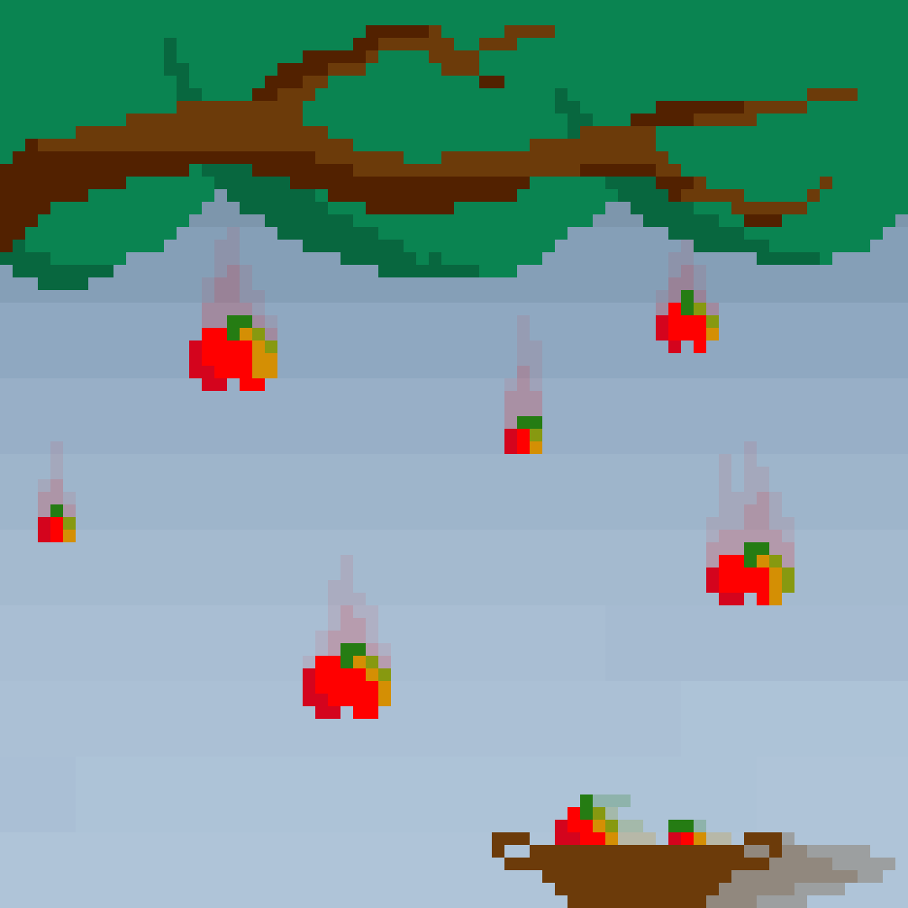

# Jeu du Panier


Maintenant que tu as appris à utiliser des **micro:bit**, il est temps de passer aux choses sérieuses avec un petit projet guidé.


Le but de ce projet est de faire un **jeu du panier** :





## Principe du jeu

Le principe général est de ramasser des pommes qui tombent du ciel à l'aide d'un panier.



### Le panier

Le panier se trouve sur le sol. Il peut se déplacer sur tout l'axe horizontal (axe X), mais pas sur l'axe vertical (axe Y). Il sert à ramasser les pommes qui tombent du ciel.

### Les pommes

Les pommes tombent une par une du ciel, depuis une position aléatoire. Il faut réussir à en attraper le plus possible pendant la partie.

### Fin de la partie

La partie se finit lorsqu'une pomme touche le sol. Dans ce cas, nous afficherons le score du joueur.


## Partie I : Le panier

*Attention, pense à bien importer la bibliothèque **microbit** avant de commencer.*

```python
from microbit import *
```

Dans cette partie, nous allons simplement nous occuper du panier. Le panier fait 1 pixel de large.  
Pour ce faire, commençons par créer une variable `pos_panier` qui sera la position du panier en X. Au début de la partie, le panier sera au milieu de l'écran, soit en position 2 comme sur l'image ci-dessous.




Maintenant que cette variable est créée, nous allons vouloir déplacer notre panier.

Pour cela, tant que le joueur n'a pas perdu, on le laissera faire bouger le panier. Tu peux utiliser une variable booléenne.




### Rappel :

Une variable booléenne représente deux valeurs : `True` ou `False`.  
Les valeurs `True` et `False` représentent respectivement les états `Vrai` et `Faux`.  
Nous sommes à l'état `Vrai` lorsque l'affirmation que l'on teste est vérifiée.

```python
# on teste l'égalité 1 = 1
>>> 1 == 1
# ce test nous renvoie le mot clé `True` donc l'affirmation 1 = 1 est vraie
True
```
Une variable booléenne peut stocker le résultat de ce test ou simplement être initialisée à `True` ou `False`.

```python
# on initialise notre variable avec le résultat de notre test
>>> v_bool = 1 == 1
>>> print(v_bool)
True
# on définit maintenant notre variable avec la valeur `False`
>>> v_bool = False
>>> print(v_bool)
False
```
Une variable booléenne peut donc être utilisée dans une condition (`if`) ou comme condition d'arrêt d'une boucle (`while`).  
Pour une utilisation dans une boucle, il faudra penser à actualiser la valeur de notre variable à l'intérieur de notre boucle.

```python
# on définit notre variable booléenne à `True` à l'état initial
v_bool = True

if v_bool:
    # si la variable est à vrai alors le programme évalue
    # les expressions à l'intérieur de la condition
    print("Condition réalisée")
```

```python
# on initialise la variable `en_cours` à `True`
en_cours = True
x = 0

while en_cours:
    # tant que la variable reste à `True`, on évalue les
    # expressions dans la boucle

     # si x est égale à 5
    if x == 5:
        # alors on met la variable `en_cours` à `False`
        en_cours = False
        # `en_cours` étant à `False` on sort de la boucle

     # sinon on ajoute 1 à x
    else:
          x = x + 1

print(x)
# Tu peux constater qu'à la fin de cette boucle
# la variable x a une nouvelle valeur : 5
```

*Bien évidemment si tu as une quelconque question, ou que tu veux qu'on te réexplique quelque chose, n'hésite pas à demander à un organisateur de l'aide.*

Dès que le panier se déplace, il faut calculer sa nouvelle position. Il faut ensuite le redessiner à l'écran à sa nouvelle position.

Afin de te faciliter le travail, on te conseille d'utiliser la variable `pos_panier`. Ainsi, tu pourras plus facilement déterminer la nouvelle position du panier en fonction des boutons pressés.

### Attention :

Il faut faire en sorte que le panier ne sorte pas de l'écran, sinon cela causera une erreur.  
Pour cela, n'oublie pas de vérifier, à l'aide de conditions, les cas suivants :
* si le panier dépasse vers la droite, que faire ?
* si le panier dépasse vers la gauche, que faire ?

Avant de passer à la partie suivante, assure-toi d'avoir un panier pouvant bouger à droite et à gauche sur toute la ligne grâce aux boutons.

### Rappel :

Pour utiliser les boutons, tu peux utiliser les fonctions suivantes :

```py
button_a.is_pressed()   # Ces fonctions renvoient True ou False si le
button_b.is_pressed()   # bouton est appuyé quand la ligne est exécutée
                        # par le micro:bit

button_a.was_pressed()  # Ces fonctions renvoient True ou False si le bouton
button_b.was_pressed()  # a été appuyé depuis la dernière fois qu'elles ont
                        # été appelées

button_a.get_presses()  # Ces fonctions renvoient le nombre d'appuis effectués
button_b.get_presses()  # sur le bouton depuis la dernière fois qu'elles ont
                        # été appelées
```

## Partie II : Les pommes

Cette partie va comprendre l'ajout des pommes.

Dans un premier temps, voici comment créer un nombre aléatoire en Python :

```python
# importer la fonction permettant de tirer un nombre aléatoire
from random import randint

# générer un nombre entier `a` entre 0 et 4 inclus :
a = randint(0, 4)
```

La variable `a` peut ici contenir la valeur `0`, `1`, `2`, `3`, ou `4`.


Pour créer notre pomme nous allons utiliser deux variables `pomme_x` et `pomme_y`.
L'utilisation de ces deux variables va nous permettre de conserver la position des pommes, la position horizontale en x et la position verticale en y, dans deux variables (ou boîte).
*En cas de besoin, n'hésite pas à demander de l'aide aux organisateurs qui sont là pour t'aider.*


```python
# ici les variables contiennent les nombres 1 et 2.
pomme_x = 1
pomme_y = 2
# Pour afficher la pomme, qui est en 2e colonne, 3e ligne
display.set_pixel(pomme_x, pomme_y, 9)
```

Tu peux maintenant faire apparaître une pomme de manière aléatoire et changer son emplacement. À chaque tour, la pomme doit descendre sur l'axe vertical.



Tu peux utiliser la fonction `sleep(time)` pour attendre entre chaque tour. Nous te conseillons de mettre la valeur `time` dans une variable et de la définir au début de ton code.

Mettre cette valeur dans une variable nous permettra de la changer, ce qui va nous être utile dans la suite du programme.

Si la pomme est sur la dernière ligne, la plus basse, il faut alors gérer les deux cas suivants :
- la position est la même que celle du panier alors le joueur a réussi, et il faut faire apparaître une nouvelle pomme sur l'écran.
- sinon, c'est que le joueur a perdu.


### Compter les pommes

Par ailleurs, il est nécessaire de compter le nombre de pommes attrapées au cours de la partie.

Pour faire cela, tu peux utiliser une variable te servant de compteur.

À la fin de la partie, tu peux, à l’aide de ce compteur, afficher le nombre de pommes attrapées.

Ce compteur est initialisé à 0 et s’incrémente de 1 à chaque fois qu’une pomme touche le panier.

Attention, il ne faut pas comptabiliser une pomme si celle-ci tombe à côté du panier.

Avant de passer à la partie suivante, veille à vérifier ces différents points :
* toujours pouvoir bouger le panier dans les deux directions.
* avoir toujours au moins une pomme qui tombe sur ton écran.
* pouvoir attraper la pomme avec le panier.
* avoir un score qui compte le nombre de pommes attrapées.

## Partie III : Fin de partie

Quand le joueur a perdu, il faut sortir de la boucle. Pour ce faire, il suffit de passer notre condition de boucle à `False`.

Une fois sorti de la boucle, il faut afficher un message pour indiquer au joueur que ce dernier a perdu.

Pour finir cette partie, vérifie que si l'on n'attrape pas la pomme, la partie se termine bien et affiche le score.

## Partie IV : Améliorations

Une fois le jeu fini, tu peux ajouter plusieurs améliorations. Note que chaque amélioration est réalisable indépendamment des autres.  
Avant de commencer cette partie, vérifie que ton jeu fonctionne correctement. Si ce n'est pas le cas, n'hésite pas à demander de l'aide aux organisateurs !

### Accélération de la chute des pommes !

Pour rendre la partie plus difficile et amusante, tu peux augmenter la vitesse de chute des pommes au fur et à mesure de l'avancement de la partie.  
*Il faut tout de même s'assurer que le jeu reste faisable, en posant par exemple une limite de vitesse de chute.*

### Rejouer et meilleur score

Cette partie a pour objectif d'améliorer ton jeu qui est déjà fonctionnel. Pour cette partie, tu auras besoin de faire appel à un nouveau type d'implémentation : les fonctions.

#### Les fonctions

En programmation, les fonctions sont très similaires aux fonctions mathématiques. En général les fonctions prennent un ou plusieurs arguments et retournent un résultat.

Plus simplement, tu peux voir une fonction comme une recette de cuisine.  
Tout d'abord si tu veux créer une nouvelle recette de cuisine, il te faut trouver le nom de notre recette, lister les ingrédients nécessaires et ensuite écrire les étapes de préparations à suivre.  
Pour écrire une nouvelle fonction, tu peux suivre le même fonctionnement. Trouver le nom de ta fonction, lister les arguments nécessaires et écrire ce que fait ta fonction.

Cette première étape s'appelle la définition d'une fonction. Pour cela nous utilisons le mot-clé ```def``` suivi du nom de notre fonction, puis des arguments que l'on souhaite utiliser entre parenthèses. Attention à ne pas oublier les 2 points après la parenthèse fermante.  
*Note qu'il est possible de définir des fonctions sans argument.*

Une fois que nous avons choisi le nom de notre fonction et déterminé ses arguments, nous pouvons définir le comportement de notre fonction.

##### Exemple :

Essayons de faire une fonction qui effectue la somme de ses deux arguments.

```python
def somme(nbr1, nbr2): # ici nous avons déclaré le nom de notre
                       # fonction et ses arguments

    return nbr1 + nbr2 # le mot clé `return` permet de renvoyer
                       # le résultat de l'addition
```
La fonction `somme` renvoie donc le résultat de la somme des deux nombres passés en arguments.

Maintenant que nous avons défini notre fonction `somme`, nous allons pouvoir l'utiliser. Pour ce faire rien de plus simple : il suffit d'appeler le nom de notre fonction avec les 2 nombres que nous voulons additionner en argument.

```python
somme(2, 4)
```
Tu remarqueras que rien ne s'affiche. C'est normal car nous ne récupérons pas le résultat de notre fonction. Plusieurs possibilités s’offrent à nous, nous pouvons afficher le résultat, ou le stocker dans une variable...

```python
print(somme(2, 3))
# résultat affiché dans la console : 5

resultat = somme(2, 3)
print(resultat)
# résultat affiché dans la console : 5
```

*Pro tips : Attention, l'ordre dans lequel tu renseignes tes arguments peut avoir un impact sur le résultat.*


---
Maintenant que nous en avons terminé avec cette partie de cours, passons à l'application directe pour notre jeu.

Une fois que le joueur a perdu, tu peux lui proposer de rejouer une partie. Pour cela, tu peux utiliser les connaissances que tu as déjà, notamment les boucles, mais tu peux aussi utiliser des fonctions.

Ainsi, à la fin d'une partie, le joueur pourra décider d'en relancer une en cliquant sur un bouton, ou d'arrêter le jeu en cliquant sur un autre.  
L'intérêt de relancer une partie sans relancer tout le programme est que l'on peut conserver les données des parties précédentes, comme le **meilleur score**.

Ainsi, à la fin d'une partie, en plus du score réalisé, tu pourras afficher le meilleur score réalisé jusque-là.

L'idée est d'utiliser une première fonction pour retourner le résultat d'une partie et ensuite d'utiliser une seconde fonction pour traiter le résultat et gérer les autres fonctionnalités de notre jeu.

Avant de finir ce projet, vérifie d'avoir bien implémenté ces différents éléments :
* pouvoir jouer normalement
* augmentation de la vitesse
* relancer la partie
* meilleur score


# FIN

Bravo, te voilà arrivée à la fin de ce projet !  
Tu as maintenant un code qui fonctionne. Si tu as des idées d’amélioration, essaye de les mettre en place par toi-même !
