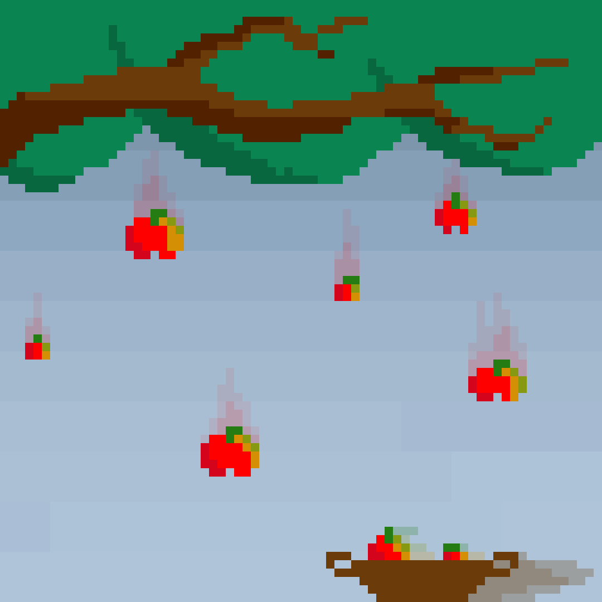

Maintenant que tu as appris à utiliser ton micro:bit, il est temps de passer aux choses sérieuses avec un petit projet guidé.

L'objectif de ce projet est de créer un **jeu du panier**.

# Principe du jeu

L'objectif est d'attraper des pommes qui tombent du ciel à l'aide d'un panier.



Avant de coder, voici les trois différentes parties du jeu :

## Le panier

Le panier se trouve sur le sol. Il peut se déplacer sur tout l'axe horizontal (axe X), mais pas sur l'axe vertical (axe Y). Il sert à attraper les pommes qui tombent du ciel.

## Les pommes

Les pommes tombent une par une du ciel, depuis une position aléatoire. Il faut réussir à en attraper le plus possible pendant la partie.

## Fin de la partie

La partie s'achève dès qu'une pomme touche le sol. Dans ce cas, un message de fin de partie et le score du joueur sont affichés.

Maintenant que tu as compris comment le jeu fonctionne, passe à la page suivante pour commencer à coder !
