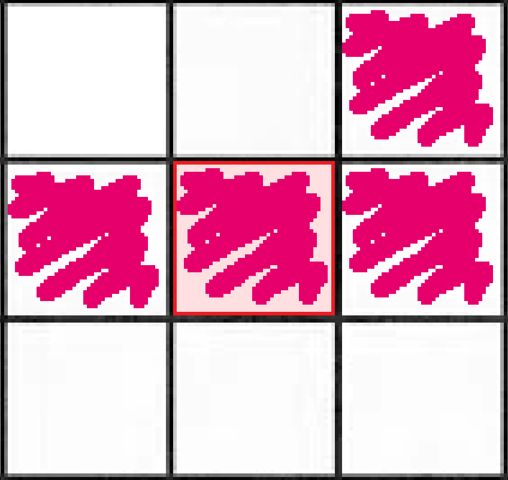
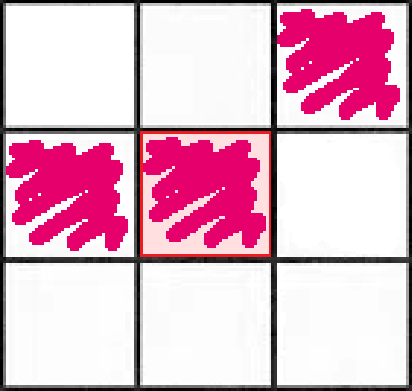

# Comment ça fonctionne ?

Dans ce jeu, chaque case représente une cellule qui peut avoir deux états : mort ou vivant.

On appelle chaque tour du jeu une *génération*, c'est-à-dire lorsque le plateau est mis-à-jour.

Le *Jeu de la Vie* suit trois règles importantes qui permettent au jeu de :
- Faire naître une cellule
- Garder une cellule en vie
- Faire mourir une cellule

## La naissance d'une cellule

Si une cellule morte a exactement trois voisines vivantes, elle fera alors naître une cellule à la prochaine génération.

<!-- Exemple -->







## La survie d'une cellule

Si une cellule déjà vivante a deux ou trois voisines vivantes, alors elle reste en vie.
<!-- Exemple -->

<table>
    <tr>
      <td style="width: 2000px;height: 400px">
        
      </td>
      <td style="width:2000px">
        
      </td>
    </tr>
    <tr>
      <td>
        La cellule en rouge a trois voisines vivantes, elle reste donc en vie !
      </td>
      <td>
        La cellule en rouge a deux voisines vivantes, elle reste donc en vie !
      </td>
    </tr>
</table>

## La mort d'une cellule 

Si une cellule ne naît pas ou ne survit pas, elle meurt.
<!-- Exemple -->














# 