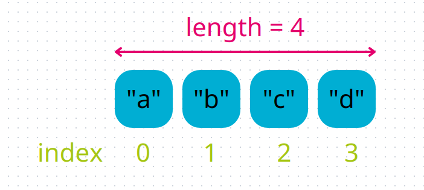

## Suppression dans une liste

Les ajouts c'est bien beau, mais si on ne peut jamais supprimer des éléments, on va vite être débordé !

Comme pour l'ajout, il existe plusieurs manières de **supprimer un élément dans une liste**, nous allons commencer avec la méthode `pop`.

### Pop

La méthode `pop` permet de supprimer un élément d'une liste.

Il existe plusieurs manières de l'utiliser :
```codepython
ma_liste = [1, 2, 3]
ma_liste.pop()
print(ma_liste)

variable = ma_liste.pop()
print(ma_liste)
print(variable)
```

Lorsque nous utilisons `pop` sans paramètre, nous supprimons le **dernier élément de la liste**.

Mais si on lui donne un paramètre, on supprime l'élément qui se trouve **à l'index donné** :
```codepython
ma_liste = ["a", "b", "c"]
ma_liste.pop(0)
print(ma_liste)
ma_liste.pop(1)
print(ma_liste)
```

{}
Encore une fois, attention aux index, à ne pas dépasser de la liste.
{}

{}

Pendant les vacances, on a mis dans la valise des objets souvenirs. On a un "porte-clé", un "magnet", une "serviette de bain", une "sculpture de bois" et une "carte postale".

Crée la liste `valise` avec ces souvenirs.
Ensuite donne le premier à tes grands-parents, le dernier à ton professeur, et garde la sculpture pour toi.

Quels souvenirs reste-t-il dans la valise ?

{}

{}

Il est possible de demander à Python de calculer la longueur d'une liste (son nombre d'éléments) pour nous, avec la fonction `len`.



Par exemple :
```codepython
ma_liste = [4, 5, 6]
longueur = len(ma_liste)  # calcule la longueur de la liste
print(longueur)

ma_liste.pop()
print(ma_liste)
print(len(ma_liste))

ma_liste.pop(0)
print(ma_liste)
print(len(ma_liste))

print(len([]))
```

Cette fonction nous permet de vérifier lors de nos programmes la taille de la liste, pour ne pas dépasser.
{}

{}

Comme vu avec l'exemple précédent du calcul de la longueur de la liste, celle-ci diminue lors de la suppression.
Donc les index des éléments avant la suppression, peuvent être différents après.

```codepython
ma_liste = ["a", "b", "c"]
print(ma_liste[1])

ma_liste.pop(0)
print(ma_liste[1])
print(ma_liste)
```

{}

### Remove

La 2e méthode pour supprimer des éléments dans une liste est `remove`.
Celle-ci permet de supprimer un élément en le cherchant dans la liste.

```codepython
ma_liste = [5, 6, 7, 8]
print(ma_liste)
ma_liste.remove(5)
print(ma_liste)
```

{}

Attention, la méthode `remove` ne peut être utilisée que sur des éléments présents dans la liste, sinon elle provoque une erreur.

```codepython
ma_liste = [1, 2, 3]
ma_liste.remove(4)
print(ma_liste)
```
{}

{}

Même exercice que le précédent, mais avec les souvenirs : "toile", "tasse", "t-shirt" et "instrument".

Et on sait à qui donner la "toile" et l'"instrument". Que nous reste-t-il ?

Utilise la fonction `remove` pour retirer les éléments de la liste.

{}

Félicitations ! Tu sais maintenant utiliser les listes avec la plupart de leurs méthodes.

Passe à la section suivante pour apprendre d'autres opérations sur les listes.