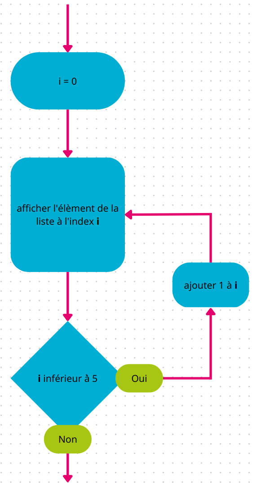

## Autres opérations sur les listes

Nous avons précédemment utilisé l'ajout et la suppresion d'éléments dans une liste.
On a également vu comment avoir le nombre d'éléments (la longueur) d'une liste avec la fonction `len`.

Voici d'autres opérations utiles sur les listes.

### `in` : appartenance d'un élément à une liste

Le mot-clé `in` ("dans" en français) permet de tester si un élément est présent dans une liste.

{}

Petit rappel sur la structure `if`/`elif`/`else` vu dans le TP précédent :

Le mot-clé `if` ("si" en français) permet d'effectuer une action en fonction d'une condition, seulement si la condition est vraie :
```codepython
if 10 > 2:
    print("C'est vrai")
print("Tout le temps affiché")
if 1 > 2:
    print("C'est faux donc cette phrase ne sera pas affichée")
print("mais celle-ci oui car elle est en dehors du bloc lié à la condition")
```

Attention à ne pas oublier les `:` à la fin de la condition du `if`, ils sont équivalents au "alors" en français.

Et les blocs de code qui sont exécutés uniquement si la condition est vraie sont "indentés" (décalés sur la droite).

De plus, `else` ("sinon" en français) peut suivre le `if` pour être exécuté uniquement si la condition de `if` est fausse.

Enfin, le `elif` est la contraction de `else` et `if` ("sinon si" en français). `elif` peut être utilisé suite à un `if` pour faire des actions différentes suivant plusieurs conditions :
```codepython
age = 18
if age < 11:
    print("Cette enfant est à l'école primaire")
elif age < 16:  # Cette condition équivaut à dire "age >= 11" et "age < 16"
    print("Celle-ci est au collège")
elif age < 19:
    print("Cette ado est au lycée")
else:
    print("C'est une adulte")
```

{}

Revenons au mot-clé `in`, il s'utilise comme suit :
```codepython
sac = ["bonbon", "cahier", "livre"]
if "bonbon" in sac:
    print("Je mange les bonbons qui étaient dans mon sac")
    sac.remove("bonbon")
else:
    print("J'ai faim mais je n'ai pas de bonbon :'(")
print(sac)
```

{}

En cours de dessin, le professeur demande à la classe de sortir un "feutre" pour ceux qui en ont, un "stylo" sinon.

Dans ta trousse, tu as un "crayon", une "règle", un "taille-crayon", un "stylo" et un "feutre".

Dis nous ce que tu va utiliser pour ce cours, grâce au mot-clé `in`.

{}

{}

Petit rappel sur les "et" et "ou" logiques, utiles pour combiner plusieurs conditions dans le même `if`.

Le "et" logique s'écrit `and` en Python. Il s'utilise comme suit :
```codepython
ma_liste = [1, 2, 3]
if 1 < 2 and len(ma_liste) > 0:
    print("vrai")
else:
    print("faux")
```

Pour que la condition combinée avec un `and` soit vraie, il faut que les 2 conditions (à droite et à gauche du `and`) soient vraies.

Le "ou" logique s'écrit `or` en Python :
```codepython
ma_liste = [1, 2, 3]
if 2 > 50 or len(ma_liste) > 0:
    print("vrai")
else:
    print("faux")
```

Pour que la condition combinée avec un `or` soit vraie, il faut qu'au moins une des 2 conditions soit vraies, donc : 
- celle de droite peut être vraie
- ou celle de gauche
- ou les deux.

{}

{}

En cours de mathématiques cette fois-ci, le professeur demande de sortir une règle, ainsi qu'un "crayon" aux élèves ayant un "crayon" et une "gomme", et de sortir un "stylo" sinon, pour dessiner un losange sur le repère de la feuille.

Ta trousse a la même composition que pour l'exercice précédent.

Que sortiras-tu ?

{}


### Parcourir tous les éléments d'une liste à l'aide d'une boucle

Il est parfois pratique d'accéder à tous les éléments d'une liste de la même manière.

Pour être plus efficace et ne pas avoir à copier coller plusieurs fois la même chose, nous pouvons utiliser une boucle.

Par exemple :
```codepython
ma_liste = ["Emmenez-moi au bout de la terre", "Emmenez-moi au pays des merveilles", "Il me semble que la misère", "Serait moins pénible au soleil"]
for variable in ma_liste:
    print(variable)
    print("...")
print("-- Applaudissements --")
```

Nous avons une liste avec 4 morceaux de phrase (les paroles d'une belle chanson d'ailleurs).

La ligne **`for variable in ma_liste:`** se lit "Pour toute `variable` dans la liste `ma_liste`", on aurait pu changer le nom de `variable` en `parole`, puisqu'il prend la valeur des éléments de la liste au fur et à mesure.

La première fois que le programme passe sur la ligne de la boucle (`for variable in ma_liste:`), `variable` prend la valeur du 1er élément de la liste : "Emmenez-moi au bout de la terre".

Ensuite le programme exécute le bloc de la boucle avec cette valeur, donc affiche `variable` puis affiche "...".

Le bloc de boucle est fini, le programme revient sur la ligne `for variable in ma_liste:`. `variable` prend ainsi la 2e valeur de la liste : "Emmenez-moi au pays des merveilles", et il exécute le bloc de la boucle avec cette valeur.

De même pour les 2 autres éléments de la liste.

Après avoir exécuté la boucle pour les 4 (tous) éléments, le programme revient sur la ligne `for variable in ma_liste:`. Il n'y a plus d'éléments dans la liste sur lesquels on n'est pas passé, donc on sort de la boucle.

Et on affiche "-- Applaudissements --"

{}

Cette partie peut être difficile à comprendre. Hésite pas à changer les éléments du code donné, rajouter des lignes, et demander de l'aide aux organisateurs.

{}

Nous avons vu que les listes pouvaient contenir plusieurs types. Peu importe ce que contient la liste, le parcours des éléments de celle-ci sera identique :
```codepython
ma_liste1 = ["un", "deux", "trois"]

for chiffre in ma_liste1:
    print(chiffre)

ma_liste2 = [1, 2, 3]

for num in ma_liste2:
    print(num)

calcul = 0
for num in ma_liste2:
    calcul = calcul + 3 * num
print(calcul)
```

{}

Attention, la variable définit par la ligne `for variable in ma_liste:` est accessible uniquement à l'intérieur de la boucle.

{}


{}

C'est bientôt les vacances ! Mais avant, c'est le dernier contrôle de l'année.

Tu voudrais vérifier que tout c'est bien passé pour ta classe et la retrouver l'année prochaine.

Calcule la moyenne des notes des élèves de ta classe.

```codepython
notes = [12, 13, 16, 14, 10, 18, 15.5, 10.5, 17, 13, 15, 19, 16.5, 17, 12, 14]
```

Pour rappel, on calcule la moyenne de plusieurs valeurs en faisant la somme des valeurs, puis en divisant par le nombre de valeurs :
```codepython
somme = 6.5 + 7 + 10.5
moyenne = somme / 3
print(moyenne)
```

Conseil : comment calcule-t-on le nombre d'éléments dans une liste ?

{}


Il existe une **2e méthode de parcours des éléments d'une liste**, qui utilise le moyen d'accéder aux éléments d'une liste vu précédemment.

Il s'agit d'une boucle `for` également, mais qui va passer sur les index, au lieu des éléments directement :
```codepython
ma_liste = ["lundi", "mardi", "mercredi", "jeudi", "vendredi"]
for i in range(len(ma_liste)):
    print(ma_liste[i])
```

Cette méthode utilise plusieurs éléments vu précédemment :
- calcul de la longueur de la liste (son nombre d'éléments)
- boucle `for` avec un `range` (vu dans le TP précédent)
- l'accès à une valeur dans la liste en utilisant les `[]` avec un index

Si on exécute ce code pas à pas, ça donnerait :
- `len(ma_liste)` -> 5
- `for i in range(5):` -> on répète 5 fois une action, avec la variable `i` qui commence à `0` et qui augmente de `1` à chaque tour de boucle
- `ma_liste[i]` -> accès à l'élément à l'index `i` dans la liste `ma_liste`
- `print(ma_liste[i])` -> affiche cette valeur



Le principal avantage de cette méthode est l'accès à l'index des éléments au fur et à mesure, donc il est également possible d'utiliser cet index, pour un calcul, ou la modification de l'élément dans la liste.

{}

Votre professeur vous dit maintenant qu'il avait oublié de rajouter 1 point bonus, qui correspond à la participation de chacun dans la classe, à tous les élèves.

Modifie les notes des élèves de l'exercice précédent en leur rajoutant 1 point et affiche les nouvelles notes !

{}

