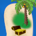

# Se déplacer dans une matrice

On utilise les boucles `for` pour se déplacer dans les matrices. Cependant, une
seule boucle `for` n'est pas suffisante car il faut parcourir à la fois les
lignes et les colonnes. Pour cela, on *imbrique* deux boucles.

En manipulant directement les éléments :

```python
for ligne in matrice:
    for element in ligne:
        # Faire quelque chose avec `element` ici.
```

En accédant aux éléments grâce aux indices et à la fonction `range` :

```python
for i in range(len(matrice)):
    for j in range(len(matrice[0])):
        # Faire quelque chose avec `matrice[i][j]` ici.
```

{}

Dans l'exemple de code ci-dessus avec les indices, on parcourt la matrice ligne
par ligne, et pour chaque ligne, colonne par colonne. Sache qu'il est tout à
fait possible de faire l'inverse : parcourir la matrice colonne par colonne, et
pour chaque colonne, ligne par ligne.

{}


{}

Code une fonction `afficher_carte(carte)` qui affiche la carte de la région. Les
symboles d'une même ligne sont séparés par un espace.

Appelée avec ta matrice `carte`, la fonction doit afficher :

```text {nocopy=true}
~ ~ ~ ~ ~ ~
~ ~ # % ~ ~
~ # # ~ ~ ~
~ # # @ ~ %
~ % ~ ~ ~ ~
```

{}


{}

Pour assurer la sureté du Golfe des Parrots, Julie décide de mettre en place
un algorithme qui signale la position de tous les bateaux pirates. Aide-la à
écrire cet algorithme.

Ecris la fonction `localiser_bateaux(carte)` qui affiche toutes les positions
(*ligne* *colonne*) de bateaux pirates.

Si tu ne t'es pas trompée, `localiser_bateaux(carte)` doit t'afficher ces trois
coordonnées (l'ordre des lignes n'a pas d'importance) :

```text {nocopy=true}
1 3
3 5
4 1
```

{}


{}

Un navire marchant doit traverser le golfe du Nord au Sud. Il doit garder un cap
strict en descendant en ligne droite. Julie est en charge de déterminer son
trajet.

Aide Julie en codant une fonction `trouver_trajets(carte)` qui renvoie la liste
des colonnes par lesquelles le bateau marchant peut passer en ne rencontrant
aucun obstacle (bateaux pirates, îles ou phares).

Appelée avec ta matrice `carte`, la fonction doit retourner : `[0, 4]`.

<style>
    table img {
        pointer-events: none;
    }
</style>

<table cellpadding="0" cellspacing="0" border="2">
    <tr>
        <td style="padding:0; line-height:0;"></td>
        <td style="padding:0; line-height:0;"></td>
        <td style="padding:0; line-height:0;"></td>
        <td style="padding:0; line-height:0;"></td>
        <td style="padding:0; line-height:0;"></td>
        <td style="padding:0; line-height:0;"></td>
    </tr>
    <tr>
        <td style="padding:0; line-height:0;"></td>
        <td style="padding:0; line-height:0;"></td>
        <td style="padding:0; line-height:0;"></td>
        <td style="padding:0; line-height:0;"></td>
        <td style="padding:0; line-height:0;"></td>
        <td style="padding:0; line-height:0;"></td>
    </tr>
    <tr>
        <td style="padding:0; line-height:0;"></td>
        <td style="padding:0; line-height:0;"></td>
        <td style="padding:0; line-height:0;"></td>
        <td style="padding:0; line-height:0;"></td>
        <td style="padding:0; line-height:0;"></td>
        <td style="padding:0; line-height:0;"></td>
    </tr>
    <tr>
        <td style="padding:0; line-height:0;"></td>
        <td style="padding:0; line-height:0;"></td>
        <td style="padding:0; line-height:0;"></td>
        <td style="padding:0; line-height:0;"></td>
        <td style="padding:0; line-height:0;"></td>
        <td style="padding:0; line-height:0;"></td>
    </tr>
    <tr>
        <td style="padding:0; line-height:0;"></td>
        <td style="padding:0; line-height:0;"></td>
        <td style="padding:0; line-height:0;"></td>
        <td style="padding:0; line-height:0;"></td>
        <td style="padding:0; line-height:0;"></td>
        <td style="padding:0; line-height:0;"></td>
    </tr>
</table>

{}
