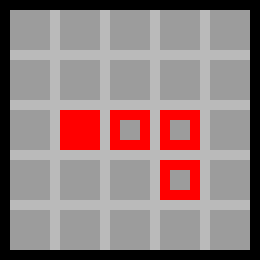

# Le jeu de Snake

Le but de cet exercice est de coder le célèbre jeu [Snake](https://fr.wikipedia.org/wiki/Snake_(genre_de_jeu_vid%C3%A9o)) sur une carte `micro:bit`.

{height=5cm}

## Principe du jeu

### Le serpent

Dans Snake, le joueur contrôle un serpent dans une zone quadrillée. Le serpent peut bouger dans les quatres directions (haut, bas, gauche et droite) et réapparait de l'autre côté quand il rentre dans un mur. Le but du jeu est de survivre le plus longtemps possible.

### Les pommes

Pendant la partie, des "pommes" vont apparaître à un endroit aléatoire sur l'écran, représentées sous la forme de simple pixels. Quand le serpent mange une pomme (i.e. quand la tête du serpent arrive sur une pomme), il grandit d'une case, et une nouvelle pomme apparaît sur l'écran.

### Fin de la partie

La partie s'arrête quand le serpent se mord la queue (i.e. quand la tête du serpent arrive sur une case de son corps). Le score du joueur est la taille du serpent. En général, on considère la partie comme gagnée si le score est égal au nombre de pixels sur l'écran (ça veut dire que le serpent a complètement rempli l'écran !).

Pour coder notre jeu Snake, nous allons utiliser une carte `micro:bit`. Sur la carte, il y a 2 boutons (A et B) ainsi que l'écran qui nous intéressent. l'écran est composé de 25 pixels rouges répartis sur 5 lignes et 5 colonnes. Les sections suivantes expliquent comment les utiliser.

## Fonctionnement de la carte `micro:bit`

### L'écran

Chaque pixel de l'écran est une LED rouge, que l'on peut allumer ou éteindre à un certain degré d'intensité allant de 0 à 9 (0 -> éteinte, 9 -> allumée au max). La ligne de code ci-dessous allumera le pixel de la première ligne et troisième colonne au niveau 6.

```py
# Attention, la numérotation des lignes et des colonnes commence à 0
display.set_pixel(0, 2, 6)
```

Il pourra vous être utile de réinitialiser l'écran et d'éteindre toutes les LEDs d'un coup. Pour cela, on utilise la fonction suivante.

```py
# Cette commande a le même effet que faire display.set_pixel(i, j, 0) 25 fois !
display.clear()
```

### Les boutons

> TODO: Expliquer les fonctions pour les boutons A et B.

Afin de pouvoir diriger notre serpent, nous allons utiliser les boutons A et B sur les côtés de l'écran.Quand on tient la carte `micro:bit` dans le bon sens, le bouton A est à gauche et le bouton B est à droite. On souhaite que l'appui sur le bouton A fasse tourner le serpent à gauche, et le bouton B à droite.

Reste à savoir comment savoir dans notre code qu'un bouton a été appuyé. Il existe pour cela 3 fonctions utiles.

```py
button_a.is_pressed()   # Ces fonctions renvoient True ou False si les boutons sont
button_b.is_pressed()   # appuyés quand la ligne est exécutée par le micro:bit

button_a.was_pressed()  # Ces fonctions renvoient True ou False si les boutons ont
button_b.was_pressed()  # été appuyés depuis la dernière fois qu'elles ont été appelées

button_a.get_presses()  # Ces fonctions renvoient le nombres d'appuis effectués sur
button_b.get_presses()  # le bouton depuis la dernière fois qu'elles ont été appelées
```

Pour ce projet, le plus pratique est d'utiliser `was_pressed()` pour pouvoir orienter le serpent en conséquence.

## Notre version de Snake sur `micro:bit`

### Le serpent

Dans notre code, on va représenter le serpent comme une liste de coordonnées sur l'écran. La première valeur de la liste est la tête de notre serpent.

```py
snake = [(2, 2), (2, 3), (3, 3), (3, 4)]
snake_len = 4 # Le serpent a une taille de 4 cases
```

L'exemple ci-dessus correspond au serpent en Figure \ref{step0} (la tête est le carré plein).


Nous nous intéressons au déplacement du serpent. Pour cela,
il faut savoir dans quelle direction il va. C'est à ça que sert la variable `direction` que l'on initialise par défaut à `UP`. Au début de la partie, le serpent ira donc vers le haut.

Pour rappel, nous souhaitons pouvoir diriger le serpent avec les boutons A et B du `micro:bit` de la façon suivante :

- si l'on appuie sur **A**, le serpent tourne à gauche
- si l'on appuie sur **B**, il tourne à droite
- sinon, le serpent ne change pas de direction

Tu peux implémenter la fonction `new_direction()` qui prend en argument la direction actuelle du serpent, qui vérifie si les boutons ont été pressés et qui renvoie la nouvelle direction du serpent.

Pour cela, tu peux t'aider des variables définies au début du ficher:

```py
# Directions
UP = 0
RIGHT = 1
DOWN = 2
LEFT = 3
```

Après avoir trouvé la direction du serpent, il faut le déplacer. Imaginons que dans l'exemple précédent, le serpent aille vers la gauche. Après s'être déplacé, l'écran ressemblera à la Figure \ref{step1}.



Comme tu peux le voir, la tête du serpent s'est déplacée d'une case vers la gauche, et le bout de la queue du serpent a disparu !

Tu peux implémenter la fonction `new_head()` qui prend en paramètres le serpent et sa direction et qui renvoie les coordonnées de sa nouvelle tête.

Attention : Si le serpent arrive contre un mur, il passe de l'autre côté de l'écran !

Maintenant que les fonctions `new_direction()` et `new_head()` fonctionnent, tu peux les appeler dans la boucle principale du jeu. La première étape est de mettre à jour la direction du serpent. Ensuite, on trouve la nouvelle tête du serpent. Pour ajouter la nouvelle tête dans la liste du serpent, tu peux faire comme cela :

```py
# Ajoute l'element en première place de la liste
liste.insert(element, 0)
```

N'oublie pas de retirer la dernière case du serpent !
Tu peux utiliser la méthode suivante

```py
# Retire la dernière case d'une liste
liste.pop()
```

Maintenant, tu devrais être capable de faire bouger ton serpent sur le `micro:bit` en appuyant du les boutons ! Mais il n'y a pas encore de challenge car le serpent de grandit pas.

### La pomme

Maintenant que le serpent peut se déplacer, nous pouvons placer des pommes sur le terrain pour le faire grandir.

À chaque tour de boucle :

- S'il n'y a pas de pomme sur le terrain, on en place une de manière aléatoire qui ne soit pas sur le serpent
- Si la tête du serpent atteint une pomme, celle-ci disparait et la taille du serpent augmente de 1

## Astuces (utiles pour certaines parties du projet)

On peut vérifier qu'une valeur est présente dans une liste de la manière suivante :

```py
>>> snake = [(1, 0)]
>>> (0, 1) in snake
False
>>> (1, 0) in snake
True
```

Pour choisir aléatoirement un nombre, tu peux utiliser la fonction `randint` :

```py
>>> randint(0, 1)
1
>>> randint(0, 1)
0
>>> randint(0, 10)
7
```

