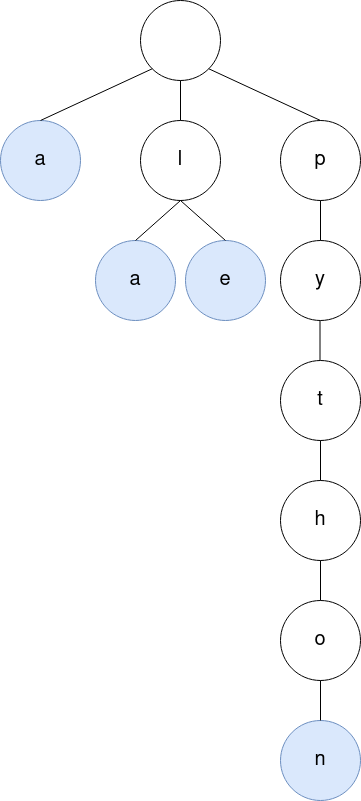
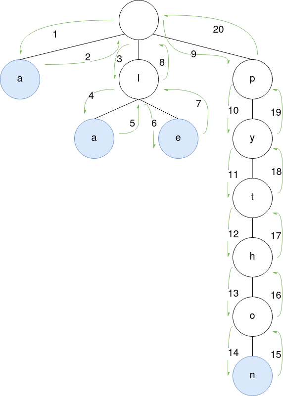
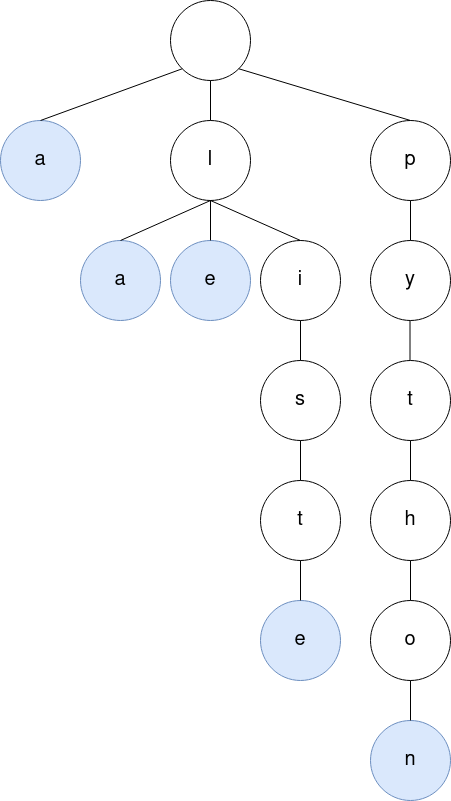

# Cours sur la structure d'arbre

## Qu'est ce que c'est un arbre ?

Un _arbre_ est une structure de donnée qui est représentable sous la forme
d’une hiérarchie qui ressemble fortement à celle d’un arbre tel qu’on les
connaît dans les parcs et les forêts.

[photo d'arbre et d'arbre info]

Avant de discuter les nombreuses situations dans lesquelles les arbres sont
utiles, il est très important de comprendre le vocabulaire qui leur est
attribué.

Chaque élément de l’arbre s’appelle un _nœud_ et a la possibilité d’avoir un ou
plusieurs _fils_. Le nœud est donc un point de départ d’une ou plusieurs
branches. Pour expliquer la relation entre les nœuds, on utilise les
terminologies de la généalogie et donc un nœud est relié à son fils par une
_arête_ et est caractérisé de _parent_.

On peut également distinguer différentes catégories de nœuds:

* La _racine_ est le premier nœud, sans parent.
* Les _feuilles_ (dit aussi nœuds _externes_) sont les nœuds qui ne possèdent
pas de fils.
* Les nœuds _internes_ sont tous les nœuds qui possèdent un ou plusieurs fils.

Les prochains termes sont également utilisés pour décrire les arbres:

* La _profondeur_ est la distance (donc le nombre d'arête) de la racine vers
un nœud.
* La _hauteur_ est la profondeur maximale de l’arbre et donc la distance avec
la feuille la plus profonde de l’arbre.
* La _taille_ est le nombre de nœud que l'arbre contient.

Enfin, un arbre est dit _étiqueté_ si ses nœuds contiennent des valeurs. Cette
spécificité est très efficace pour pouvoir stocker des valeurs et des données,
comme on le verra au fur et à mesure de ce TP.

Il est important de noter qu’il y a pleins de définitions d’arbres plus
spécifiques. Par exemple, il existe des arbres binaires où chaque nœud à au
plus deux fils. Mais tous ont le même vocabulaire de base qui a été présenté
au-dessus.

## Leur utilisation

Les arbres sont très utilisés en informatique car la complexité des algorithmes
d'insertion et de recherche est généralement plus faible que celui des listes,
et leur utilisation est assez simple.

Ils permettent également de montrer la hiérarchie d'une situation, comme un
arbre généalogique, ou le rangement de fichiers et dossiers sur un ordinateur.

# Introduction aux Tries

Un `Trie` est un cas particulier de la structure de données d'arbre (`Tree`).  
Il peut servir à implémenter des algorithmes de compression, de correction
orthographique, etc. en l'utilisant pour stocker un dictionnaire.

Par exemple:  
{width=4.5cm height=8cm}

Ce `Trie` représente le dictionnaire:

- "a"
- "la"
- "le"
- "python"


Nous allons dans cet exercice implémenter cette structure et l'utiliser comme
correcteur orthographique.

## Création

Pour créer notre trie, nous allons créer une classe `Node`.  
Celle-ci représente un noeud de l'arbre.  
Il est composé d'un caractère, d'une liste de fils et d'un bouléen qui nous
dit si le noeud marque la fin d'un mot.  
Pour ce faire, en se souvenant du cours sur les classes, on écrit la fonction
`__init__` qui initialise ces 3 attributs.
Le caractère est donné en paramètre, la liste de fils est initialisée vide, et
la plupart du temps, le mot n'est pas terminé donc on initialisera le booléen
à `False`.
```python
class Node:
    def __init__(self, char)
```

## Insertion

Donc maintenant, on peut créer un noeud avec un caractère, mais il nous apporte
pas beaucoup dans ce qu'on veut faire, on voudrait lui ajouter des fils.  
On va donc lui donner une autre méthode, `add_child_at`. Elle prendra en
paramètre un entier qui représente la position où l'on veut ajouter un noeud
dans la liste de fils et le noeud en question.
```python
class Node:
    # méthodes précédentes

    def add_child_at(self, index, child_node)
```
Je vous conseille de regarder les fonctions sur les listes, elle vous permettra
d'ajouter le noeud dans la liste très simplement.  
Il faut faire attention aux paramètres qu'on nous donne, en effet, ils peuvent
être erronés. Donc avant d'ajouter le noeud à la bonne position, on doit
vérifier que cette position a du sens, donc que l'entier est positif et
inférieur ou égal à la taille de la liste actuelle.  
(Poser des questions aux encadrants si vous ne comprenez pas pourquoi ;) )  
Pour renseigner à l'utilisateur si on a effectivement ajouté le noeud dans les
fils, on retourne un booléen: `True` si on l'a ajouté, `False` sinon.

Grande nouvelle, on peut dès à présent créer l'arbre que l'on souhaite !  
Mais calculer les positions à la main peut être ennuyeux et on peut commettre
des erreurs (les fils doivent être triés en fonction de leur caractère).  
On va créer une nouvelle méthode qui créera le fils pour nous, directement au
bon emplacement.  
On appelle cette fonction `insert_char`, qui prend en paramètre un caractère
à ajouter dans les fils du noeud courant.
```python
class Node:
    # méthodes précédentes

    def insert_char(self, char)
```
Lors de l'ajout du caractère, nous avons 2 situations:

- soit le noeud n'est pas présent dans les fils auquel cas il faut le créer
 et l'ajouter
- soit le noeud est déjà présent

On va donc parcourir les fils et comparer leur caractère à celui qu'on veut
ajouter.  
Pour récupérer le caractère d'un fils, il suffit d'accéder à son attribut,
par exemple:
```python
# si l'attribut de `Node` représentant la liste de fils est `children`
>>> child = node.children[0]
```
`child` est le premier fils du noeud `node` et de la classe `Node`

On récupère son caractère en faisant:
```python
# si l'attribut de `Node` représentant le caractère est `char`
>>> child.char

# ce qui est équivalent à
>>> node.children[0].char
```
On a dit précédement que les fils étaient triés selon leur caractère, ils sont
triés par ordre lexicographique et ils sont uniques, il n'y a pas de caractère
en double. On a donc:
```python
# si `node` a 3 fils
>>> node.children[0].char < node.children[1].char
True
>>> node.children[1].char < node.children[2].char
True
```
On peut ainsi calculer la position d'un nouveau noeud, elle correspond à la
position du premier noeud avec un caractère supérieur s'il existe ou la taille
de la liste sinon. (Je vous conseille d'utiliser une boucle pour passer sur
les noeuds).  
Une fois le noeud trouvé si le caractère était déjà présent, ou ajouté sinon,
on retourne celui-ci.

C'est beaucoup plus pratique pour ajouter un caractère non ?  
C'est fini pour les bases de la structure de `Trie`, on va commencer la
partie qui nous intéresse: le spell checker (vérificateur d'orthographe).


# Spell Checker

Le but principal de cet exercice est de vérifier l'orthographe des mots donnés
en entrée par l'utilisateur.

On va implémenter des fonctions basiques comme:

- créer le dictionnaire et y rajouter des mots
- afficher le dictionnaire
- rechercher si un mot est dans le dictionnaire, est ce qu'il existe

## Parcours du dictionnaire

Pour pouvoir vérifier l'orthographe de mots, nous avons besoin comparer les
mots présents dans le dictionnaire avec ceux de l'utilisateur.  

Prenons comme exemple le dictionnaire minimaliste utilisé précédemment, qui
contient les mots:

* "a"
* "le"
* "la"
* "python"

On peut représenter ce dictionnaire comme:  
{width=4.5cm height=8cm}

On a la `root`, ou point d'entrée de l'arbre (le cercle le plus haut) qui ne
contient pas de caractère, il nous permet d'accéder aux premières lettres des
mots.

Puis, nous avons la première ligne, les initiales: `a`, `l`, `p`. Le
dictionnaire contient 4 mots mais 2 d'entre eux ont la même initiale, ce qui
nous donne 3 noeuds au premier étage de l'arbre.

Le noeud qui contient la lettre `a` est coloré en bleu, ce qui signifie la fin
du mot donc que le booléen du noeud `a` est à `True`. Ainsi, nous retrouvons
le mot "a".

Le noeud avec la lettre `l` a deux fils, il est utilisé pour construire 2 mots:
"la" et "le".

Et on continue ainsi jusqu'à la fin.  
Si on compte le nombre de noeuds bleus dans l'arbre, on retrouve le nombre de
mots insérés: 4.

### Algorithme

Il peut être pratique d'afficher son dictionnaire que ce soit pour l'utilisateur
ou pour le programmeur. Ça nous permet de vérifier le comportement de notre
programme.

D'après le schéma ci-dessus, on en conclut que suivre une branche revient à
écrire un mot. Prenons la dernière branche par exemple, elle contient les noeuds
`p`, `y`, `t`, `h`, `o`, `n`, qui représente le mot "python".

Ainsi, pour donner les mots de notre dictionnaire, il suffit de suivre toutes
les branches. C'est ce qu'on fait avec un `dfs` ou depth-first search (parcours
en profondeur en français). C'est un algorithme récursif qui passe sur tous les
noeuds de l'arbre. Plus particulièrement, nous allons utiliser un parcours en
profondeur préfixe, puisqu'il commence par le permier fils et nous permet de
garder l'ordre des noeuds, le dictionnaire affiché sera donc dans l'ordre
lexicographique.

Pour expliquer simplement, l'algorithme commence par descendre sur le premier
fils, s'occupe de son sous arbre, puis de passe au deuxième fils, etc.

Voici l'algorithme:
```
visiterPréfixe(Arbre A):
    visiter (A)
    Pour tous les fils F de A:
          visiterPréfixe(F)
```

Pour vous donner un exemple de l'ordre de passage sur les noeuds de cet
algorithme, nous pouvons l'exécuter sur l'arbre précédent:

- on commence avec `A` = la root de l'arbre, le noeud tout en haut
- ligne 2: on visite ce noeud, nous allons expliquer plus tard quoi faire ici
- ligne 3: une boucle sur les fils de `A`: on commence donc avec `F` = le
premier fils: le noeud avec la lettre `a`.
- ligne 4: on appelle récursivement la fonction `visiterPréfixe` sur ce noeud
- on revient donc à la ligne 1 avec l'arbre `A` = le noeud `a`.
- ligne 2: visiter le noeud
- ligne 3: une boucle sur les fils du noeud `a`, mais `a` n'a pas de fils donc
la fonction s'arrête ici et on revient à l'appel de celui-ci lorsque `A` = la
root et `F` = le noeud `a`, à la ligne 4.
- le contenu de la boucle sur `F` est fini donc on revient à la ligne 3 avec
`F` = le prochain fils de `A`, ici le noeud `l`.
- on appelle récursivement la fonction `visiterPréfixe` sur ce noeud
- on est maintenant au début de la fonction `visiterPréfixe` avec `A` = le noeud
`l`.
- on passe plus rapidement: on va à la boucle sur les fils: le noeud `l` = `A` a
plusieurs fils, donc on rentre dans la boucle
- `F` = le premier fils = le noeud `a`, on appelle la fonction `visiterPréfixe`
dessus
- ce noeud n'a pas de fils donc on ne rentre pas dans la boucle et on revient
à l'appel de la fonction ligne 4 avec `A` = noeud `l` et `F` = noeud `a`
- on passe au fils suivant, `F` = noeud `e` et on appelle la fonction sur celui-ci
- ce noeud n'ayant pas de fils, on ne rentre pas dans la boucle et on revient
à la ligne 4 avec `A` = le noeud `l` et `F` = le noeud `e`.
- `A` n'ayant plus de fils à parcourir, on revient à l'appel précédent avec `A` =
la root et `F` = le noeud `l`
- on passe au fils suivant de la root: `F` = noeud `p` et on appelle la fonction
`visiterPréfixe` sur celui-ci
- on a `A` = le noeud `p`, il possède un fils donc on appelle la fonction sur le
noeud `y`
- on a `A` = le noeud `y`, il possède un fils donc on appelle la fonction sur le
noeud `t`
- on a `A` = le noeud `t`, il possède un fils donc on appelle la fonction sur le
noeud `h`
- on a `A` = le noeud `h`, il possède un fils donc on appelle la fonction sur le
noeud `o`
- on a `A` = le noeud `o`, il possède un fils donc on appelle la fonction sur le
noeud `n`
- le noeud `n` n'a pas de fils, on revient sur l'appel précédent
- le noeud `o` n'a plus de fils à visiter, on revient sur l'appel précédent
- et ainsi de suite jusqu'à revenir avec `A` = la root et `F` = le noeud `p`
- le noeud root n'ayant plus de fils à visiter, on sort de l'algorithme.

Pour résumer, nous sommes passé sur les noeuds de l'arbre dans le même ordre
que ces flèches numérotées:  
{width=8cm height=10cm}

### Concrètement

On reprend notre classe `Node`, l'algorithme se traduit par:
```python
def parcours(root):
    visit(root) # une action à faire sur le noeud courant
    for child in root.children:
        parcours(child)
```

Par exemple, si nous voulons afficher les noeuds dans l'ordre de visite:
```python
def display(root):
    print(root.char)
    for child in root.children:
        display(child)


>>> display(trie) # trie étant la root de l'arbre précédent

a
l
a
e
p
y
t
h
o
n
```

Pour que vous puissez tester plus rapidement, voici le code pour créer l'arbre:
```python
root = Node("")

a1 = Node("a")
# raccroche le fils `a1` à son parent `root`
root.children.append(a1) # première branche

l = Node("l")
a2 = Node("a")
l.children.append(a2)

e = Node("e")
l.children.append(e)

root.children.append(l) # deuxième branche

p = Node("p")
y = Node("y")
t = Node("t")
h = Node("h")
o = Node("o")
n = Node("n")
o.children.append(n)
h.children.append(o)
t.children.append(h)
y.children.append(t)
p.children.append(y)

root.children.append(p) # troisième branche

display(root)
```

### Afficher des mots

L'affichage précédent permet de comprendre l'algorithme mais on arrive pas à
lire les mots directement. On va donc modifier la fonction précédente pour
afficher le mot entièrement, une fois le noeud contenant la dernière lettre
visitée.

Pour cela, il nous suffit de reconstruire le mot lors de la descente, et de
l'afficher lorsque le booléen représentant la fin du mot est à `True`.  
Il faudra que la fonction prenne un second paramètre: la chaine de caractères
correspondant au début du mot.
```python
def display(root, word)
```

Conseil: on peut composer une chaine de caractères en faisant simplement une
somme.  
Ex:
```python
>>> "l" + "e"
"le"

>>> "" + "a"
"a"

>>> "pyt" + "h"
"pyth"
```

Résultat attendu pour l'arbre précédent:
```python
>>> display(root, "")
"a"
"la"
"le"
"python"
```

### Récupérer les mots

Sur le même principe, on peut créer une fonction qui récupère la liste des mots
présents dans le dictionnaire.

Contrairement aux fonctions précédentes, celle-ci doit retourner un objet: une
liste. Si on se rappelle l'algorithme de parcours, après l'appel récursif à la
fonction, on devra en plus récupérer la valeur de retour de celle-ci. Ce qui
nous donne, pour une liste:
```python
def parcours(root):
    res = []
    visit(root) # une action à faire sur le noeud courant
    for child in root.children:
        res_child = parcours(child)
        res += res_child # fusionne les listes
    return res # retourne la liste formée
```

Conseil: Pour ajouter un élément à la fin d'une liste, on peut utiliser la
méthode `append`.  
Ex:
```python
>>> l = []
>>> l
[]
>>> l.append("a")
>>> l
["a"]
>>> l.append("prolo")
>>> l
["a", "prolo"]
```

La fonction s'appellera `get_words` et s'utilisera comme ceci:
```python
>>> get_words(root, "") # root étant l'arbre précédent
["a", "la", "le", "python"]
```


On peut même l'intégrer dans la classe `Node` puisqu'on l'appelle récursivement
sur les noeuds:
```python
class Node:
    # méthodes précédentes

    def get_words(self, prefix="")
```
Il suffira de remplacer les occurences de `root` dans l'algorithme par `self`.

Le fait d'écrire `prefix=""` dans le prototype de la fonction permet de
spécifier la valeur par défaut du paramètre `prefix`, la fonction peut ainsi
être appelée en omettant ce paramètre.  
Ex:
```python
>>> root.get_words("") # prefix est donné explicitement
["a", "la", "le", "python"]
# ce qui est équivalent à
>>> root.get_words() # prefix prend sa valeur par défaut: ""
["a", "la", "le", "python"]
```

## Recherche d'un mot

En utilisant les fonctions précédentes, il serait facile de trouver un mot dans
notre dictionnaire. Il suffirait de récupérer la liste de mots avec `get_words`
et de comparer chaque mot avec celui qu'on cherche, mais on perdrait l'intérêt
de notre structure `Trie` qui permet une recherche beaucoup plus rapide.

Chercher un mot avec notre structure est en fait assez simple, il suffit de
suivre les lettres dans l'ordre, en suivant les liens parent-fils.  
Par exemple, dans notre arbre précédent, pour chercher le mot "le":

- on cherche dans les fils de la `root`, si un noeud possède la lettre `l`
- il est présent donc on rappelle recursivement la fonction, en retirant une
lettre au mot recherché
- on est donc sur le noeud `l` et on cherche le mot "e"
- le noeud `l` possède un fils avec la lettre `e` donc on appelle récursivement
la fonction dessus
- on est sur le noeud `e` et on cherche le mot ""
- le mot est vide donc il nous suffit de vérifier le booléen représentant la fin
du mot pour savoir si le mot est bien présent dans notre dictionnaire

Si un des caractères n'était pas trouvé, le mot ne serait pas présent dans
notre dictionnaire.

Cette fonction récursive doit nous renseigner sur oui ou non le mot est présent
dans le dictionnaire, elle doit donc retourner un booléen.  
Ce booléen est mis à `True` si le mot est trouvé et est remonté à l'utilisateur
en récupérant la valeur de retour de l'appel récursif.

Ex:
```python
def exists(root, word)

>>> exists(root, "le") # root étant l'arbre précédent
True
>>> exists(root, "la")
True
>>> exists(root, "lu")
False
>>> exists(root, "l")
False # car le booléen de fin de mot du noeud `l` est à `False`
>>> exists(root, "e")
False # car le noeud `root` ne possède pas de fils avec la lettre `e`
```

On peut également intégrer la fonction `exists` à la classe `Node`:
```python
class Node:
    # méthodes précédentes

    def exists(self, word)
```
Et en remplaçant `root` par `self` dans la fonction.

## Création du dictionnaire

Depuis le début, on fait tout avec le classe `Node`, c'est très pratique grâce
à sa structure, mais notre but étant de créer un dictionnaire, c'est peut-être
pas assez explicite seulement avec une classe. On va donc définir la classe
`Dict` qui aura pour seul attribut la racine de notre dictionnaire.

Si on nomme cet attribut `root`, cela nous donne:
```python
class Dict:
    def __init__(self):
        self.root = Node("")
```
Comme dit précédemment la racine de l'arbre ne sert qu'a contenir les initiales
des mots, on l'initialise donc avec la chaine de caractères vide.

### Ajout d'un mot

On commence toujours avec un arbre vide, donc l'ajout des premiers mots revient
à créer un noeud par lettre et de les relier (comme dans l'exemple de l'arbre
créé pour tester la fonction `display`).

Mais ensuite, on voudra ajouter des mots lorsque la première partie sera déjà
présente dans l'arbre, donc il faut d'abord vérifier pour chaque lettre si le
noeud existe:

- si oui, on descend sur ce noeud et on cherche la prochaine lettre
- si non, on crée le noeud avec la lettre en question, on l'ajoute dans la
liste de fils du noeud précédent, et on descend sur le noeud pour continuer
l'ajout

Une fois sur le noeud contenant la dernière lettre, on mettra le booléen du
noeud qui représente la fin du mot à `True`.

Exemple: Dans l'arbre précédent, on veut ajouter le mot "liste".

Donc de l'arbre  
{width=4cm height=8cm}

On passera à:  
{width=4.8cm height=8cm}

Avec les étapes:

- on veut ajouter `liste`, on regarde d'abord si la `root` possède un fils avec
la lettre `l`
- ce noeud existe donc on cherche le reste du mot: "iste", au niveau de ce noeud
- on regarde si le noeud `l` possède un fils avec la lettre `i`
- ce noeud n'existe pas, donc on le crée et on ajoute le noeud dans les fils du
noeud `l`
- on cherche ensuite le reste du mot: "ste", au niveau de ce noeud
- le noeud `i` ne possède pas de fils, donc on crée le noeud `s` et on l'ajoute
- et ainsi de suite jusqu'au noeud `e`
- le noeud `e` est créé et ajouté aux fils du noeud `t`, le reste du mot est ""
donc on n'a plus de lettre à ajouter, on met le bouléen fin de mot du noeud `e`
à True

La fonction s'appellera `add_word`, prendra en paramètre un mot et sera une
méthode de la classe `Dict`.  
Pour vous aider et découper le problème en sous parties, vous pouvez créer la
méthode `get_child` de la classe `Node` qui cherche un caractère dans les fils
du noeud, et retournerait le fils en question s'il est trouvé, `None` sinon.  
Enfin, on se servira de la méthode `insert_char` écrite précédemment, qui crée
un noeud avec la lettre donnée en paramètre et l'ajoute à la liste de fils.


## Dernière étape: le main

Pour permettre à l'utilisateur d'utiliser vos fonctions, il est préférable de
lui créer une petite interface. Elle peut prendre simplement la forme de
quelques phrases écrites dans la console.

Par exemple, votre programme pourrait agir ainsi:
```
42sh$ ./my_dict.py # le nom de votre fichier
Entrez votre commande: # message affiché par votre programme
help # message de l'utilisateur pour demander la liste des commandes disponibles
- exit: quitter le programme
- add: ajouter un mot
- exist: vérifier qu'un mot existe
- display: afficher les mots du dictionnaire

Entrez votre commande:
add
Quel mot ajouter ?
gcc

Entrez votre commande:
display
"gcc"

Entrez votre commande:
exit
42sh$ # Vous avez quitté le programme
```

Vous pouvez ajouter toutes sortes de commandes, il vous suffit de les ajouter
à la liste de celles affichées après la commande `help` pour renseigner à
l'utilisateur qu'elles existent.

Une interface utilisateur prend souvent la forme d'une boucle infinie, qui
répète donc les mêmes actions. Il faut permettre à l'utilisateur de quand même
quitter votre programme avec une action de sortie, ici `exit`. Cette action va
simplement arrêter la boucle, avec le mot clé `break`.

Petit rappel sur les boucles:  
On peut créer une boucle avec le mot clé `while` ou avec le mot clé `for`.  
On a déjà vu une première utilisateur du mot clé `for` avec l'algorithme de
parcours d'arbre.  
Pour l'interface utilisateur, il sera plus simple d'utiliser un `while`.  
Ce mot clé définit une boucle qui s'exécute "tant que" le booléen qui suit le
mot clé s'évaluera à `True`.  
Par exemple:
```python
>>> while True:
        print("a") # s'exécutera indéfiniment
>>> while False:
        print("b") # ne s'exécutera jamais
>>> i = 0
>>> while i < 3:
        print(i)
        i += 1
0
1
2
# s'arrête lorsque i = 3
```
On peut également stopper la boucle sans modifier sa condition:
```python
>>> i = 0
>>> while i < 5: # condition: i < 5
        print(i)
        if (i == 2)
            break # stop la boucle
        i += 1
0
1
2
```

Conseil:  
Pour afficher une phrase, un entier ou autre à l'utilisateur, on utilise la
fonction `print`.  
Pour récupérer le message entré par l'utilisateur, on utilise la fonction
`input`.  
Exemple:
```python
print("Bonjour !")
name = input("Quel est ton nom ?\n")
print("Enchanté " + name)
```

```
42sh$ ./program.py # on lance le code ci dessus
Bonjour !
Quel est ton nom ?
Marie # écrit par l'utilisateur
Enchanté Marie
```


Conseil 2:  
En python, il est simple de comparer des chaînes de caractères, on peut
utiliser les opérateurs logiques: `==`, `<`, `>`. L'ordre utilisé est l'ordre
lexicographique:
```python
>>> "a" < "b"
True
>>> "b" < "a"
False
>>> "ab" < "b"
True
>>> "abcdef" < "g"
True
>>> "ab" == "ab"
True
>>> "ab" == "a"
False
>>> "ab" == "ba"
False
```


On vous recommande de créer une commande pour chaque fonction écrite
précedemment, on a donc:

- ajouter un mot au dictionnaire
- tester si un mot existe
- afficher la liste de mots contenu dans le dictionnaire

# Bonii

Si vous avez aimé créer ce dictionnaire, on vous propose de rajouter des
fonctionnalités pour jouer un peu plus avec !  
Tous les bonii sont indépendants, donc vous pouvez choisir de commencer par
celui que vous voulez.

Attention: Vous serez un peu moins guidé dans les bonus, donc n'hésitez pas
à demander encore plus d'aide aux encadrants.

## Initialisation du dictionnaire à partir d'un fichier de texte

Pour réaliser ce bonus, vous allez devoir lire un fichier et ajouter les mots
qu'il contient à votre dictionnaire. Le fichier contient un mot par ligne.  
Ex:
```
a
le
python
la
```
Ce fichier permet de créer l'arbre utilisé tout au long de ce sujet.

Conseil:

- Vous pouvez lire un fichier en utilisant la fonction `open`. Cherchez comment
elle s'utilise dans la documentation python. Il ne faut pas oubliez de fermer
le fichier lorsqu'on n'en a plus besoin.
- Vous pouvez récupérer les lignes du fichier une fois ouvert avec la méthode
`readlines`.
- Vous pouvez retirer le `\n` des chaines de caractères, qui permet de sauter
une ligne dans le fichier d'origine, avec la méthode `strip` des chaines de
caractères.

## Spell Checker sur un fichier donné

Le but de ce bonus est de lire le texte d'un fichier et de vérifier que chaque
mot existe. Si un mot n'existe pas, on le renseigne à l'utilisateur. Si tous
les mots existent, on affiche le message "Tous les mots sont dans le
dictionnaire".

Conseil:

- Vous pouvez lire un fichier en utilisant la fonction `open`. Cherchez comment
elle s'utilise dans la documentation python. Il ne faut pas oubliez de fermer
le fichier lorsqu'on n'en a plus besoin.
- Vous pouvez séparer les mots du fichier en utilisant le module `re` qui
permet d'utiliser les expressions régulières (motif qui décrit un ensemble de
chaînes de caractères, par exemple le mot "a.b" peut être décrit par
"[a-z]\.[a-z]": une lettre puis un '.', puis une lettre).
Voici l'expression contenant les différents caractères susceptibles de séparer
les mots:
```python
"\.|'|\"|,|:|;|\n|\r| |!|\?|<|>|\[|\]|{|}|=|\+|%|/|\*"
```

## Recherche dichotomique

Ce bonus est purement algorithmique. Il permet une recherche encore plus rapide
des mots dans le dictionnaire.

Le principe de la dichotomie est le suivant:

- On compare la valeur cherchée à la valeur centrale de la liste ou du tableau
- Si les 2 valeurs est égales, on a trouvé l'élément qu'on cherchait, on le
retourne
- Si la valeur cherchée est inférieure à la valeur centrale, on continue de
chercher sur la première partie du tableau
- Si la valeur cherchée est supérieure à la valeur centrale, on continue de
chercher sur la deuxième partie du tableau
- On continue jusqu'à trouver l'élément que l'on cherche.

Cet algorithme pourra être utilisé à chaque recherche du caractère suivant dans
la liste de fils d'un noeud.

## Autocomplétion lorsque l'utilisateur écrit

Probablement le plus dur des bonii présentés. Le but est de permettre à
l'utilisateur d'écrire plus facilement en lui proposant les mots contenus dans
le dictionnaire qui commencent par les lettres écrites.

On va vouloir:

- Terminer la ligne lorsque l'utilisateur appuie sur `Enter`,
- Il peut y avoir plusieurs mots sur la même ligne,
- Pouvoir supprimer la dernière lettre lorsqu'on appui sur `Backspace`,
- Afficher des suggestions (s'il existe des mots dans le dictionnaire
commençant par le mot écrit par l'utilisateur), séparées par " - " s'il en
existe plusieurs.

Conseil:

- Utilisez le module python `getkey` qui permet de récupérer les touches
entrées par l'utilisateur (notamment la fonction `getkey()` et `keys.ENTER` etc)
- Le caractère `\r` permet de revenir au début de la ligne lors de l'affichage

Si vous avez compris la structure de `Trie`, récupérer les mots qui ont le même
préfixe devrait être rapide.
